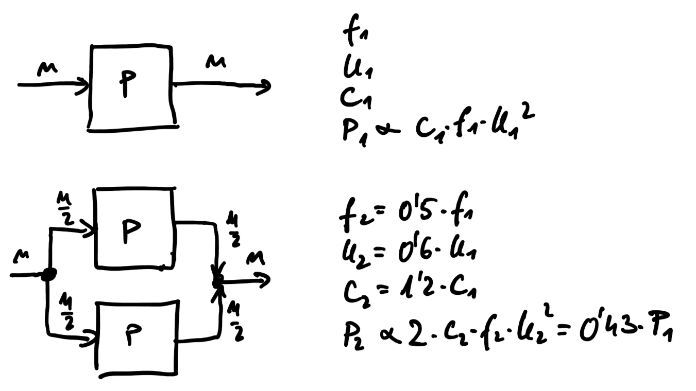

# Uvod

## Zakaj potrebujemo vzporedno in porazdeljeno procesiranje

- znanost: 
    - realistične simulacije, ceneje od eksperimentov v naravi
    - vremenska napoved, iskanje novih zdravil, simulacije tokov
- podatkovno rudarjenje:
    - zbira se vedno več podatkov
    - iskanje zakonitosti v podatkih, preverjanje modelov
    - statistična analiza in umetna inteligenca
- poslovni svet:
    - hitrejše obdelave več podatkov predstavljajo konkurenčno prednost
    - stranke želijo učinkovite in robustne rešitve
    - računalništvo v oblaku
- naprave na robu (*angl.* Edge computing)
    - Industrija 4.0, senzorska omrežja

## Razvoj računalniških sistemov

- von Neumannova arhitektura: CPE, pomnilnik, V/I naprave
- dolgo časa (do 2004) je zmogljivost računalniških sistemov naraščala z miniaturizacijo (releji, elektronke, vedno manjši in več tranzistorjev, zviševanje frekvence ure) in izboljševanjem strojne opreme
- karakteristike procesorjev skozi čas ([graf](https://www.karlrupp.net/2018/02/42-years-of-microprocessor-trend-data/))
- Moorov zakon: zmogljivost sistemov se vsakih 18 mesecev podvoji ([graf](https://en.wikipedia.rg/wiki/Transistor_count#/media/File:Moore's_Law_Transistor_Count_1970-2020.png))
- Dennarj= Uevo pravilo: zmanjšanje velikosti tranzistorja na pol, poveča njihovo število za štirikrat, vsak tranzistor dela dvakrat hitreje ob nespremenjeni količini odvedene toplote
- težava z odvajanjem energije pri več kot 130 W porabe na procesor
- pojavljati se začnejo večjedrne arhitekture (po 2004), ki so energijsko bolj učinkovite
- s povečevanjem števila procesorskih jeder se ohranja veljavnost Moorovega zakona

## Večjedrni procesorji so energijsko bolj učinkoviti od enojedrnih

- poraba procesorja je odvisna od frekvenca ure (f), napajalne napetosti (U) in kapacitivnosti vezja (C)
- višja frekvenca, več preklopov, večja porabe energije
- če pretiravamo, se čipi pregrevajo in prihaja do nezanesljivega delovanja

    $$ P = U_0I=U_0\frac{de}{dt}=U_0C\frac{dU}{dt}$$

    $$ U = U_0\sin(2\pi f t) $$
    
    $$ \frac{dU}{dt} = 2\pi fU_0\cos(2\pi f t)$$
    
    $$ P = 2\pi C f U_0^2 \cos(2\pi f t)$$
    
    $$ P = k C f U_0^2 $$
 
- dve procesorski jedri lahko delata pri nižji napetosti, imata pa višjo kapacitivnost
- ker imamo dve procesorski jedri, lahko s polovično frekvenco ure opravimo približno enako količino dela
 
    
 
## Vzporedenje postane ključno

- ključne omejitve, ki so pripeljale do večjedrnih procesorjev:
    - omejitev porabe moči
    - omejitev vzporedenja v procesorju
        - cevovod
        - špekulativno izvajanje
        - superskalarni procesorji
    - omejitve prepustnosti pomnilnika
        - procesorji so mnogo hitrejši od pomnilnikov    
        - pomaga predpomnilnik, vendar se na večjedrnih procesorjih stvari zapletejo
        - problemi z raztegljivostjo (skalabilnostjo)

- podpora za razvoj vzporedne programske kode
    - kljub dolgoletnim raziskavam, avtomatsko pretvarjanje ne deluje dobro
    - prevajalniki, ki bi znali naše zaporedne programe samostojno pretvoriti v vzporedno obliko, so v razvojni fazi in so slabi
    - knjižnice za podporo vzporedenju
    - novi programski jeziki z vgrajeno podporo za vzporedenje

- rešitev
    - da dobro izkoristimo nove arhitekture, moramo sami pisati vzporedne programe
    - novi procesorji imajo mehanizme, ki znajo izkoriščati vzporedne programe (strojne niti)
    - za doseganje dobrih rezultatov moramo dobro poznati arhitekturo
    - kako pisati kodo, da bo učinkovita tudi na prihajajočih procesorjih

## Aktualnost področja

- bolj učinkovito izvajanje programskih rešitev (hitrejše, manjša poraba energije)
- večja zanesljivost
- programska oprema kot množica mikrostoritev
- superrračunalniški sistemi v Evropi in svetu ([www.top500.org](https://www.top500.org/))
- prosto dostopne superračunalniške gruče v Sloveniji ([https://doc.sling.si/navodila/clusters/](https://doc.sling.si/navodila/clusters/))

## Razlogi za delo na superračunalniški gruči

- vsi imamo enako strojno opremo (množica vozlišč z modernimi večjedrnimi procesorji in grafičnimi pospeševalniki)
- programsko opremo namestijo administratorji
- delate lahko doma ali na fakulteti
- celo šolsko leto imate dostop, lahko uporabljate tudi pri drugih predmetih, za najprej pišete na support@sling.si za podaljšanje 
