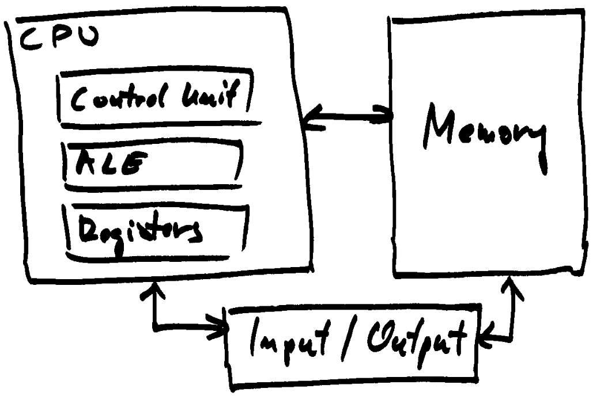
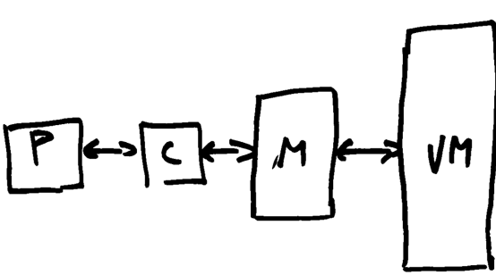
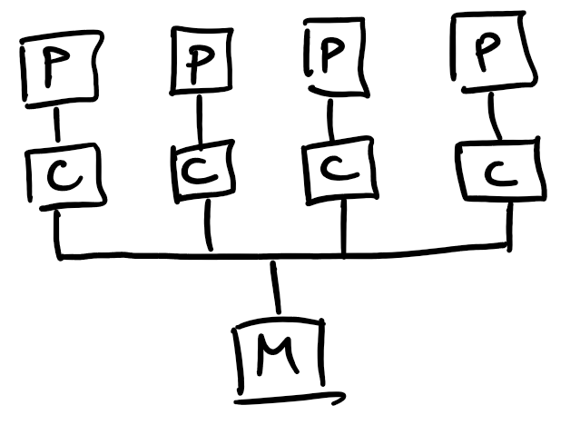
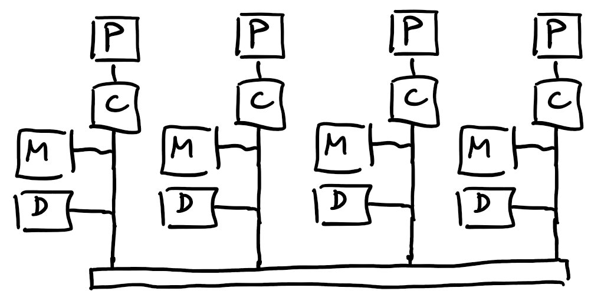
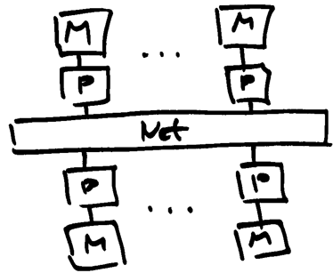
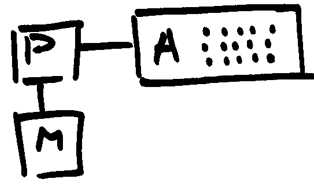
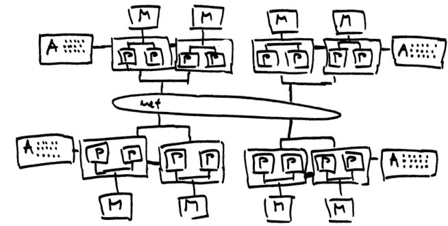
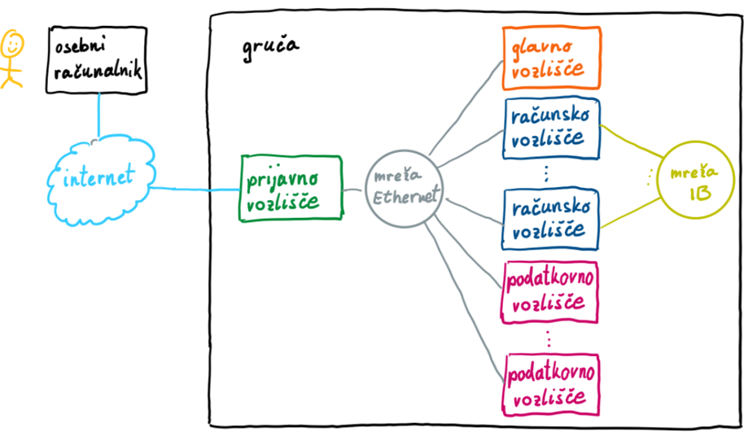

# Arhitekture računalniških sistemov

## von Neumannova arhitektura in izboljšave

- centralna procesna enota ali procesor, pomnilnik, V/I naprave

    

- delovanje: prevzem ukaza, dekodiranje, prevzem operandov, izvajanje, shranjevanje
- zaporedno izvajanje ukazov
- pomnilniško ozko grlo
- izboljšave:
    - pomnilniška hierarhija
        - registri
        - niz predpomnilnikov (L1, L2, L3)
        - glavni pomnilnik
        - navidezni pomnilnik

    - izkoriščanje prostorske in časovne lokalnosti
    - vzporedenje v strojni opremi:
        - cevovod
        - vektorski ukazi
        - več funkcijskih enot
        - špekulativno izvajanje
        - superskalarnost
        - strojne niti

### Pomnilniška hierarhija

- procesor z registri (P), predpomnilnik (C), glavni pomninlnik (M) in navidezni pomnilnik (VM)

- dostop do glavnega pomnilnika je dva velikostna reda počasnejši kot do registrov (latenca in prepustnost)
- večnivojski predpomnilnik
    - organiziran v predpomnilniške bloke
    - vedno se prenaša cel predpomnilniški blok
    - če podatkov ni, procesor še vedno čaka
    - zadetek in zgrešitev v predpomnilniku
    - tipi predpomnilnikov: asociativni, set-asociativni in direktni
    - pomembno je zagotavljanje skladnosti pomnilnikov (pisanje skozi, pisanje nazaj)
- navidezni pomnilnik
    - razširitev glavnega pomnilnika
    - bistveno počasnejši od glavnega pomnilnika, še večja potreba po lokalnosti
    - ostranjevanje in napaka strani

### Vzporedenje v strojni opremi

- Cevovod
    - funkcijske enote so razvrščene v stopnje
    - stopnje naj bi bile čim bolj enako kompleksne

- Vektorski ukazi
    - hkratno izvajanje istega ukaza na več skalarnih operandih 
    - posebni ukazi

- Več funkcijskih enot
    - izkoriščajo paralelizem v enem ukaznem toku

- Špekulativno izvajanje
    - med izvajanjem pogoja lahko izvajamo aritmetično operacijo (če je pogoj izpolnjen)

- Superskalarnost
    - vzporedno izvajanje neodvisnih ukazov
    - dodeljevanje funkcijskih enot poteka med izvajanjem 

- Strojne niti
    - hkratno izvajanje različnih programskih tokov
    - izkoriščajo prisotnost več enakih funkcijskih enot

## Sistemi s skupnim pomnilnikom

- *angl.* shared memory systems
- imajo enega ali več procesorjev z enim ali več procesorskimi jedri
- procesorji so s skupnim pomnilnikom povezani preko vodila
- procesorji si delijo skupni pomnilnik
- spremembe v pomnilniku vidijo vsi procesorji
- pomnilnik je razdeljen na module, do enega modula dostopa en procesor naenkrat
- vsak procesor ima svoj L1 predpomnilnik, saj vanj poleg podatkov shranjuje tudi ukaze
- predpomnilnika L2 in L3 shranjujeta samo podatke, zato si jih lahko deli več procesorjev
- enovit naslovni prostor
- arhitekturi UMA in NUMA

    - kompleksnost in raztegljivost
    - dostopni časi do pomnilnika
    - zagotavljanje skladnosti pomnilnika

### Arhitektura UMA (SMP)

- *angl.* Unified Memory Architecture
- *angl.* Symmetric Multi-Processor

    

- dostopni čas do kateregakoli dela pomnilnika je v povprečju enak za vsa procesorska jedra
- zagotavljanje skladnosti predpomnilnikov: 
    - običajno pisanje skozi v kombinaciji z vohljanjem 
    - ko zaznamo spremembo, posodobimo blok v predpomnilniku
    - pisanje nazaj je počasno, težave z raztegljivostjo

### Arhitektura NUMA

- *angl.* Non-Unified Memory Architecture

    

- procesorska jedra so razdeljena v domene NUMA
- pomnilniški moduli so enakomerno razporejeni med domene NUMA
- dostopni časi do pomnilniških modulov so različni: krajši do pomnilniških modulov, neposredno povezanih na domeno, daljši do pomnilnikov bolj oddaljenih domen (časi so lahko do 3-krat daljši)
- zagotavljanje skladnosti predpomnilnikov:
    - imenik (direktorij, D) za vodenje stanja predpomnilniških blokov, 
    - imeniški protokoli, na primer MESI (Modified, Exclusive, Shared, Invalid)
    - pisanje nazaj in razveljavljanje predpomnilnikov na drugih procesorskih jedrih
    - manj prenosov, večja prepustnost
- veliko boljša raztegljivost kot pri arhitekturi UMA
- pomembno je, da procesorska jedra iz izbrane domene čim več delajo s pomnilnikom, ki je neposredno povezan nanjo
- primer [AMD EPYC 7002](https://infohub.delltechnologies.com/p/numa-configuration-settings-on-amd-epyc-2nd-generation/)
    - 4 NUMA domene v katerih so procesorska jedra organizirana hierarhično
    - vsaka domena ima 2 silicijevi rezini in na vsaki rezini 2 procesorska kompleksa
    - vsak procesorski kompleks sestavljajo 4 procesorska jedra, ki se delijo predpomnilnik L3

## Sistemi s porazdeljenim pomnilnikom

- sistemi s skupnim pomnilnikom (vozlišče, strežnik) ima danes do 96 procesorskih jeder
- če potrebujemo večjo procesno moč, moramo povezati več vozlišč med seboj
- dobimo sistem s porazdeljenim pomnilnikom
- v sistemih s porazdeljenim pomnilnikom so vozlišča med seboj povezana z mrežo
- pomnilnik je porazdeljen: 
    - vsak procesor lahko neposredno dostopa samo do pomnilnika na svojem vozlišču
    - vsak pomnilnik ima svoj (ločen) naslovni prostor
- komunikacija med vozlišči običajno poteka z izmenjavo sporočil
- so bolj raztegljivi kot sistemi s skupnim pomnilnikom, komunikacija med procesorji je počasnejša
- danes je velik poudarek na razvoju mrežne opreme

- vrste sistemov s porazdeljenim pomnilnikom [www.top500.org](https://www.top500.org/):

    - gruče
        - sestavljene so iz elementov, ki jih lahko kupimo na trgu
        - na vsakem vozlišču teče operacijski sistem
        - NSC, Trdina, Arnes, Vega
    - masivno vzporedni procesorji
        - *angl.* Massively Parallel Processors
        - večja stopnja integracije
            - ena kopija (porazdeljenega) operacijskega sistema teče na vseh vozliščih
            - posebej izdelane omrežne povezave
    - ozvezdja
        - več procesorskih jeder na vozlišče kot je vozlišč

## Pospeševalniki

- nekoč matematični soprocesorji, danes grafične kartice
- danes imajo notranjo hierarhično pomnilniško strukturo in mnogo enostavnih procesnih elementov
- niso popolnoma samostojni
- razbremenjevanje glavnega procesorja
    - procesor prenese podatke iz glavnega pomnilnika v pomnilnik pospeševalnika
    - procesor sproži izvajanje obdelave
    - pospeševalnik izvede obdelavo in rezultate shrani v pomnilnik pospeševalnika
    - procesor prenese podatke nazaj v glavni pomnilnik
- množica preprostih procesnih elementov, vzporedno procesiranje na množici podatkov
- ozko grlo je prenos podatkov med gostiteljem in pospeševalnikom
- zaradi drugačne arhitekture je treba močno prilagoditi programe

## Primer: moderna superračunalniška gruča

- mnogo vozlišč, zelo heterogen sistem

    

    - vozlišče je sistem s skupnim pomnilnikom
    - več vozlišč sestavlja porazdeljeni sistem, vozlišča med seboj komunicirajo z izmenjevanjem sporočil
    - pospeševalniki 

- superračunalniška gruča

    

    - vozlišča: glavno, prijavno, računsko, podatkovno vozlišče
    - mrežne povezave: Ethernet, (Infiniband)
    - porazdeljeni datotečni sistem (vsa vozlišča vidijo programe in podatke)
    - dostop do prijavnega vozlišča preko SSH
