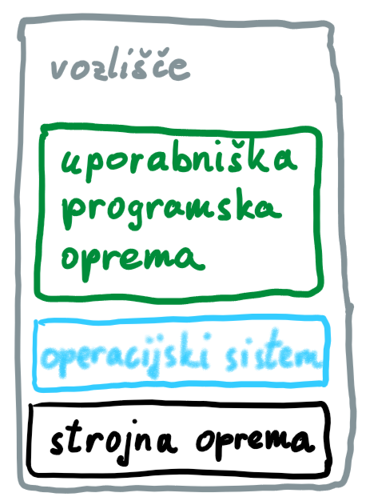
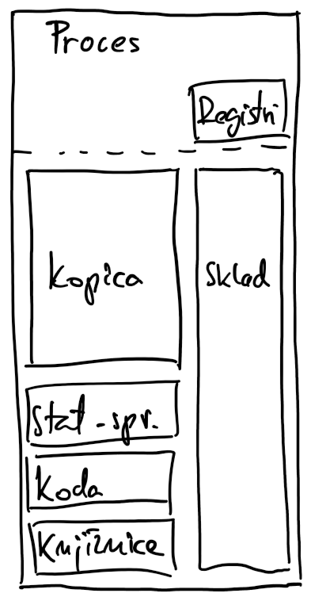
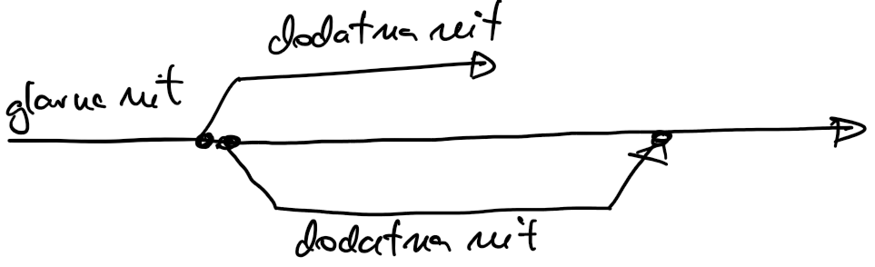
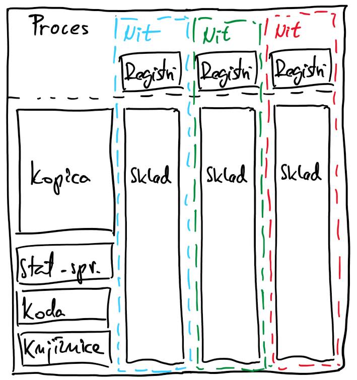
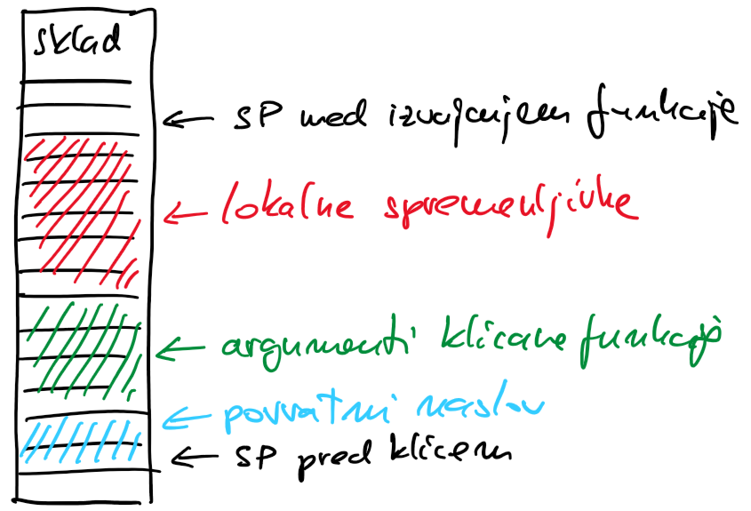
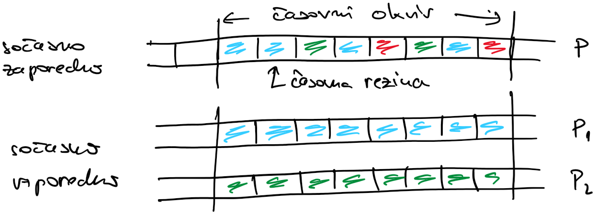
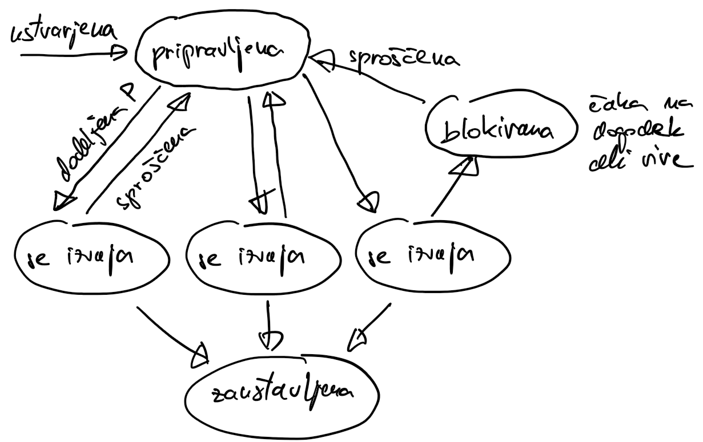
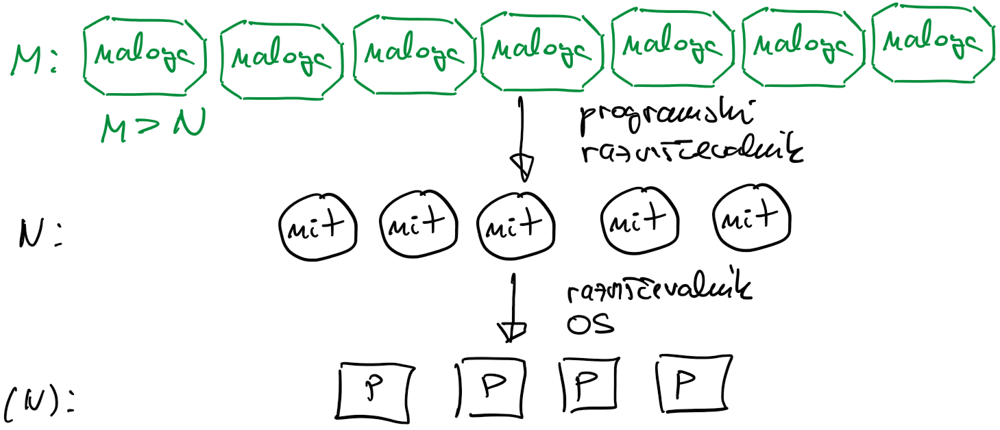

# Programska oprema

## Operacijski sistem

- most med strojno in uporabniško programsko opremo

    

- je programska oprema, ki izvaja osnova opravila, kot so:
    - upravljanje procesorjev
    - upravljanje pomnilnika 
    - nadzor V/I naprav
    - upravljanje datotečnega sistema
    - nadzor delovanja sistema
    - izvajanje varnostnih funkcij
    - spremljanje porabe sredstev
    - detekcija napak
- moderni operacijski sistemi so večopravilni 
    - zaganjanje več aplikacij hkrati
    - računalniški viri so dodeljeni različnim procesom, vsak dobi svoj delež glede na prioritete
    - preklapljanje med procesi in porazdeljevanje procesorskih virov med njih
    - preklapljanje med procesi ni zastonj
        - shraniti je treba vse vire (rokovalnike do datotek, programski števec, skladovni kazalec)
        - ob ponovni aktivaciji procesa jih je treba spet rekonstruirati
- moderni operacijski sistemi so sočasni

## Procesi

- ko zaženemo program, se v operacijskem sistemu pojavi nov proces
- proces je osnovna enota, ki ji operacijski sistem dodeli vire
    - delež procesorskih ciklov
    - del prostega pomnilnika, ki ga operacijski sistem varuje pred dostopom drugih procesov
    - dostop do komunikacijskih vrat in V/I naprav
    - rokovalnike do datotek, ki jih potrebuje program
- proces najprej zažene kodo, ki postori zgornje, nato zažene funkcijo `main()` v  programu
- dodeljevanje pomnilnika

    - programska koda in dinamične knjižnice
    - globalne spremenljivke, definirane zunaj funkcije `main()`
    - kopica je namenjena dinamičnemu dodeljevanju pomnilnika
    - na sklad se shranjuje vse potrebno ob klicu funkcije in spremenljivke, definirane v funkcijah

    
    
## Niti

- proces je osnovna enota, ki ji operacijski sistem dodeli vire, ni pa osnovna enota, ki jo operacijski sistem lahko izvaja
- proces lahko vključuje več internih izvajalnih enot ali niti
- proces ima vedno vsaj glavno nit
- iz glavne niti lahko po potrebi zaženemo dodatne niti 
    - s tem ustvarimo nov zaporedni programski tok, ki se izvaja asinhrono z glavnim 
    - glavni programski tok se izvaja naprej nemoteno
    - od tu dalje sta glavna in dodatna nit enakovredni
    - dodatno nit lahko po potrebi pridružimo glavni niti

    

- izvajanje niti
    - niti izvaja operacijski sistem, nimamo vpliva na vrstni red izvajanja    
    - večnitni program lahko izvajamo na enem jedru
    - če niti izvajajo neodvisne programske tokove na več jedrih hkrati, govorimo o vzporednem procesiranju
- programske in strojne niti
    - strojne niti omogočajo hkratno izvajanje več ločenih programskih tokov
    - operacijski sistem določi katera strojno nit bo izvajala neko programska nit
        

### Organizacija pomnilnika v večnitnem procesu

- do globalnih spremenljivk (na sliki static) lahko dostopa vsaka nit
- vse niti lahko dostopajo do programske kode
- vse niti lahko dostopajo do dinamično dodeljenega pomnilnika (kopica)
- niti si delijo dostop do datotek, vrat, V/I naprav
- lokalne spremenljivke na skladu so privatne za vsako nit
- če nit deli pomnilniški naslov z ostalimi nitmi, lahko te dostopajo do njenega lokalnega pomnilnika

Niti izvajajo neodvisne programske tokove, zato ima vsaka svoje:

- registre, na primer programski števec in skladovni kazalec
- sklad
    - delovanje: princip LIFO, skladovni kazalec

        

    - ob klicu funkcije na sklad shranimo povratni naslov in argumente, nato tudi vse spremenljivke
    - ob vračanju se vse lokalne spremenljivke in argumenti odstranijo iz sklada, program nadaljuje izvajanje na povratnem naslovu
- če ima proces več niti kot ima procesor jeder, operacijski sistem preklaplja med nitmi
- preklapljanje med nitmi je učinkovitejše od preklapljana med procesi, saj ni treba shranjevati stanja virov, ki so na voljo vsem nitim
- niti so "lahki" procesi s poenostavljenim upravljanjem virov
- lahko jih razumemo tudi kot "napredne" funkcije, ki imajo svoje izvajalno okolje

## Programski in izvajalni model

- programski model predstavlja logično organizacijo programa
    - mora biti kar se da splošen, da je prenosljiv med različnimi sistemi
- izvajalni model natančno podaja način izvajanja na ciljnem sistemu
    - odvisen od strojne opreme in programskih okolij
- izvajanje večnitnega programa
    - sočasno: več niti v procesu se izvaja (rešuje problem) v istem časovnem okviru
    - vzporedno: različne niti se hkrati (v istem trenutku) izvajajo na različnih procesorskih jedrih
    - izvajanje niti je lahko sočasno ni pa vzporedno (dodeljevanje časovnih rezin)
    - če je izvajanje niti vzporedno, je tudi sočasno (hkratno izvajanje na več procesorskih jedrih)
    - sočasnost je programski vzorec, vzporednost je lastnost strojne opreme   
    - dobro napisan program s podporo za sočasnost
        - se bo lahko izvajal sočasno na enem procesorskem jedru ali
        - vzporedno na več procesorskih jedrih hkrati

### Življenjski cikel niti

- pripravljena: čaka v bazenu niti, da ji bo razvrščevalnik dodelil procesor
- v izvajanju: nit se izvaja na procesorju
- blokirana: izvajanje niti je zaustavljeno
    - preden jo operacijski sistem vrne v stanje pripravljenosti preden začne izvajati drugo nit
    - programska blokada ob čakanju na pogoje
    - ko je nit blokirana, ne rabi procesorskih virov
- zaustavljena: 
    - ko je zaključila z delom
    - ko je prekinitev izvajanja zahtevala druga nit

### Prednosti večnitnih programov
- vzporedno izvajanje
- prepletanje računanja in komunikacije (računanje se lahko izvaja medtem, ko nit čaka na V/I)
- večnitni strežniki (spletne storitve, ena nit za vsakega uporabnika)
- grafični vmesniki: vsaj ena dodatna nit za obdelovanje dogodkov

## Naloge: ko niti niso dovolj

- mnoga programska orodja delajo neposredno z nitmi (pThreads, OpenMP)
- za učinkovito vzporedno izvajanje določenih tipov programov (na primer rekurzivnih) potrebujemo dodaten nivo abstrakcije (cilk, TBB, go)
- model nalog
    
    - program ustvari niti
        - so blokirane in čakajo v bazenu niti
        - po potrebi jih programski razvrščevalnik (knjižnica) zbudi
        - lahko vsako nalogo izvaja svoja nit, ali pa imamo več nalog kot niti
    - program ustvarja naloge, ki jih oddaja v bazen nalog
    - naloge se izvajajo takrat, ko so niti na voljo 
    - naloge dodeljuje nitim programski razvrščevalnik (knjižnica, jezik)
        - naloge se lahko izvajajo v drugačnem vrstnem redu, kot so bile oddane v bazen

- stanja nalog:
    - čakajoča
    - pripravljena za izvajanje
    - v izvajanju

- programski razvrščevalnik 

    

    - razvrščevalnik $M: N$, razvršča $M$ nalog na $N$ niti ($M > N$, $N$ je običajno enak številu procesorjev)
    - nalogo da na čakanje takoj, ko je njeno izvajanje blokirano, in zažene drugo nalogo iz bazena
    - koncept je podoben kot pri nitih, vendar samo ko pride do blokade, ne pa tudi zaradi porazdeljevanja procesorskih virov med naloge
    - s tem, ko neprestano preklaplja med blokiranimi in neblokiranimi nalogami, skrbi, da niti nikoli ne čakajo in procesor nima razloga za zamenjavo z drugimi nitmi
    - preklapljanje med nitmi ~12k ukazov, preklapljanje med nalogami ~2,4k ukazov
    - precej kompleksen: globalni seznam nalog, seznam nalog za vsako nit, LIFO in FIFO, kraja 
    - vir: [William Kennedy: Scheduling In Go](https://www.ardanlabs.com/blog/2018/08/scheduling-in-go-part1.html)

- prednosti nalog: 
    - znebimo se visokih stroškov ob ustvarjanju, zaključevanju, preklapljanju niti
    - programi se lahko poenostavijo -- lahko privzamemo, da imamo neomejeno število nalog
