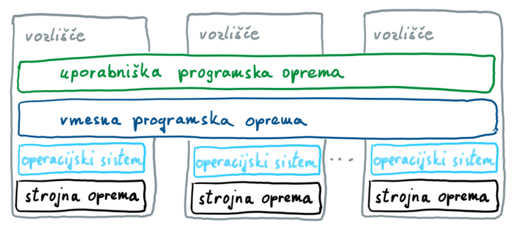
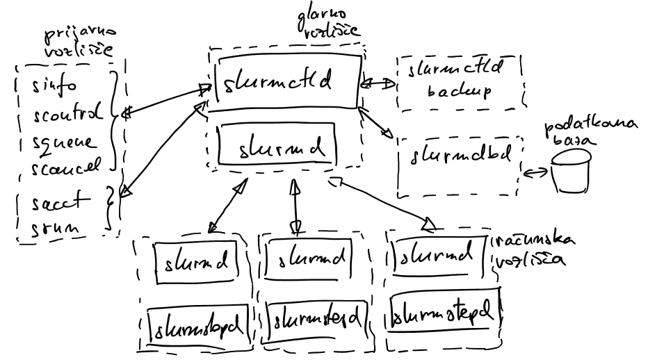
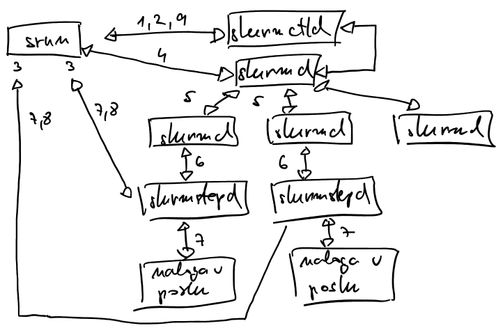
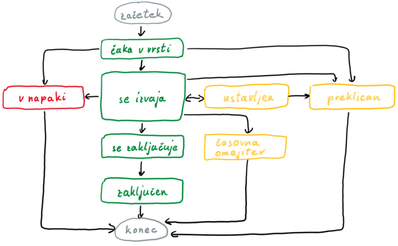

# SLURM (Simple Linux Utility for Resource Management)

- vmesna programska oprema   
    - upravljanje virov na gruči in razvrščanje poslov
    - upravlja s čakalno vrsto 
    - uporabnikom dodeljuje računske vire
    - okolje za zaganjanje, izvajanje in nadziranje dela (poslov)
    - sklad programske opreme na gruči

        

- glavne lastnosti
    - odprtokodni projekt
    - odporen na napake
    - kompleksen razvrščevalnik
    - visoko raztegljiv
    - mnogo različnih vtičnikov

## Arhitektura

- vozlišča (nodes): računski viri
- particije (partitions): logične skupine vozlišč, vsaka ima svojo vrsto poslov
- posli (jobs): vključuje viri, začasno dodeljene uporabniku, podatke in programsko opremo
- koraki (job steps): manjše izvajalna enota v poslu

### Servisi

- slurmctrld 
    - na glavnem vozlišču
    - nadzira in dodeljuje vire
    - upravlja s čakalnimi vrstami
    - redundanca ob namestitvi na več vozlišč

- slurmd
    - teče na vsakem vozlišču
    - čaka na posel, poskrbi za izvedbo, sporoča statuse
    - hierarhična zasnova
    - komunikacija odporna na napake
    - zažene slurmstepd, ki izvaja posel

- slurmstepd
    - dejansko izvede posel

- slurmdbd
    - povezan s podatkovno bazo
    - shranjuje zgodovino, obračunavanje

### Delovanje

1. uporabnik z ukazom `srun` pošlje zahtevo za dodelitev virov za posel, `slurmctrld` jo mora odobriti
2. `srun` po odobritvi pošlje zahtevo za vzpostavitev posla, `slurmctrld` izda poverilnice (gesla, dodeljene vire)
3. `srun` odpre komunikacijske kanale
4. `srun` pošlje poverilnice in podrobnosti o poslu na `slurmd`
5. `slurmd` podatke posreduje dodeljenim vozliščem
6. `slurmd` zažene `slurmstepd`
7. `slurmstepd` vzpostavi kanal z `srun` (na prijavnem vozlišču) in zažene posel (naloge v njem)
8. `slurmstepd` obvesti `srun` o zaključku posla
9. `srun` o zaključku posla obvesti `slurmctrld`
10. `slurmctrld` preko `slurmd` preveri, da je posel zaključen, in sprosti vire

## Življenjski cikel posla

- PD: pending, čaka v vrsti
- R: running, se izvaja
- S: suspended, zaustavljen
- CA: canceled, preklican
- TO: timeout, časovna omejitev
- CG: completing, se zaključuje
- CD: completed, zaključen
- F: failed, v napaki
- CF: configuring, NF: node failure, RV: revoked, SE: special exit state, , …

## Uporaba SLURM
- delavnica [Osnove superračunalnišva](https://doc.sling.si/workshops/supercomputing-essentials/)
- rezervacija `--reservation=psistemi`
