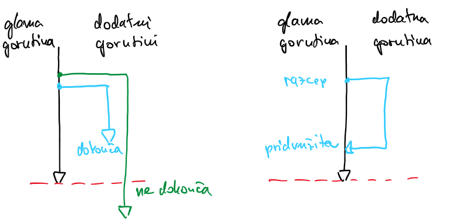
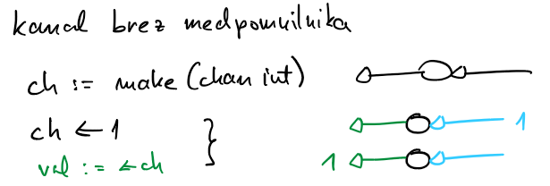
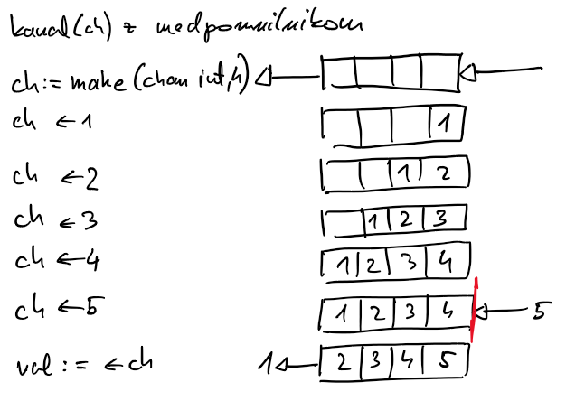

# Programski jezik go

## Zgodovinski pogled

- najprej jezik C, s katerim so lahko dobro izkoristili malo virov, ki so bili na voljo; čista sintaksa, enostavnost programiranja nista prioriteti
- kasneje C++, C#, java podpirajo večnitno programiranje, čiščenje pomnilnika, z novimi in novimi funkcionalnosti vedno bolj zmogljivi
- jezika python/javascript: ogromna skupnost, veliko paketov, ni prevajan, fokus ni na zmogljivosti
- niša: zmogljiv, prevajan, večplatformni jezik z vgrajeno podporo za vzporedenje (sistemsko programiranje)
- statično tipiziran jezik, ni objekten, podpora za pisanje vmesnikov

## Glavne lastnosti

- ima zelo čisto in enostavno sintakso, malo ključnih besed in vrst ločil
- strikten pri pisanju kode, večja berljivost
- razvit v mislih na večjedrne procesorje, ima vgrajeno podporo za vzporedenje (naloge/gorutine in kanali)
- je prevajani jezik, prevajalnik je izjemno hiter, na voljo za najrazličnejše platforme
- delo s pomnilnikom (kazalci, dostop, mehanizem za čiščenje pomnilnika se izvaja vzporedno, ne ustavlja izvajanja programa) 
- vgrajen izviren sistem za preverjanje napak
- je statično tipizirani programski jezik, na podatkovni tip lahko sklepa iz kode
- pozna tipe in metode, ne pa dedovanja, ima podporo za vmesnike
- vgrajeno upravljanje paketov
- zasnovan za sistemsko programiranje, mrežne vmesnike in razvoj spletnih aplikacij, že zdavnaj je prešel te okvire
- primeren je za pisanje visokozmogljivih programov (hitro izvajanje, nizke latence)
- pri razvoju so imeli v mislih dobre inženirske prakse (testiranje enot)
- vedno večja skupnost razvijalcev in uporabnikov

[Primerjava jezikov go in java](https://www.turing.com/blog/golang-vs-java-which-language-is-best/#comparison)

## Podpora za sočasnost

- model opravilo kanal (Foster, 1995), model CSP, *angl.* Communicating Sequential Processes (Hoare, 1978)
    
    - 1978: ali uporabljati stavek goto, osnutki objektnega programiranja, nihče ne razmišlja o sočasnosti
    - CSP predstavljen kot programski jezik
    - model
        - sestavni deli: vhod, izhod, sekvenčna funkcija (proces, naloga)
        - ukaz za pošiljanje vsebine na vhod, izvajanje naloge, ukaz za branje izhoda
        - programski jezik zagotavljanje pravilno komunikacijo med nalogami
    - Hoare pokaže, da je mnogo problemov zelo enostavno reševati na ta način
    - z leti se je pokazalo, da je ta model zelo blizu našemu načinu razmišljanja
- logiko modela opravilo kanal privzame jezik go
    - naloge poimenuje sorutine / gorutine
    - gorutine si podatke izmenjujejo preko kanalov
    - hitro preklapljanje med gorutinami nam omogoči, da
        - delamo sočasno z veliko množico gorutin
        - problem lahko razbijemo na enostavne in obvladljive enote
        - poskrbeti moramo za komunikacijo med njimi
    - kanale uporabljamo za komunikacijo med gorutinami
        - lahko jih združujemo (več izhodov združimo kot vhod v naslednjo gorutino)
        - stavek `select` poenostavi logiko za delo s kanali: združevanje kanalov, čakanje na dogodke, naključno izbiro dogodka med množico aktivnih kanalov
        - s kanali lahko sinhroniziramo delovanje gorutin
        - kanali so blokirajoči - gorutina bo čakala, dokler se na kanalu ne pojavi sporočilo

## Gorutine

- sinonimi: naloga, sorutina in gorutina
- osnovna enota programa v jeziku go
- program v jeziku go ima vedno vsaj glavno gorutino
- glavna gorutina se zažene, ko se proces začne izvajati

- jezik go sledi sočasnemu modelu razcepi-pridruži (*angl.* fork-join)

    

- prevajanje in zaganjanje na gruči Arnes

    [pozdrav-1.go](koda/pozdrav-1.go)
```
    $ module load Go
    $ srun --reservation=psistemi --tasks=1 --cpus-per-task=2 go run pozdrav-1.go

    $ go build pozdrav-1.go
    $ srun --reservation=psistemi --tasks=1 --cpus-per-task=2 ./pozdrav-1

```

- ustvarimo gorutino

    [pozdrav-2.go](koda/pozdrav-2.go)

    - funkcija `hello` se izvaja v svoji gorutini
    - ni točke pridruževanja, zaključila se bo enkrat v prihodnosti, preostali program se bo izvajal naprej
    - zelo verjetno se gorutina `hello` sploh ne bo zagnala, saj se bo glavna rutina zaključila prej

- zakasnimo glavno gorutino

    [pozdrav-3.go](koda/pozdrav-3.go)
    - če v glavni gorutini počakamo pred zaključkom programa, dobimo izpis
    - še vedno ni bilo pridruževanja dodatne gorutine

- uporabimo vzorce razcepi-pridruži
    
    [pozdrav-4.go](koda/pozdrav-4.go)
    - uporabimo sinhronizacijo, paket `sync`
    - definiramo skupino gorutin, ki jih želimo na neki točki pridružiti (`WaitGroup`) 
    - povemo koliko gorutin bomo ustvarili (`wg.Add()`)
    - vsaka gorutina sporoči skupini, da je zaključila (`wg.Done()`)
    - določimo točko pridruževanja (`wg.Wait()`)
    - `WaitGroup` je neke vrste števec, prirejen za sočasno izvajanje, ki ga povečujemo in zmanjšujemo ter z njim na neki točki zadržimo izvajanje gorutine

- dve različni gorutini

    [pozdrav-5a.go](koda/pozdrav-5a.go)
    - jezik go ne jamči vrstnega reda izvajanja gorutin
    - izvajanje gorutine se lahko začasno tudi prekine
    - gorutino lahko kličemo z argumenti
    - glavna gorutina čaka, da se dodatne gorutine zaključijo

    [pozdrav-5b.go](koda/pozdrav-5b.go)
    - jezik go ne jamči vrstnega reda izvajanja gorutin
    - izvajanje gorutine se lahko začasno tudi prekine
    - gorutino lahko kličemo z argumenti
    - glavna gorutina tudi opravi delo

## Kanali

- sinhronizacijski konstrukt, ki ga je predvidel model CSP
- njihova primarna naloga je zagotavljanje komunikacije med gorutinami
- lahko pa jih učinkovito uporabimo tudi za sinhronizacijo
- katerakoli gorutina lahko pošlje vrednosti v kanal, katerakoli gorutina jih lahko potem iz kanala prebere
- različne gorutine za komunikacijo potrebujejo le referenco na skupni kanal
- ustvarjanje kanalov
    - dvosmerni kanal za celoštevilčne vrednosti

        ```go
        var dataStream chan int
        dataStream = make(chan int)
        ```

    - enosmerni kanal za branje

        ```go
        var dataStreamRead <-chan int
        dataStreamRead = make(<-chan int)
        ```

    - enosmerni kanal za pisanje

        ```go
        var dataStreamWrite chan<- int
        dataStreamWrite = make(chan<- int)
        ```
- običajno ustvarimo dvosmerni kanal, enosmerne kanale pa uporabljamo kot argumente funkcij ali jih funkcija vrača, saj jezik go po potrebi dvosmerni kanal prevede v ustrezen enosmerni kanal

    ```go
    dataStreamRead = dataStream
    dataStremWrite = dataStream
    ```
- pri delu s kanali operator `<-` uporabljamo za pisanje vrednosti v kanal in za branje vrednosti iz kanala

    ```go
    dataStream <- 314       // pisanje
    value = <- dataStream   // branje
    ```
- kanali so blokirajoči

    - gorutina ne more pisati v poln kanal; če je kanal poln, gorutina čaka, dokler se kanal ne izprazni
    - gorutina ne more brati iz praznega kanala; če je kanal prazen, gorutina čaka, da se v kanalu pojavi vrednost
    - nepravilna uporaba kanalov lahko pripelje do smrtnega objema ([smrtni-objem.go](koda/smrtni-objem.go))
    
    ```go
    func writer() {
        return
        dataStream <- 13                // gorutina nikoli ne zapiše vrednosti v kanal
    }

    func main() {
        go writer()
        value := <-dataStream           // glavna gorutina blokira ob čakanju na podatek --> smrtni objem
        fmt.Println("Value:", value)
    }
    ```

<!--

- kanal ima definirano kapaciteto; privzeta kapaciteta kanala je 0

    - definiciji `dataStream = make(chan int)` in `dataStream = make(chan int, 0)` sta enakovredni
    - kanal s kapaciteto 0 je poln, še preden lahko vanj pišemo
    - če je ob pošiljanju vrednosti v kanal že pripravljena tudi gorutina, ki iz kanala bere, nam vrednosti ni treba nikamor shraniti

        

    [pozdrav-6.go](koda/pozdrav-6.go)

    - glavna gorutina ustvari kanal
    - dodatne gorutine v kanal pišejo
    - zadnja dodatna gorutina se konča pred zadnjim branjem glavne gorutine

- kanali z medpomnilnikom definirane velikosti

    ```go
    var bufferStream = make(chan int, 4)
    ```

    - v kanal `bufferStream` lahko zapišemo štiri vrednosti preden katerokoli vrednost preberemo

        

    - če nobena gorutina ne bo pripravljena na branje iz kanala, bo blokirano pisanje pete vrednosti; če bo pripravljena, pa bo blokirano šele pisanje šeste vrednosti
    - branje vrednosti iz kanala z medpomnilnikom poteka po principu FIFO - v enakem vrstnem redu kot vpisovanje

    [pozdrav-7.go](koda/pozdrav-7.go)

    - glavna gorutina ustvari kanal z medpomnilnikom za vsa sporočila
    - dodatne gorutine v kanal pišejo
    - vse dodatne gorutine se končajo pred izpisovanjem v glavni gorutini

- zapiranje kanalov   

    - branje iz odprtega in zaprtega kanala
        
        ```go
        dataStream <- 314
        value, ok := <-dataStream       // 314, true
        close(dataStream)
        value, ok := <-dataStream       // 0, false
        ```

    - s tem, ko zapremo kanal, povemo bralnim gorutinam, da v kanal nihče več ne bo vpisoval
    - branje iz zaprtega kanala je vedno mogoče
    - potem, ko zapremo kanal, gorutine, ki čakajo na vrednost, preberejo privzeto vrednost (0 pri int) in nadaljujejo

        - v bistvu na ta način lahko pošljemo signal vsem gorutinam, da nadaljujejo
        - bolj učinkovito, kot za vsako čakajočo gorutino vpisati vrednost v kanal

    [pozdrav-8.go](koda/pozdrav-8.go)

    - glavna gorutina ustvari kanal z medpomnilnikom za vsa sporočila
    - dodatne gorutine v kanal pišejo
    - vse dodatne gorutine se končajo pred izpisovanjem v glavni gorutini
    - glavna gorutina želi prebrati eno vrednost preveč; ker smo kanal predhodno zaprli, dobimo privzeto vrednost, zastavica `ok` pa je `false`

    [pozdrav-9.go](koda/pozdrav-9.go)

    - ključna beseda `range` poenostavi branje iz kanala
    - z uporabo ključne besede `range` zanka dela obhode, dokler je kanal odprt
    - z zaprtjem kanala sporočimo, da ne bo več novih vrednosti, zanka nadaljuje obhode, dokler ne obdela vseh vrednosti v kanalu

### Priporočila za delo s kanali

- gorutina, ki je lastnik kanala

    - kanal vzpostavi
    - piše vanj
    - ga zapre
    
    na ta način preprečimo delo z zaprtim kanalom (vzpostavitev, pisanje, večkratno zapiranje)

- gorutina, ki bere

    - mora preverjati ali je kanal odprt ali zaprt
    - paziti, da ne pride do smrtnega objema

- primer: [velike-crke.go](koda/velike-crke.go)

    - dve funkciji: prva sporočilo pošilja po znakih v kanal; druga znake bere, male črke pretvarja v velike in sestavlja sporočilo
    - v funkciji `main` ne uporabimo ključne besede `go`
    - v funkciji `getLettersFromMessage` najprej ustvarimo kanal, nato pa s ključno besedo `go` pokličemo anonimno funkcijo (gorutino), ki piše v kanal in ga na koncu zapre
    - funkcija `getMessageFromLetters` bere znake dokler je kanal odprt; kanal je odprt samo za branje, da preprečimo morebitne nevšečnosti ob pisanju v zaprti kanal

### Sinhronizacija s kanali

- kanal uporabimo kot sinhronizacijski element, po njem nič ne prenašamo
- da gre za sinhronizacijski element dodatno poudarimo s kanalom za podatkovni tip `struct{}` (prazna struktura)

- primer: [razglas.go](koda/razglas.go)

    - poslušalci (`listener`) se zaženejo in čakajo na sporočilo na kanalu
    - ko razglaševalec(`speaker`) izpiše novico, zapre kanal ne da bi karkoli vanj poslal
    - ko je kanal zaprt, poslušalci iz kanala nemudoma preberejo privzeto vrednost in nadaljujejo

-->