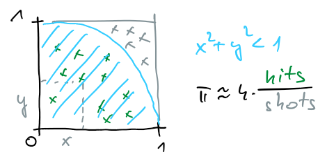
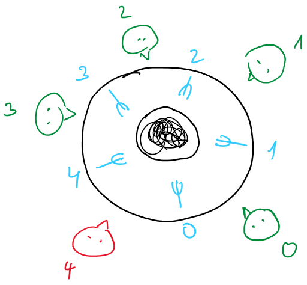

# Sinhronizacija

## Tvegano stanje in kritični odsek

- gorutine komunicirajo preko spremenljivk v skupnem pomnilniku (*angl.* shared variables)

- **tvegano stanje** (*angl.* race condition) je nezaželeno stanje sistema; 
    - pojavi se, ko želimo dve ali več operacij izvesti v pravem vrstnem redu, program pa ni napisan tako, da bi zahtevani vrstni red zagotavljal
    - do tveganega stanja lahko pride, kadar želi več gorutin spremeniti vrednost skupne spremenljivke, pri tem pa je rezultat odvisen od vrstnega reda izvajanja gorutin 



- izračunajmo $\pi$ po metodi Monte Carlo s streljanjem v tarčo:

    - okrog krožnega izseka (četrtinke kroga) s polmerom 1 orišemo kvadrat
    - naključno streljamo v kvadrat 
    - štejemo število strelov ($shots$) in število zadetkov ($hits$) v krožni izsek
    - pri velikem številu strelov je verjetnost zadetka v krožni izsek enaka razmerju ploščin krožnega izseka in kvadrata, $$\frac{hits}{shots}\approx \frac{\pi/4}{1}$$ in torej $$\pi \approx 4 \frac{hits}{shots}$$
    - relativna natančnost izračuna je $1/\sqrt{shots}$

    [pi-1.go](koda/pi-1.go)

- zaženemo več gorutin in jim razdelimo delo

    [pi-2.go](koda/pi-2.go)
    - gorutine oštevilčimo
    - strele enakomerno razdelimo med gorutine
    - rezultat je napačen
        - operator `shots++` je okrajšava za  `shots = shots + 1`
        - procesorsko jedro mora prebrati podatek, ga povečati in shraniti
        - lahko je prva gorutina prebrala vrednost, nato je zaspala; medtem druga gorutina prišteva; ko se prva gorutina zbudi prišteje vrednost in zapiše; vse kar je vmes delala druga gorutina smo izgubili ...
        - vrstico lahko izvaja samo ena gorutina naenkrat

- **kritični odsek** je del kode, ki ga sme izvajati samo ena gorutina naenkrat 
    - gorutina ne sme vstopiti v kritični odsek, če je trenutno v njem druga gorutina
    - z uporabo kritičnih odsekov se izognemo tveganim stanjem

- prištevanje dovolimo samo eni gorutini - prvi poskusi
 
    [pi-3.go](koda/pi-3.go)
    - uvedemo spremenljivko `lock`
    - gorutina v zanki čaka, dokler je `lock` različen od 0; ko vstopi v kritični odsek, takoj nastavi `lock` na `1`; ko izstopi iz kritičnega, `lock` postavi na `0`
    - rezultat je napačen
    - koraki preverjanja, postavljanja in brisanja spremenljivke `lock` so ločeni
    - v kritični odsek še vedno lahko hkrati vstopi več gorutin

    [pi-4.go](koda/pi-4.go)
    - uporabimo spremenljivko `lock`, vendar tokrat njena vrednost določa, katera gorutina lahko vstopi
    - rezultat je (večinoma) pravilen
    - jezik go zazna tvegano stanje ob hkratnem branju in pisanju ([https://go.dev/ref/mem](https://go.dev/ref/mem))
    - računanje je počasno, saj vrednosti krožno pobiramo iz gorutin; gorutine precej čakajo

### Ključavnice

- *angl.* mutex (MUTual EXclusion), medsebojno izključevanje
- s ključavnicami zaklepamo dostop do kritičnega odseka
- v kritičnem odseku je lahko naenkrat samo ena gorutina
- ključavnica je pomnilniška beseda, katere vsebina je binarna vrednost: zaklenjeno/odklenjeno
- vsaka gorutina pred vstopom v kritični odsek preveri stanje ključavnice
    - če je odklenjena, jo zaklene in vstopi v kritično sekcijo
    - če je zaklenjena, čaka pred kritičnim odsekom (v zanki) dokler se ne odklene
- po izstopu iz kritičnega odseka mora gorutina odkleniti ključavnico, da omogoči vstop drugim gorutinam
- branje, nastavljanje in zaklepanje ključavnice mora biti **atomarna operacija**

### Nedeljive ali atomarne operacije
- operacija je nedeljiva ali atomarna, če je v obsegu delovanja ne moremo razdeliti na manjše dele ali prekiniti
- obseg delovanja: operacija, ki je atomarna za proces, morda ni atomarna za operacijski sistem; operacija, ki je atomarna za operacijski sistem, lahko ni atomarna za procesor ali dostop procesorja do pomnilnika
- najprej moramo določiti obseg, v katerem mora biti operacija atomarna
- atomarna operacija se bo znotraj obsega delovanja izvedla v celoti, brez zunanjih vplivov
- primer: operacija `shots++` je sestavljena iz treh atomarnih operacij (branje, povečevanje in shranjevanje); za procesor to ni atomarna operacija; atomarna je v sekvenčnem programu, ne pa tudi v sočasnem programu
- če je operacija atomarna v obsegu sočasnega programa, je varna in jo lahko uporabimo pri pisanju logično pravilnih sočasnih programov
- za optimizacijo programov je pomembno, da prepoznamo odseke kode, ki morajo biti atomarni, in poskrbeti, da je takih odsekov čim manj

### Podpora za delo s ključavnicami v procesorjih

- večjedrni procesorji imajo posebne atomarne ukaze

    - preveri in nastavi (*angl.* test-and-set, TAS)
        - procesor hkrati (atomarno) vrne staro vrednost bita in nastavi njegovo vrednost na 1
        - zaklepanje pomnilniškega vodila ali rešitev v pomnilniku
        - če je stara vrednost 0, program po ukazu lahko nadaljuje
        - če je stara vrednost 1, potem je ključavnica nastavljena in mora ponovno poskusiti (*angl.* spin lock)
    - primerjaj in zamenjaj (*angl.* compare-and-swap, CAS)
        - primerja trenutno vrednost in pričakovano vrednost; če sta enaki vrednost nastavi na novo vrednost
        - podobna rešitev kot preveri in nastavi
        - Intel: `lock`: v okviru protokola MESI: najprej se uskladi predpomnilniški blok med vsemi procesorskimi jedri, nato je v ekskluzivni lasti procesorskega jedra, ki je izdalo ukaz z `lock`, dokler se izvaja ukaz ga ne more uporabljati nobeno drugo procesorsko jedro
    - prevzemi in dodaj (*angl.* fetch-and-add, FAA)
        - vrne staro vrednost in na pomnilniškem naslovu atomarno poveča vrednost 
        - podobna rešitev kot preveri in nastavi
    - nalaganje in pogojno shranjevanje (*angl.* load-liked/store-conditional, LL/SC)
        - prvič se pojavi pri procesorjih RISC, danes ARM, RISC V
        - s parom nalaganje in pogojno shranjevanje procesor zagotavlja atomarno posodabljanje pomnilnika v večjedrnih sistemih 
        - ni potrebno zaklepanje pomnilniških lokacij za izključni dostop enega procesorja
        - z ukazom LL naložimo vrednost iz pomnilniške lokacije v register, jo spremenimo in s ukazom SC novo vrednost napišemo nazaj v pomnilnik
        - pomnilnik je razdeljen na logične bloke; vsak logični blok mora voditi evidenco o procesorju, ki je zadnji izstavil ukaz LL
        - ukaz SC uspe - vrednost se bo zapisala v pomnilnik - samo v primeru, če je vmes ni spremenil noben drug procesor
        - ali je bilo zapisovanje uspešno ali ne, pokaže ustrezna zastavica
        - če je bilo pisanje uspešno, vemo, da pri operaciji ni prišlo do tveganega stanja; če je bilo pisanje neuspešno, je odvisno od programa ali bo poskusil ponovno ali ne (izvajanje ukazov LL/SC v zanki)

### Kritični odsek z eno ključavnico

- prištevanje dovolimo samo eni gorutini - dobre rešitve

    [pi-5.go](koda/pi-5.go)
    
    - jezik go pozna posebno strukturo, imenovano ključavnica
    - rezultat je pravilen
    - ni več nepotrebnega čakanja (primer pi-4)
    - s **ključavnico** (*angl.* mutex - MUTual EXclusion) definiramo kritični odsek
    - ključavnice zagotavljajo, da v kritični odsek lahko vstopi samo ena gorutina naenkrat
    - posebni ukazi procesorja zagotavljajo atomarnost pri zaklepanju ključavnice

    [pi-6.go](koda/pi-6.go)
    - uporabimo paket `sync/atomic` in atomarno prištevanje

    [pi-7.go](koda/pi-7.go)
    - vsaka gorutina ima svojo lokalno spremenljivko `mypi`
    - samo ob zaključku gorutina `mypi` prišteje strele in zadetke v globalno spremenljivko `pi`
    - bistveno manj vstopov v kritični odsek
    - pravilen rezultat je izračunan hitreje
        
- sočasen izračun brez ključavnic
    
    [pi-8.go](koda/pi-8.go)
    - ustvarimo rezino (*angl.* slice) za strukture `pi`, za vsako gorutino svojo
    - rezultat je slabši, saj so pomnilniške lokacije v rezini skupaj in prihaja do usklajevanja predpomnilnikov (lažni skupni podatki, *angl.* false sharing)
    - po pridruževanju gorutin, delne vsote zaporedno seštejemo

    [pi-9.go](koda/pi-8.go)
    - gorutina prišteva v lokalno spremenljivko in ne neposredno v globalno rezino
    - lokalne spremenljivke so na skladu, pomnilniške lokacije so dovolj narazen in do nepotrebnega usklajevanja predpomnilnikov ne prihaja več

- rešitev s kanali

    [pi-10.go](koda/pi-10.go)
    - odpremo kanal
    - vsaka gorutina pošlje sporočilo z delnim rezultatom v kanal
    - glavna gorutina bere sporočila in vrednosti prišteva v globalno spremenljivko `pi`
    - zahteva toliko branj, kolikor dodatnih gorutin smo zagnali
    - ker je kanal blokirajoč, bo glavna gorutina čakala toliko časa, da zaključijo vse dodatne gorutine
    - ne potrebujemo nobenih drugih sinhronizacijskih elementov

### Hkratna uporaba več ključavnic in smrtni objem



- Primer: 5 filozofov pri večerji 

    - za okroglo mizo zboruje pet filozofov, ki v več ciklih razmišljajo, so lačni, jejo, potem spet razmišljajo, ...
    - jedo špagete, iz skupnega krožnika na sredini mize
    - na voljo imajo samo 5 vilic
    - vsak filozof pri jedi potrebuje par vilic; uporabi lahko le tiste na svoji levi in svoji desni

        - vilice so omejen vir, ene lahko uporablja samo en filozof na enkrat, zato jih predstavimo s ključavnicami
        - vsak filozof mora dobiti par vilic

    - [filozofi-1](koda/filozofi-1.go)

        - nepravilna rešitev: nobenega nadzora nad jemanjem vilic

    - [filozofi-2](koda/filozofi-2.go)

        - vilice predstavimo s ključavnicami, 
        - nepravilna rešitev: pride do **smrtnega objema** (*angl.* deadlock)

    - [filozofi-3](koda/filozofi-3.go)
    
        - posebna ključavnica za jemanje vilic
        - smrtnega objema ni več, samo en filozof lahko jemlje naenkrat

    - [filozofi-4](koda/filozofi-4.go)

        - delujoča rešitev
        - če filozof ne uspe dobiti drugih vilic, odloži tudi prve in nato še enkrat poskusi

    - [filozofi-5](koda/filozofi-5.go)

        - delujoča rešitev
        - vilice vedno pobirajo v enakem vrstnem redu - vedno najprej vzamejo vilice z nižjim indeksom

    - [filozofi-6](koda/filozofi-6.go)

        - delujoča rešitev s kanali
        - vilice vedno pobirajo v enakem vrstnem redu - vedno najprej vzamejo vilice z nižjim indeksom

- do **smrtnega objema** (*angl.* deadlock) pride, če so izpolnjeni vsi Coffmanovi pogoji:
    - viri (kritični odseki) imajo omejeno število lastnikov (gorutin)
    - lastnik lahko pridobi en vir in čaka na naslednji vir
    - lastnik ima izključno pravico do sproščanja vira
    - obstaja krožna odvisnost med lastniki -- prvi čaka drugega, drugi tretjega, ..., zadnji spet prvega

    - primer smrtnega objema s parom ključavnic

        ```go
        // gorutina 1           // gorutina 2
        lock1.Lock()           lock2.Lock()
        lock2.Lock()           lock1.Lock()
        ...                     ...
        lock1.Unlock()         lock1.Unlock()
        lock2.Unlock()         lock2.Unlock()
        ```

- preprečevanje smrtnega objema:

    - hierarhija ključavnic (statično)
        - definiramo hierarhijo ključavnic - določimo vrstni red, jih (navidezno) oštevilčimo
        - ključavnice zaklepamo vedno v definiranem vrstnem redu - posamezna gorutina naj nikoli ne skuša zakleniti ključavnice $n$, če ima zaklenjeno ključavnico $m$, pri čemer je $n < m$

    - pogojno zaklepanje (dinamično)
        - če zaradi narave problema ne moremo uporabiti hierarhije ključavnic
        - zaklenemo prvo ključavnico, potem poskusimo zakleniti še vse ostale
        - če katere od ključavnic ne uspemo zakleniti, sprostimo vse, nato ponovno poskusimo od začetka, z zaklepanjem prve ključavnice

### Tipi zastojev v programu

- smrtni objem (glej prejšnji razdelek)
- živi objem (*angl.* livelock)
    - dve gorutini se ne ustavita, ampak ves čas izvajata program, vendar se ta ne premakne v naslednje stanje
    - gorutini neprestano ponavljata isto operacijo kot odgovor na spremembe v drugi gorutini in pri tem ne počneta nič uporabnega
    - primer: dve osebi se približujeta v ozkem hodniku, da se ne zaletita se obe umakneta na isto stran, potem se obe umakneta na drugo stran, ..., ves čas nekaj počneta, vendar ne znata razrešiti konflikta
- stradanje
    - o stradanju govorimo, kadar gorutina ne more dobiti vseh virov, ki jih potrebuje za delo
    - običajno ene gorutine bolj intenzivno zahtevajo vire in ostalim onemogočajo, da bi delo opravile učinkovito
    - [stradanje.go](koda/stradanje.go) 
        - dve gorutini z enako količino dela, pohlepna gorutina bo kritični odsek zaklenila enkrat za dlje časa, prijazna gorutina pa večkrat, vsakič za krajši čas
