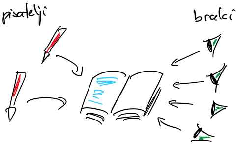

# Sinhronizacija

## Semaforji

- semafor (*angl.* semaphore) je struktura, podobna ključavnici
- za razliko od ključavnice, ki je binarna (odklenjena ali zaklenjena), je semafor števen, njegova vrednost je pozitivna ali enaka nič
- semafor pozna dve atomarni operaciji:
    - poskusi vstopiti: 
        - vstop je mogoč, če je vrednost semaforja večja od 0
        - ob vstopu se vrednost semaforja zmanjša za ena  
    - sprosti
        - vrednost semaforja se poveča za ena
- katerakoli gorutina lahko spreminja stanje semaforja
    - za razliko od semaforjev je priporočljivo, da gorutina, ki ključavnico zaklene, ključavnico tudi odklene
- semaforje lahko uporabimo za komunikacijo med nitmi/gorutinami v procesu ali za komunikacijo med procesi (jezik C)

## Bralno-pisalne ključavnice
- bralno-pisalno ključavnico (*angl.* reader-writer lock) lahko zaklenemo in odklenemo za branje ali za pisanje
- če jo zaklenemo za branje, lahko vstopi več gorutin z željo po branju, ne morejo pa vstopiti gorutine za pisanje
    - mnogo gorutin želi hkrati brati skupno spremenljivko
- če jo zaklenemo za pisanje, ne more vstopiti nobena druga gorutina
    - nobena gorutina ne sme dostopati do skupne spremenljivke medtem, ko ena gorutina vanjo piše
- primer uporabe: 
    - branje in pisanje datotek
    - metodi *get* in *set* pri dostopanju do lastnosti objektov

- primer: pisatelji in bralci

    

    - imamo več pisateljev, ki pišejo knjigo, in več bralcev, ki knjigo berejo
    - pisatelji ne smejo pisati med branjem in bralci ne smejo brati med pisanjem
    - piše lahko samo en pisatelj naenkrat
    - bere lahko več bralcev hkrati

    - [pisatelji-bralci-1.go](koda/pisatelji-bralci-1.go)
        - nobenega nadzora nad dostopom do knjige

    - [pisatelji-bralci-2.go](koda/pisatelji-bralci-2.go)
        - ključavnico `lockBook` lahko odklene ena, zaklene pa druga gorutina
        - običajno želimo, da jo zaklene in odklene ista gorutina (nit)
            - jezik C: če zaklepa ena, odklepa pa druga nit, obnašanje ni definirano
            - jezik go: 
                - dovoljuje, vendar potem prevajalnik ne zna zaznati smrtnega objema, ne more dobro optimizirati kode, ...
                - v jeziku go2 zaklepanje z eno in odklepanje z drugo goruitno verjetno ne bo več dovoljeno

    - [pisatelji-bralci-3.go](koda/pisatelji-bralci-3.go)      
        - boljša rešitev je z uporabo **semaforjev** (*angl.* semaphores)
            - za razliko od ključavnice, ki je binarna (odklenjena ali zaklenjena), je semafor števen, njegova vrednost je pozitivna ali enaka nič
            - semafor pozna dve atomarni operaciji:
                - poskusi vstopiti: 
                    - vstop je mogoč, če je vrednost semaforja večja od 0
                    - ob vstopu se vrednost semaforja zmanjša za ena  
                - sprosti
                    - vrednost semaforja se poveča za ena
            - v jeziku go lahko semafor enostavno naredimo s kanali

    - [pisatelji-bralci-4.go](koda/pisatelji-bralci-4.go)
        - uporabimo bralno-pisalno ključavnico
        - bralcev nam ni treba šteti
