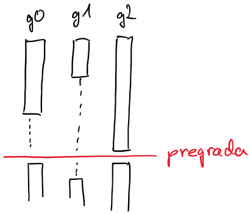
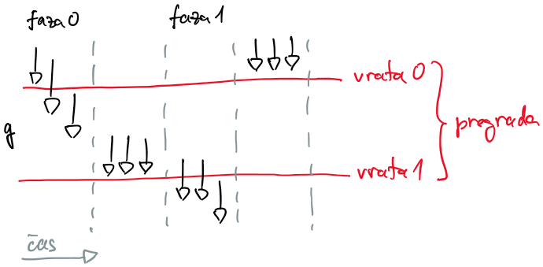

# Sinhronizacija

## Pogojne spremenljivke

- uporabimo jih za zaustavitev in ponovni zagon gorutin glede na stanje pripadajoče ključavnice

- delovanje
    - gorutina najprej zaklene ključavnico
    - ko pride do funkcije `Wait`, ključavnico sprosti in čaka na signal za nadaljevanje; pri tem se postavi na zadnje mesto v vrsti zaustavljenih gorutin
    - ko pogojna spremenljivka prejme signal, se gorutina zbudi, zaklene ključavnico in nadaljuje
        - s `Signal` zbudimo samo eno spečo nit
        - z `Broadcast` zbudimo vse speče niti
    - na koncu mora gorutina ključavnico sprostiti

- pogojne spremenljivke ne hranijo vrednosti; bolj gre za vrsto spečih gorutin, ki gredo v izvajanje ob izpolnjenem pogoju

- primer: pregrada (*angl.* barrier)
    - želimo, da se na neki točki vse gorutine počakajo in potem skupaj nadaljujejo

    

    - rešimo lahko z `wg.Add()`, `wg.Done()` in `wg.Wait()`, vendar vsakič ustvarjamo gorutine

    - [pregrada-1.go](koda/pregrada-1.go)
        - osnutek, brez nadzora

    - [pregrada-2.go](koda/pregrada-2.go)
        - štejemo gorutine, ki so že izvedele operacije v zanki
        - do težave pride ob ničenju števca - preden gorutina 0 postavi števec na 0, lahko druga gorutina že izvede naslednjo iteracijo in poveča števec, program se obesi
        - če ne bi imeli več obhodov zanka in s tem večkratne rabe iste pregrade, bi bila rešitev sprejemljiva

    - [pregrada-3.go](koda/pregrada-3.go)
        - pregrado si predstavljamo kot dvoja vrata
             - vrata 1 se odprejo šele, ko so vse gorutine šle skozi vrata 0 (faza 0)
             - vrata 0 se odprejo potem, ko so vse gorutine šle skozi vrata 1 (faza 1)
             - spremenljivki števec gorutin med vrati (`g`) in faza (`phase`)
             - jezik go zazna tvegana stanja

                        

    - [pregrada-4.go](koda/pregrada-4.go)
        - z zastavicama `phaseGlobal` in `phaseLocal` ločimo sode in lihe obhode zank
        - ob vstopu v pregrado vsaka gorutina obrne svojo zastavico
        - zadnja gorutina, ki vstopi v pregrado, obrne globalno zastavico in izniči števec
        - gorutina lahko pregrado zapusti šele, ko je lokalna zastavica enaka globalni
        - podobna rešitev kot zgoraj
        - jezik go zazna tvegana stanja
