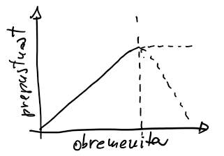
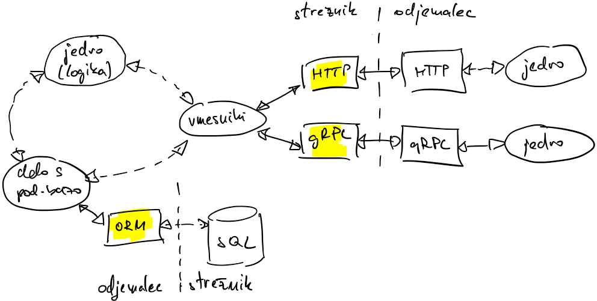
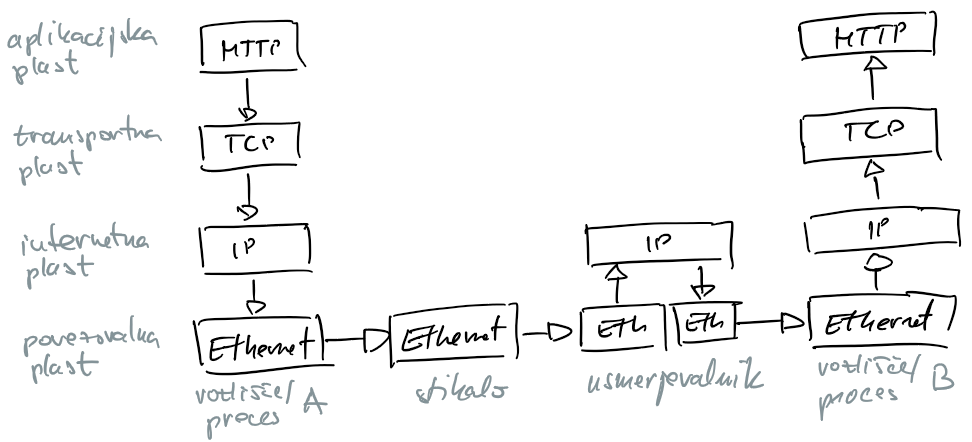
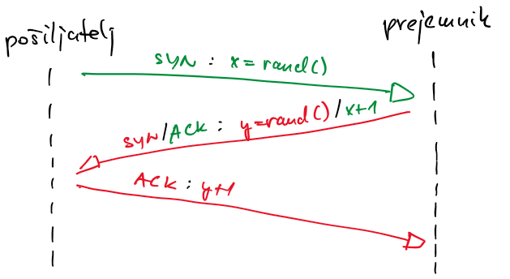
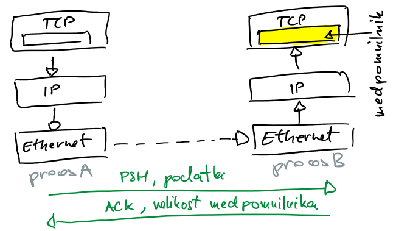

# Posredovanje sporočil

Porazdeljeni sistem je tisti, v katerem okvara računalnika, za katerega sploh niste vedeli, naredi vaš računalnik neuporaben.

-- <cite>Leslie Lamport</cite>

## Porazdeljeni sistem

- porazdeljeni sistem je skupina vozlišč, ki si prek komunikacijskih povezav izmenjujejo sporočila, da bi izvedla neko nalogo
- vozlišče je lahko fizični stroj (strežnik, telefon) ali programski proces (brskalnik)
- mnoge aplikacije so že po naravi porazdeljene
    - do spleta dostopamo preko brskalnika, ki teče na napravi; strežniki in naprave predstavljajo ogromen porazdeljeni sistem
    - ko pošiljamo sporočilo iz svojega telefona na prijateljičin telefon, sporočilo potuje preko neke vrste omrežja
- porazdeljeni sistem potrebujemo:
    - pri zagotavljanju visoke stopnje zanesljivosti
        - posamezno vozlišče je potrebno vsake toliko časa ponovno zagnati; če uporabljamo več vozlišč, bodo druga vozlišča prevzela njegove naloge; uporabnik ne bo opazil težave
        - kontrola zračnega prometa: 2oo3, sistem je odporen na izpad enega vozlišča
        - spletne shrambe
    - za obdelovanje poslov, ki so preveliki za eno, še tako zmogljivo, vozlišče
        - superračunalniki: procesorska moč, pomnilnik; CERN: milijoni procesorskih jeder, 1 EB pomnilnika ($10^{18}$), ...
        - spletni iskalniki: hitro morajo obdelati množico zahtev
    - za aplikacije z visokimi zahtevami glede zmogljivosti
        - ponudniki pretočnih vsebin: strežniki razpršeni po celem svetu, lokalni prenosi
### Izzivi pri gradnji porazdeljenega sistema
- obvladovanje napak
    - bolj kot je sistem kompleksen, večja verjetnost je, da gre kaj narobe
    - potrebujemo sistem za detekcijo napak na vozliščih in na omrežju
    - zaradi tega je obvladovanje sistemov s porazdeljenim pomnilnikom bistveno težje kot obvladovanje sistemov s skupnim pomnilnikom
- komunikacija
    - vozlišča morajo med seboj komunicirati preko omrežja (izpad omrežja, napake pri prenosu, prisluškovanje)
    - uporabljamo knjižnice, dobro se je zavedati, kaj se dogaja v ozadju (Arnesova gruča in omrežni datotečni sistem)
- usklajevanje (*angl.* coordination)
    - pri doseganju skupnega cilja je potrebno usklajevanje med vozlišči
    - to je še posebej težko, če v sistemu prihaja do napak
    - problem dveh generalov: generala (vozlišči) želita napasti mesto, komunicirata preko kurirjev, ki jih lahko zajame sovražnik (napaka v omrežju); ali se lahko uskladita glede časa napada? Na žalost potrjevanje ne pomaga
- raztegljivost (*angl.* scalability)
    - pomembno nam je, kako učinkovito se porazdeljeni sistem spopada z obremenitvami
    - obremenitev je vse, kar izrablja računalniške vire (procesorski čas, pomnilnik, pasovno širino)
    - obremenitev merimo na različne načine
        - število obdelanih poslov v časovni enoti, število hkratnih uporabnikov
    - odziv sistema opazujemo s količinami kot sta
        - prepustnost - količina obdelav v časovni enoti (količina prenesenih podatkov, število obdelanih poslov)
        - odzivni čas - čas, ki je potekel od pošiljanja sporočila do prejema odgovora
    - tipičen odziv: z večanjem obremenitve prepustnost narašča do točke, ko dosežemo kapaciteto sistema; z nadaljnjim povečevanjem obremenitve lahko prepustnost ne narašča več ali pa se sistem celo sesede 
    - učinkovitost porazdeljenega sistema je odvisna od arhitekture, izvedbe in fizičnih omejitev, kot so pomnilnik, frekvenca, pasovna širina, latenca
    - sistem je raztegljiv, kadar povečevanje obremenitve ne poslabša učinkovitosti aplikacije, na primer, ob veliki količini zahtev vzpostavimo dodatne strežnike
    
    
        
    - odpornost (*angl.* resilency)
        - porazdeljeni sistem je odporen, če lahko nadaljuje z delom tudi ko pride do napake (odpoved vozlišča, napake na omrežju)
        - ne glede na to, kako majhna je verjetnost za napako, večji kot je porazdeljeni sistem, večja je verjetnost, da bo do napake prišlo
        - dostopnost sistema je delež časa, ko je sistem na voljo; običajno se meri s številom devetic (99.99 %)        
    - vzdrževanje
        - običajno je vzdrževanje dražje od same vzpostavitve sistema
        - dobre prakse: pisanje testov enot, velika stopnja parametrizacije, DevOps (načrtovanje, izvedba, testiranje in nadzor delovanja)
    
### Zgradba porazdeljenega sistema
- z vidika strojne opreme je porazdeljeni sistem skupina naprav, ki komunicira preko omrežja
- z gledišča izvajanja je porazdeljeni sistem skupina procesov, ki med seboj komunicirajo preko mehanizmov za medprocesorsko komunikacijo (*angl.* inter process communication, IPC), na primer TCP, HTTP)
- s stališča razvoja programske opreme gre za skupino šibko povezanih storitev, ki komunicirajo preko programskih vmesnikov (*angl.* adapters), na primer RPC (*angl.* remote procedure call)
    - strežnik je proces, ki ponuja storitev ostalim procesom
    - odjemalec je proces, ki pošilja zahteve strežniku
    - proces je lahko hkrati odjemalec in strežnik

## Komunikacijski sklad

- komunikacija preko omrežij naredi sistem porazdeljen
- da procesi lahko komunicirajo, morajo slediti množici pravil (način komunikacije, zapis podatkov, obdelava podatkov)
- pravila določajo protokoli na več plasteh; nižje plasti so bližje strojni opremi
- prenos podatkov na pošiljatelju poteka od višje plasti proti nižji, na strani sprejemnika pa od nižje proti višji plasti
    - povezovalna plast vključuje lokalne omrežne protokole (Ethernet); naprave na tej plasti so stikala
    - internetna plast s protokolom IP (*angl.* internet protocol) skrbi za usmerjanje paketov podatkov v omrežju; paketi se lahko izgubijo, podvojijo, pokvarijo, ne prihajajo v pravem vrstnem redu; naprave na tej plasti so usmerjevalniki
    - transportna plast s protokolom TCP (*angl.* transmission control protocol) skrbi za zanesljiv prenos podatkov med dvema procesoma (ni izgube paketov, podvajanja, napak); da imamo na istem vozlišču lahko več aktivnih procesov, vsakemu procesu dodelimo vrata (*angl.* port); vrata predstavljajo logično oznako procesa v omrežju
    - aplikacijska plast s protokoli kot sta HTTP, DNS (*angl.* domain name server) je tista, ki jo najpogosteje uporabljamo
- višje plasti so kompleksnejše vendar uporabljajo bolj zanesljive protokole
    - TCP nadgrajuje IP
    - TLS (*angl.* transport layer security) med transportno in aplikacijsko plastjo nadgrajuje TCP

    

## Zanesljiv prenos podatkov (TCP)

- prenos paketa podatkov od pošiljatelja do sprejemnika lahko poteka čez množico usmerjevalnikov 
- za pravilno dostavo paketa rabimo naslove vozlišč (IPv4 $2^{32}$ in IPv6 $2^{128}$) in usmerjevalne tabele
- protokol TCP podatkovni tok razbije na množico paketov (*angl.* segmentov)
- protokol TCP nadgrajuje protokol IP z zagotavljanjem zanesljivosti prenosa paketov: zagotavlja vrstni red paketov, ni manjkajočih in podvojenih paketov, v paketih ni napak, preprečuje preobremenitev omrežja
    - sprejemnik mora vsak paket potrditi; če ga ne, ga bo, po preteku dovoljenega časa za prenos, pošiljatelj še enkrat poslal
    - vsak paket ima kontrolno vsoto za preverjanje pravilnosti vsebine paketa
    - paketi so oštevilčeni, lahko ugotovimo, da gre za podvojeni paket, ki ga ignoriramo
    - sprejemnik sporoča koliko prostora ima še v medpomnilniku
- mehanizem vtičnic (*angl.* socket)
    - vtičnica je vmesnik med transportno in aplikacijsko plastjo
    - vključuje naslov vozlišča, vrata in protokol
    - strežnik in odjemalec pripravita vsak svojo vtičnico; odjemalec se ob vzpostavljanju povezave poskuša povezati na strežnikovo

### Povezava med strežnikom in odjemalcem
- strežnik pripravi vtičnico in pasivno čaka na odjemalca, da se poveže
- odjemalec pripravi vtičnico in aktivno dela na vzpostavitvi povezave
- povezava je dvosmerna: strežnik lahko pošilja podatke odjemalcu, odjemalec pa strežniku
- po vzpostavljeni povezavi sta odjemalec in strežnik enakovredna
    - vsak lahko pošilja in prejema podatke
    - strežnik imenujemo tudi pasivni partner, odjemalca pa aktivni partner
- odpiranje povezave       
    - tristopenjsko rokovanje: pošiljatelj pošlje naključno število (paket SYN), prejemnik ga poveča in pošlje svoje število (paket SYN/ACK), pošiljatelj poveča prejemnikovo število (paket ACK)
    
        

    - hitrejši kot je odzivni čas (bližje kot so vozlišča), prej bo povezava vzpostavljena in se bo začel prenos podatkov

- povezava vzpostavljena
    - nadzor pretoka            
        - je mehanizem, s katerim protokol TCP preprečuje, da bi preobremenil prejemnika
        - pošiljatelj pošlje sporočilo (PSH)
        - na strani prejemnika se paketi shranijo v bralni medpomnilnik
        - prejemnik ob vsaki potrditvi paketa (ACK) pošiljatelju sporoča količino prostega medpomnilnika

            
    
    - nadzor zasičenosti omrežja
        - okno zasičenosti (*angl.* congestion window) predstavlja število paketov, ki jih pošiljatelj pošilja, ne da bi prejel potrditev
        - ob vzpostavitvi povezave je okno nastavljeno na privzeto vrednost; ob vsakem potrjenem paketu se eksponentno povečuje do zgornje meje; v primeru izgubljenih paketov se zmanjšuje do spodnje meje
        - večje kot je okno, večja je prepustnost omrežja
        - krajši kot je odzivni čas (od pošiljanja do prejema potrditve), večja je prepustnost omrežja

- zapiranje povezave
    - ko je prenos podatkov končan, povezavo zapremo, da sprostimo vire
    - zapiranje je spet večstopenjsko rokovanje, ki vzame svoj čas
    - če bomo povezavo kmalu ponovno rabili, je raje ne zapremo
    - povezava se ne zapre hipoma - sistem še nekaj minut čaka na pakete, ki so morda še na poti
    - pogosto odpiranje in zapiranje povezav lahko privede do tega, da imamo odprto maksimalno število hkratnih povezav in začne vozlišče zavračati nove povezave

### Primeri komunikacije TCP

- [posredovanje nizov](koda/tcp-nizi/tcp-nizi.go) ([strežnik](koda/tcp-nizi/streznik.go) in [odjemalec](koda/tcp-nizi/odjemalec.go))
    - strežnik
        - določimo protokol TCP in vrata, na katerih strežnik posluša (`listener`)
        - v neskončni zanki čakamo na vzpostavitev povezave (`connection`)
        - vsako povezavo obdelamo v svoji gorutini
            - preberemo izbrano količino bajtov, izluščimo sporočilo in ga obdelamo
            - po obdelavi povezavo zapremo
        - na ta način omogočimo streženje več odjemalcem hkrati
    - odjemalec
        - pokliče strežnik na ustreznem naslovu URL (*angl.* unified resource locator) in vratih
        - pošlje sporočilo
        - na isti povezavi čaka na povratno sporočilo
- [posredovanje struktur](koda/tcp-strukture/tcp-strukture.go) ([strežnik](koda/tcp-strukture/streznik.go) in [odjemalec](koda/tcp-strukture/odjemalec.go))
    - jezik go ponuja paket `gob`, s katerim podatke, shranjene v programskih strukturah jezika go, elegantno pripravimo za prenos preko omrežja (*angl.* encode, serialize, marshall) in jih na drugi strani spet elegantno pretvorimo nazaj v programske strukture  (*angl.* decode, deserialize, unmarshall)

## Nezanesljiv prenos podatkov (UDP)

- s protokolom TCP pridobimo na zanesljivosti prenosov na račun manjše prepustnosti
- kadar zanesljivosti ne potrebujemo, raje uporabimo protokol UDP (*angl.* user datagram protocol)
- protokol UDP uporablja vrata, pri njem ne vzpostavljamo povezav
- gre za precej osnoven protokol, ki omogoča hiter prenos podatkov
    - ne zna sam razdeliti podatkovnega toka na pakete, ampak lahko pošilja samo podatkovne pakete omejene dolžine ali datagrame
    - ne pozna potrjevanja, zato datagrami niso oštevilčeni
    - ne nadzoruje pretoka in zasičenosti omrežja
- uporaba
    - računalniške igre za več igralcev v realnem času: zanima nas trenutno stanje; pakete, ki niso prispeli, zavržemo
    - ponudniki pretočnih vsebin
    - protokol NTP (*angl.* network time protocol) na vratih 123, s katerim vozlišča usklajujejo uro

## Varnost v omrežjih

- protokol TCP podatke pošilja nekodirane, vsak posrednik lahko izlušči vsebino komunikacije
- nadgradnja protokola TCP je TLS (*angl.* transport layer security), ki vključuje
    - varnostno kodiranje (*angl.* encription)
        - zagotavlja, da vsebino lahko prebere samo prejemnik
        - ob vzpostavitvi povezave TLS strežnik in odjemalec uporabita nesimetrično varnostno kodiranje z javnimi in zasebnimi ključi in se dogovorita za simetrični ključ
        - prenos podatkov poteka s simetričnimi kriptografskimi metodami, ki so znatno hitrejše
        - simetrični ključ med povezavo redno spreminjata
    - overovitev (*angl.* authentication)
        - strežnik in odjemalec se želita prepričati, da je na drugi strani pravi sogovornik
        - certifikati, s katerimi lahko overimo sogovornika, vključujejo javni ključ, obdobje veljavnosti, podatke o izdajatelju (*angl.* certification authority, CA)
            - sogovornikov certifikat si moramo namestiti z orodji operacijskega sistema
            - odjemalec pri vzpostavljanju povezave TLS pošlje certifikat; strežnik povezavo potrdi, če ima certifikat nameščen
            - paziti moramo, da certifikat ne poteče (marsikatera spletna stran ima s tem težave)
    - integriteto
        - sporočila so opremljena z zgoščeno vrednostjo (*angl.* hash), da prejemnik lahko preveri, če je prišlo do napake pri prenosu (TCP ni 100 % zanesljiv, algoritem CRC) ali do zlonamernega spreminjanja vsebine
