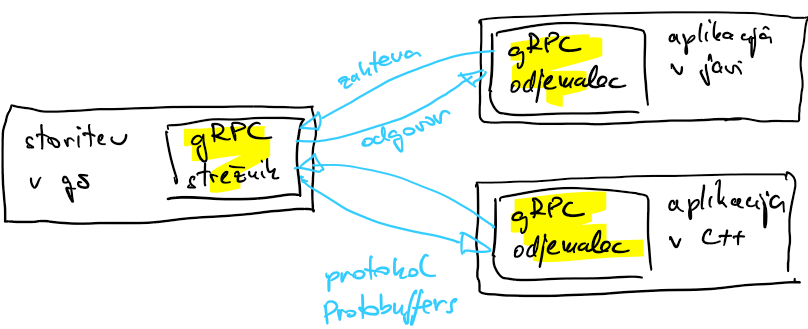
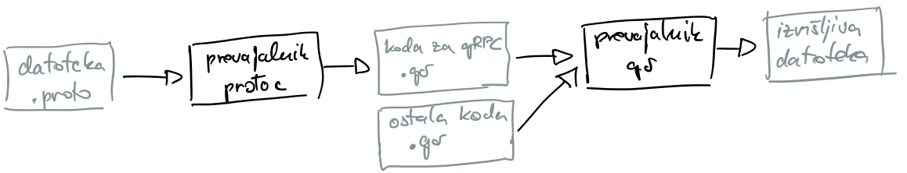

# Posredovanje sporočil

## Programski vmesniki

### Operacije CRUD

- akronim CRUD (*angl.* create, read, update, delete) se nanaša na štiri osnovne operacije na podatkovnih shrambah: ustvarjanje, branje, posodabljanje in brisanje zapisov
- paket [`storage`](koda/storage/storage.go) predstavlja enostaven primer shrambe
    - osnova je slovar `TodoStorage` za shranjevanje nalog `Todo`
    - vključuje funkcijo `NewTodoStorage`, ki shrambo ustvari
    - jezik go ni objekten, pozna pa metode, ki jih lahko dodajamo strukturam 
    - metodo definiramo podobno kot funkcijo, le da za ključno besedo `func` napišemo strukturo ali kazalec nanjo
        ```go
        func (tds *TodoStorage) Create(todo *Todo, ret *struct{}) error {
            ...
        }
        ```
    - paket vključuje štiri metode: `Create`, `Read`, `Update` in `Delete`
- osnovno uporabo shrambe prikazuje program [`uporaba.go`](koda/storage/uporaba/uporaba.go)
    - shrambo najprej ustvarimo
        ```go
        store := storage.NewTodoStorage()
        ```
    - nato pa na spremenljivki `store` kličemo želene metode, na primer
        ```go
        lecturesCreate := storage.Todo{Task: "predavanja", Completed: false}
        err := store.Create(&lecturesCreate, &reply)
        ```
- v nadaljevanju bo shramba `TodoStore` tekla na strežniku, odjemalci pa bodo dostopali do nje preko programskih vmesnikov
- zato, da je gradnja vmesnikov sploh mogoča, je pri načrtovanju shrambe potrebno upoštevati določena pravila
    - jezik go v programski vmesnik za komunikacijo med procesi RPC vključi samo metode, ki imajo dva argumenta (vhodni argument in kazalec na odgovor) in vračajo tip `error`
        ```go
        func (t *T) ImeMetode(argument T1, odgovor *T2) error
        ```
    - za programski vmesnik HTTP (Restful), moramo ob strukturi podati preslikavo v format JSON (*angl.* javascript object notation)
        ```go
        type Todo struct {
    	    Task      string `json:"task"`
    	    Completed bool   `json:"completed"`
        }
        ```

### Namen programskega vmesnika

- želimo sistem, v katerem odjemalec kliče operacije (funkcije, procedure, metode), ki jih ponuja strežnik
- strežnik operacije ponuja preko programskega vmesnika (*angl.* application programming interface)
- vmesnik skrbi za prevajanje sporočil, prejetih iz omrežja, v klice funkcij in metod na strežniku
- komunikacija je lahko 
    - neposredna: odjemalec in strežnik komunicirata neposredno; v tem primeru morata biti aktivna oba
    - posredna: odjemalec in strežnik komunicirata preko posrednika; smiselno, če ne moremo zagotoviti neposredne komunikacije; odjemalec ima več avtonomije, počasnejša komunikacija
- zahteva in odgovor morata biti standardizirana (tekstovna XML in JSON, binarni Protocol Buffers)
- komunikacija je lahko 
    - sinhrona: odjemalec blokira, dokler strežnik ne odgovori; zaradi čakanja na odgovor je neučinkovita
    - asinhrona: odjemalec nadaljuje izvajanje kode, ko prispe odgovor se izvede povratni klic (*angl.* callback); v jeziku go to dosežemo z gorutinami, mnogi drugi jeziki (javascript, C#) poznajo ključne besede kot sta async/await
- želimo si, da so metode idempotentne
    - metoda je idempotentna, če se v shrambi nič ne spremeni, ko jo izvedemo dvakrat zapored
    - do dveh zaporednih izvajanj lahko pride zaradi težav z dosegljivostjo strežnika (ob izpadu omrežja ali samega strežnika odjemalec ponovi zahtevo)
- danes pogosto uporabljane tehnologije za komunikacijo med procesi
    - RPC (*angl.* remote procedure call): za interno komunikacijo med procesi, napisanimi v istem programskem jeziku
    - gRPC: postaja nov standard, uporablja HTTP/2, zaradi binarnega zapisovanja (Protocol Buffers) je hitrejši od HTTP/1.1
    - HTTP: najbolj uporabljana tehnologija za javne strežnike, podpirajo jo vsi brskalniki preko kode javascript, HTTP/1.1

### RPC
- vzorec RPC (*angl.* remote procedure call) 

- vzorec klicanja oddaljenih metod; programer oddaljene metode kliče na podoben način kot lokalne
    - strežnik nudi storitve v obliki metod, ki jih je mogoče klicati oddaljeno
    - odjemalec lahko pokliče metodo na strežniku, kot bi šlo za lokalni klic
    - metoda vključuje argumente (vhod in izhod)
    - koda posamezne metode se dejansko izvede na strežniku 
    - na odjemalcu kličemo metode na enak način kot na strežniku, le da metoda na odjemalcu (*angl.* stub) vključuje le mehanizme za klic metode na strežniku
        - metoda na odjemalcu vključuje kodiranje (*angl.* marshalling), prenos argumentov na strežnik in zahtevo za izvajanje
        - metoda na strežniku argumente dekodira (*angl.* unmarshalling) in zažene metodo z dekodiranimi argumenti; rezultate izvajanja kodira in pošlje nazaj odjemalcu
        - metoda na odjemalcu dekodira sporočilo, ga zapiše v zahtevane strukture in vrne kot rezultat
    - za razliko od metod, ki se dejansko izvajajo na odjemalcu, pride pri izvajanju na strežniku lahko do napak: pri prenosu argumentov, med izvajanjem, pri prenosu rezultatov
        - kje se je zataknilo, kako se odzvati (ponoven prenos, koliko časa čakati, ...)

- zgodovinski razvoj
    - SunRPC, osnova za porazdeljene podatkovne sisteme, 1980
    - CORBA (*angl.* common object request broker architecture), 1990
    - Microsoft DCOM (*angl.* distributed component object model), 1996
    - Java RMI (*angl. remote method invocation), 1997
    - SOAP (*angl.* simple object access protocol), običajno v navezi z XML (*angl.* extended markup language), 1998
    - AJAX (*angl.* asynchronous javascript and XML), 1999
    - REST (*angl.* representational state transfer), v navezi z JSON (*angl.* javascript object notation), 2000
    - Google gRPC (*.angl.* generic remote procedure call), 2015

- paket `rpc` omogoča objavo in dostop do oddaljenih metod preko omrežja
    - za serializacijo podatkov uporablja interni protokol jezika go - [gob](https://pkg.go.dev/encoding/gob)
    - na strežniku prijavimo metode, ki so potem vidne kot storitev
    - po prijavi so metode dostopne na daljavo
    - na strežniku imamo lahko hkrati prijavljenih več metod različnih struktur

- za oddaljeni dostop so na voljo samo metode, ki zadoščajo naslednjim kriterijem
    - metoda je javna (*angl.* exported, se začne z veliko črko)
    - metoda ima dva argumenta, drugi je kazalec
    - metoda vrača podatkovni tip `error`
    ```go
    func (t *T) ImeMetode(argument T1, odgovor *T2) error
    ```
    - podatkovni tip T1 predstavlja argument, ki ga posreduje odjemalec; T2 predstavlja odgovore, ki jih strežnik posreduje odjemalcu
    - vrnjena vrednost (`error`) se posreduje nazaj kot niz z opisom napake, ki se prevede v tip `error`
    - strukture T, T1 in T2 so serializirane s paketom `encoding/gob`
- [primer RPC](koda/rpc/rpc.go) ([strežnik](koda/rpc/streznik.go) in [odjemalec](koda/rpc/odjemalec.go))
    - izmenjava poteka po protokolu TCP ali HTTP
        - s protokolom HTTP dobimo podporo za overovitev: začetna izmenjava poteka po protokolu HTTP, naprej sledijo enaki paketi kot pri TCP
    - strežnik
        - prijavi metode za RPC
        - vzpostavi vtičnico (`listener`), na kateri čaka na povezavo
        - streže zahteve z `Accept` (TCP) ali `Serve` (HTTP)
    - odjemalec
        - se poveže na strežnik
        - preko metode `client.Call` kliče metode na strežniku sinhrono (koraki 1 do 6)
        - preko metode `client.Go` kliče metode na strežniku asinhrono (korak 7)

### gRPC
- [gRPC](https://grpc.io/)
- vzorec klicanja oddaljenih metod, tako kot RPC
- Google ga je zasnoval za učinkovit prenos podatkov med mikrostoritvami
- moderni pristopi uporabljajo jezike za opis vmesnika (*angl.* interface definition language, IDL)
- za kodiranje podatkov uporablja binarni protokol [Protocol Buffers](https://protobuf.dev/)
- za prenos podatkov uporablja protokol HTTP/2, možnost overovitve pošiljatelja
- omogoča dvosmerni tok podatkov, majhna latenca, velika pasovna širina
- primeren za kompleksne programske vmesnike
- za razliko od RPC, ki je omejen samo na jezik go, lahko gRPC uporabljamo v množici podprtih programskih jezikov

    

#### Protocol Buffers
- gRPC privzeto uporablja protokol [Protocol Buffers](https://protobuf.dev/overview) za kodiranje (*angl.* marshalling) strukturiranih podatkov
    - pripravimo opisno datoteko, ki vključuje strukture in metode
    - prevajalnik `protoc` nam iz opisne datoteke pripravi paket, s katerim elegantno izvajamo klice metod na strežniku
        - podrobnosti o namestitvi paketa najdete v komentarju k datoteki [protobufStorage.proto](koda/grpc/protobufStorage/protobufStorage.proto)
    - paket prevedemo skupaj z našo kodo
    - prevedeni paket ali izvršljivo datoteko uporabljamo za izvajanje klicev oddaljenih metod

        

- primer: opisna datoteka za shrambo [protobufStorage.proto](koda/grpc/protobufStorage/protobufStorage.proto)
    - podamo ime paketa
    - podamo strukture in podatkovne tipe; vsaki spremenljivki priredimo številko; številke znotraj iste strukture morajo biti različne
    - definiramo storitev (v našem primeru `CRUD˙) ter metode z argumenti in vrednostmi, ki jih vračajo
    - če prevajalnik `protoc` zaženemo s stikali
        ```bash
        srun protoc --go_out=. --go_opt=paths=source_relative --go-grpc_out= --go-grpc_opt=paths=source_relative protobufStorage.proto
        ```
        nam kar v isti mapi pripravi paket za go, v našem primeru `main/grpc/protobufStorage`, ki vključuje dve datoteki [protobufStorage.pb.go](koda/grpc/protobufStorage/protobufStorage.pb.go) in [protobufStorage_grpc.pb.go](koda/grpc/protobufStorage/protobufStorage_grpc.pb.go)
    - paket, ki ga tvorita ti dve datoteki, uporabimo pri pisanju strežnika in odjemalca

#### Strežnik in odjemalec
- [primer gRPC](koda/grpc/grpc.go) ([strežnik](koda/grpc/streznik.go) in [odjemalec](koda/grpc/odjemalec.go))
    - strežnik 
        - pripravimo strukturo in metode, pri tem izhajamo iz predloge (`protobufStorage.UnimplementedCRUDServer`)
        - v strukturo dodamo potrebne elemente
        - pripravimo kodo za vse metode, ki jih strežnik podpira
            - vsaka metoda vključuje izvajalno okolje (*angl.* context), vhodne argumente in vrnjene vrednosti (kazalec na strukturo in napako)
            - primer
                ```go
                func (s *server) Create(ctx context.Context, in *protobufStorage.Todo) (*emptypb.Empty, error) {
                    ...
                }
                ```
            - izvajalno okolje skrbi za nadzorovano izvajanje gorutin (gorutine si lahko izmenjujejo informacije o globalnem stanju aplikacije, na primer, lahko jih prekličemo zaradi časovne omejitve)
        - na strežniku prijavimo metode gRPC in zaženemo strežnik gRPC
    - odjemalec 
        - se povežemo na strežnik s potrebnimi pravicami
        - vzpostavimo izvajalno okolje
            ```go
            contextCRUD, cancel := context.WithTimeout(context.Background(), time.Second)
            ```
        - vzpostavimo vmesnik gRPC, 
            ```go
            grpcClient := protobufStorage.NewCRUDClient(conn)
            ```
        - kličemo oddaljene metode, kot bi bile na voljo lokalno
            ```go
            _, err := grpcClient.Create(contextCRUD, &lecturesCreate)
            ```

### REST
- REST (*angl.* representational state transfer) so priljubljena načela za oblikovanje elegantnih in raztegljivih programskih vmesnikov za protokole HTTP
- programske vmesnike, zgrajene po teh načelih, imenujemo RESTful
- glavna načela:
    - obdelave nimajo stanja, zato vsaka zahteva vsebuje vse potrebne informacije za obdelavo
    - odzivi so označeni ali jih je dovoljeno predpomniti ali ne; če je odziv predpomnjen, lahko odjemalec ob kasnejši enaki zahtevi uporabi odgovor v predpomnilniku 
- za razliko od RPC in gRPC, ki omogočata dvosmerno komunikacijo, REST uporablja koncept zahteva-odgovor 
- za kodiranje podatkov pred prenosom (*angl.* marshalling) uporablja tekstovni protokol XML ali JSON
- primeren za enostavne programske vmesnike
- omejitve
    - za hitrejšo komunikacijo s strežnikom HTTP/1.1 ohranja povezavo s strežnikom odprto
    - novega zahtevka ni mogoče izdati, dokler odjemalec ne prejme odgovora na prejšnjega
    - zahteve je treba pošiljati zaporedno (zaporeden prenos slik na spletni strani) 
    - izboljšave s HTTP/2 (binarni protokol, multipleksiranje povezav), HTTP/3 lasten protokol nad UDP
- zahteva in odgovor
    - lokacijo vira podamo z URL (*angl.* unified resource locator), na primer `http://localhost:9876/todos?task=predavanja`; vir je naveden za znakom `/`, neobvezen filter pa za znakom `?`
    - odjemalec v glavi zahteve med drugim poda želeni format, na primer `application/json`
    - strežnik odgovori s sporočilom
        - v glavi so osnovne informacije: format zapisa, koda odgovora (200 - 299: uspešno, 300 - 499: neuspešno, 500 -: kode aplikacije na strežniku)
        - v telesu se nahaja vsebina
- najpogosteje uporabljane metode REST so POST (pisanje), GET (branje), PUT (posodabljanje) in DELETE (brisanje)
    - določene metode lahko predpomnimo (GET)
    - določene metode so idempotentne (GET, PUT, DELETE)
    - tudi POST je lahko idempotenten - transakcija na strežniku: preverjanje obstoja ključa in vpisovanje
- [primer HTTP REST](koda/rest/rest.go) ([strežnik](koda/rest/streznik.go) in [odjemalec](koda/rest/odjemalec.go))
    - strežnik
        - pripravimo shrambo
        - ustvarimo multiplekser za izbiranje rokovalnika, ki bo izvedel zahtevo za izbrani vir
            - dve opciji: prikaz osnovne spletne strani (`/`) ali klic metode (`/todos`, `/todos/`)
            - rokovalnik mora vključevati metodo `ServeHTTP` z dvema argumentoma: prvi predstavlja odgovor, drugi pa zahtevo
                ```go
                func (tdh *TodosHandler) ServeHTTP(w http.ResponseWriter, r *http.Request) {
                ```
            - glede na tip zahteve se izvede ustrezna operacija na shrambi
            - ob zaključeni operaciji strežnik vrne ustrezno pripravljen odgovor
        - zaženemo strežnik
    - odjemalec `curl`
        - za primere glej komentar na vrhu datoteke [streznik.go](koda/rest/streznik/streznik.go)
    - odjemalec v jeziku go:
        - zahteve ustvarjamo s funkcijami iz paketa `net/http`: `Post`, `Get`, `NewRequest/Do`
        - pri vsaki zahtevi pravilno nastavimo naslov storitve (URL)
