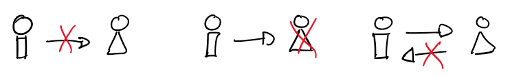
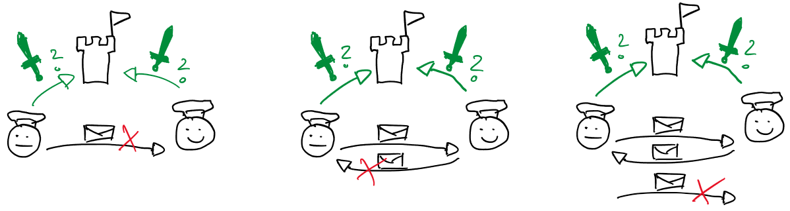
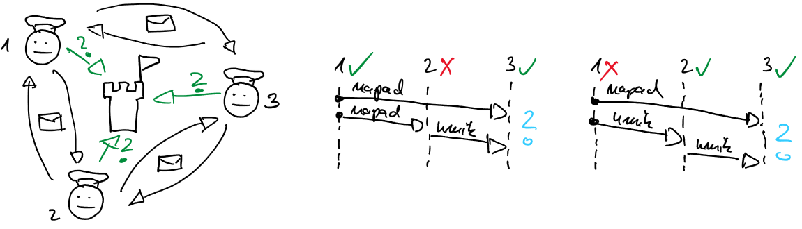

# Modeli porazdeljenih sistemov

- z modelom podamo pričakovanja o obnašanju sistema
- ključni elementi obnašanja sistema so povezave v omrežju, obnašanje procesov in čas
- povezave so lahko točka-točka (*angl.* point-to-point) ali eden-vsem, razširjanje (*angl.* broadcast), pri modeliranju se lahko omejimo na točka-točka

- modeli povezav v omrežju
    - povezava s sprejemljivimi izgubami (*angl.* fair-loss link) predpostavlja, da se sporočila lahko izgubijo in podvajajo; če pošiljatelj sporočilo pošilja neprestano, bo to prej ali slej prišlo do prejemnika (UDP)
    - zanesljiva povezava (*angl.* reliable link) predpostavlja, da je sporočilo dostavljeno točno enkrat, brez izgube ali podvajanja; zanesljivo povezavo dobimo, če pri povezavi s sprejemljivimi izgubami razrešimo podvajanje sporočil na sprejemni strani (TCP)
    - overovljena zanesljiva povezava (*angl.* authenticated reliable link) je zanesljiva povezava nadgrajena z mehanizmi za overovitev pošiljatelja (TLS)

- modeli obnašanja procesov
    - bizantinski model ali proces z napako (*angl.* arbitrary fault) predpostavlja, da lahko proces na nek način odstopa od algoritma; nepričakovano obnašanje zaradi hroščev, napak ali zlonamerih posegov; kljub napačnemu obnašanju do 1/3 procesov sistem še vedno lahko deluje pravilno (2oo3)
    - obnovljivi proces (*angl.* crash-recovery) predpostavlja, da proces ne odstopa od algoritma, ampak se lahko kadar koli zruši in ponovno zažene, pri čemer izgubi stanje pomnilnika
    - neobnovljivi proces (*angl.* crash-stop) predpostavlja, da proces ne odstopa od algoritma, vendar se ob sesutju ne vzpostavi nazaj; primeren za modeliranje napak strojne opreme

- modeliranje časa
    - sinhroni model predpostavlja, da se posredovanje sporočila vedno zaključi v danem časovnem okviru; ni preveč realističen za porazdeljene sisteme (preobremenjenost omrežja, sproščanje pomnilnika, razvrščanje niti)
    - asinhroni model predpostavlja, da posredovanje sporočila ali izvajanje procesa traja neomejen čas; algoritmi, zgrajeni na tem modelu, so zelo robustni; mnogih problemov ni mogoče rešiti ob tej predpostavki
    - delno sinhroni model predpostavlja, da se sistem obnaša večino časa obnaša sinhrono; najprimernejši za modeliranje porazdeljenih sistemov

- v nadaljevanju bomo predpostavili da imamo povezave s sprejemljivimi izgubami, obnovljive procese in delno sinhrono obnašanje

## Zaznavanje napak

- pri posredovanju sporočila se lahko zgodi troje: sporočilo ne prispe do prejemnika, prejemnik ga ne obdela, potrditev ne pride do pošiljatelja

    

- rešitve: 
    - v najslabšem primeru bo pošiljatelj čakal v nedogled
    - pošiljatelj po določenem času ugotovi, da prejemnik ni dostopen: zaključi z napako ali ponovi posredovanje sporočila; koliko časa čakati?

- dostopnost sistema
    - 24/7
    - štiri devetke: 0,9999, 53 minut/leto (moderna omrežja)
    - pet devetk: 0,99999, 5,3 minute/leto (klasične telefonske centrale)
    - kdaj sistem ni dostopen, določa pogodba o storitvi, *angl.* service level agreement, SLA
        - je sprejemljivo, da brskalnik spletno stran nalaga pol minute ali pet minut

- robustni sistemi (sistemi odporni na napake)
    - robusten sistem je načrtovan tako, da deluje kljub določenim odpovedim
        - porazdeljeni datotečni sistemi, NAS
    - izogibanje posameznim točkam odpovedi (*angl.* single point of failure)
        - če imamo eno stikalo, nam nič ne pomaga pet vozlišč, povezanih nanj
        - internet se ne bo ustavil, če izpade posamezno vozlišče ali usmerjevalnik
    - prvi korak je detekcija možnih napak

- detekcija napak v porazdeljenem sistemu
    - za procese, ki komunicirajo redkeje, je dovolj, da težavo zaznamo ob pošiljanju sporočila
    - za procese, ki pogosto komunicirajo, povezavo raje neprestano preverjamo
        - pošiljanje periodičnih zahtev in potrjevanje (*angl.* ping); te pošiljamo tudi potem, ko sprejemnik ni dostopen; na ta način ugotovimo, kdaj je spet na voljo
        - srčni utrip (*angl.* heartbeat) pošilja vsaka stran posebej; ko signala dlje časa ne dobimo, sklepamo, da je povezava padla
    - idealni detektor napak obstaja za procese z zaustavitvijo in sinhronim obnašanjem
    - za bizantinske procese z delno sinhronim obnašanjem idealnega detektorja napak ni

## Problem dveh generalov

- generala vodita vsak svojo vojsko, rada bi zavzela mesto
- če mesto napade en sam general, bo poražen
- če napadeta hkrati, bo mesto padlo
- informacije o napadu si izmenjujeta preko kurirjev
    - prvi general pošlje kurirja
    - kurir lahko pride do drugega generala ali pa ga ujamejo
    - drugi general mora preko kurirja potrditi, da je prejel obvestilo
    - kurir lahko pride do prvega generala ali pa ga ujamejo
    - kako bo drugi general vedel, da je prvi dobil potrdilo in da bo napadel

    

- strategija generalov
    - napade v vsakem primeru, lahko bo poražen
    - lahko čaka na potrditev; ne glede na število izmenjav general nikoli ne bo prepričan, da bo prišlo do usklajenega napada; več kot je izmenjav, bolj verjeten je usklajen napad

- v porazdeljenem sistemu noben proces ne more vedeti stanja drugega procesa brez izmenjevanja sporočil

- realni problem: spletna trgovina in banka
    - komunicirata preko RPC, kakšno sporočilo se lahko izgubi
    - spletna trgovina bo kupčevo kartico bremenila, ko so izdelki poslani
    - problem je rešljiv, ker spletna trgovina ob neuspešnem pošiljanju lahko vrne denar

## Problem Bizantinskih generalov

- imamo tri ali več generalov s svojim vojskami
- tokrat kurirji zanesljivo prenesejo sporočilo
- nekateri generali so lahko izdajalci in zavajajo ostale generale
- pošteni generali ne vejo, kdo so izdajalci, izdajalci lahko sodelujejo
- pošteni generali se morajo dogovoriti za usklajen napad

    

- problem je rešljiv, če je manj kot tretjina generalov izdajalcev
- stvari se poenostavijo, če lahko sporočila kodirajo

- realni problem: zaupanje
    - kupec mora zaupati spletni trgovini
    - spletna trgovina zaupa banki
    - banka mora zaupati spletni trgovini (da ne posluje z ukradenimi karticami)
    - spletna trgovina mora privzeti, da so kupci goljufivi (če jim pošlje izdelke pred plačilom, bodo to lahko izkoristili)
    - na koncu se morajo vsi trije sporazumeti, da uspešno izvedejo naročilo