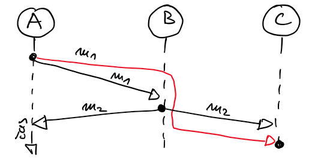
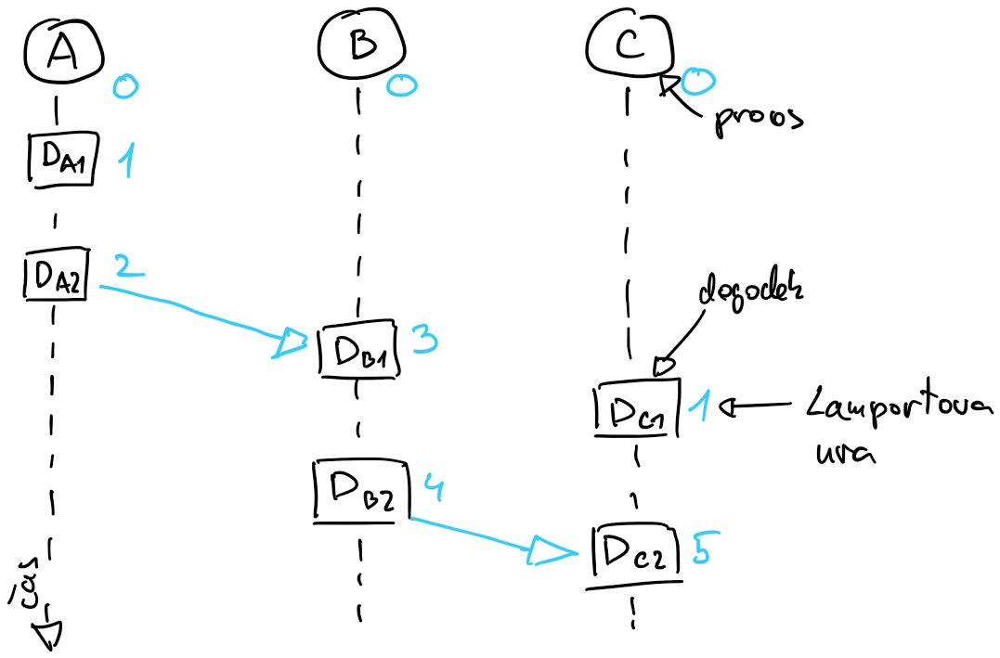
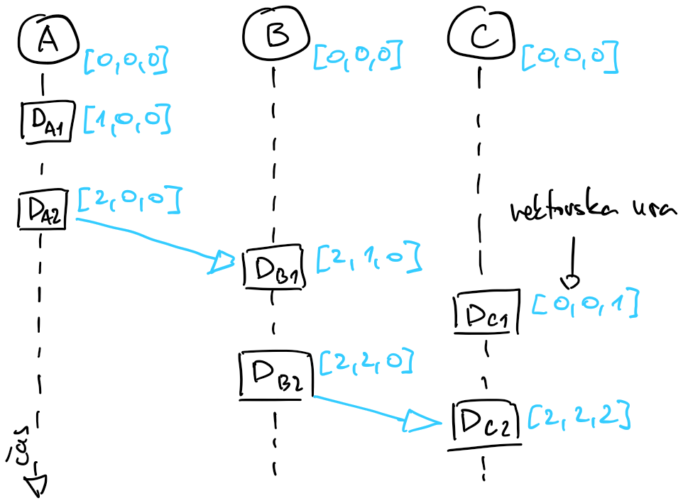

# Čas v porazdeljenih sistemih

- čas je pomemben element v vsakem programu, sploh v porazdeljenem
    - iztek časa (*angl.* timeout) pri detekciji napak
    - vrstni red dogodkov

- pri zaporednih programih je potek izvajanja programa lahko razbrati, saj se vsi ukazi izvajajo eden za drugim
- v porazdeljenih sistemih ni skupne globalne ure, s katero bi lahko določali vrstni red dogodkov in procesi se lahko izvajajo sočasno

## Fizične ure

- na skoraj vseh računalniških sistemih ima proces dostop do fizične ure 
    - realni čas (*angl.* wall-clock time) in procesorski čas (*angl.* CPU time)

- merjenje realnega časa s kristalom kvarca
    - kristal kvarca je poceni in ni preveč natančen
    - frekvenca nihanja je odvisna od mnogih dejavnikov (proizvodni proces, temperatura)
    - zdrs ure (*angl.* clock drift) je relativna hitrost ure glede na točno uro
        - merimo ga v enotah PPM (*angl.* parts-per-million), mikrosekundah na sekundo 
    - zamik ure (*angl.* clock skew) je razlika med vrednostmi ur v nekem trenutku
    - uro s kristalom kvarca je treba periodično sinhronizirati

- merjenje realnega časa z atomsko uro
    - izkoriščajo kvantno-mehanske lastnosti atomov
    - sekunda je definirana kot 9.192.631.770 nihajev atoma Cs-133 
    - natančnost 1 sekunda v 3 milijonih let
    - čas TAI (*angl.* time atomic international), povprečje več kot 300 ur
    - atomske ure so v satelitih GPS, vrednost v sporočilu

- atomska in astronomska ura
    - zemlja se ne vrti tako natančno, kot niha atom Cs-133
    - potrebno je usklajevanje ur
    - čas UTC (*angl.* universal time coordinated)
        - dvakrat na leto (30.6. in 31.12. ob 23:59:59) mu lahko odvzamejo sekundo (takojšen premik na 00:00:00) ali dodajo sekundo (premik na 23:59:60 in potem na 00:00:00)
        - prestopna sekunda [*angl.* leap second](https://en.wikipedia.org/wiki/Leap_second)
        - dan je lahko dolg 86.399, 86.400 ali 86.401 sekund
        - težave v programski opremi (hrošč v jedru Linux je pripeljal do živega objema, zaustavljen letalski promet v Londonu 30.6.2012)
        - danes programska oprema prestopno sekundo uvaja postopno, čez daljše časovno obdobje
    - čas na operacijskem sistemu Linux se meri v sekundah od 1.1.1970 00:00:00, čas na operacijskih sistemih Windows pa od 1.1.1601 00:00:00 UTC in ne upošteva prestopnih sekund
    - pri uporabi časovnih žigov v porazdeljenih sistemih so prestopne sekunde pomembne

- protokol NTP za periodično sinhronizacijo ure
    - *angl.* network time protocol
    - strežnik je naprava z natančno (atomsko) uro
    - odjemalec določi zamik svoje ure iz časa potovanja sporočila in odziva
    - iz izmerjenega zamika lahko prilagodi svojo uro
    - ura lahko skače naprej ali nazaj v času
        - problem pri primerjanju časovnih žigov v dnevniku

- večina operacijskih sistemov pozna monotono uro, pri kateri ne prihaja do skokov
    - meri relativni čas od poljubnega dogodka (zagon procesa)
    - vedno samo narašča, idealna za merjenje časa
    - znotraj procesa jo lahko uporabimo v dnevniku
    - neuporabna pri primerjavi dogodkov med procesi

- časi v jeziku go: [cas.go](koda/cas.go) 
    - paket `time`, struktura `time.Time` vključuje čas UTC in monotoni čas
    - primer izpisa
        ```
        Time start  : 2023-11-12 11:12:12.763038573 +0100 CET m=+2.001302270
        Time end    : 2023-11-12 11:12:13.763185182 +0100 CET m=+3.001448893
        Time elapsed (UTC)      : 1.000146609s
        Time elapsed (monotonic): 1.000146623s
        ```
    - razlika monotonih časov (m) je enaka izpisanemu pretečenemu času, razlika časov UTC je 14 nanosekund manjša

### Usklajevanje ur po protokolu NTP

- strežniki stratum 0 (atomska ura ali sprejemnik GPS), 1 (strežnik, ki je usklajen s stratum 0), ...
- operacijski sistem privzeto uporablja enega od strežnikov
- pošiljanje več zahtev za boljšo statistiko, lahko bi kontaktirali več strežnikov
- dosežemo, da je običajen zamik ure največ nekaj milisekund, ob slabih pogojih lahko bistveno več
- vzroki: omrežje, procesiranje
- zadnja verzija: [RFC 5905](https://datatracker.ietf.org/doc/html/rfc5905)
- shema 


- meritev
    - odjemalec strežniku pošlje sporočilo s časovnim žigom $t_1$
    - ob sprejemu sporočila strežnik zapiše svoj časovni žig, $t_2$
    - ob oddaji odgovora, strežnik v sporočilo poleg časovnih žigov $t_1$ in $t_2$ vpiše tudi časovni žig oddaje $t_3$ 
    - ob prejemu odgovora, odjemalec zabeleži časovni žig $t_4$
- izračun
    - čas potovanja sporočila in odgovora je $\delta = (t_4 - t_1) - (t_3 - t_2)$
    - v trenutku, ko odjemalec prejme odgovor, je čas na strežniku $t_S = t_3 + \delta/2$
    - zamik ure je tako $\theta = t_S - t_4 = (t_2-t_1+t_3-t_4)/2$
- popravljanje ure
    - manjše razlike, $|\theta| < 125 \text{ ms}$, odjemalec prilagodi počasi, s tem da uro povečuje malce hitreje ali počasneje
    - v primeru večje razlike, $125 \text{ ms}\leq |\theta| < 1000 \text{ s}$ odjemalec svojo uro nastavi na novo vrednost
    - v primeru zelo velike razlike, $1000 \text{ s} \leq |\theta|$ zazna težavo in ne naredi ničesar
- primer: [odjemalecNTP.go](koda/odjemalecNTP.go)


## Logične ure

- ure realnega časa ne znamo zanesljivo sinhronizirati med procesi na različnih vozliščih, zato z njo ne moremo zanesljivo razvrščati dogodkov
- primer

    - proces A pošlje sporočilo $m_1$ procesoma B in C
    - proces B se odzove in polje sporočilo $m_2$ procesoma A in C
    - zaradi zakasnitve sporočila $m_1$ pri prenosu od procesa A na C, je vrstni red na C nesmiseln
    - lahko dodamo časovni žig, vendar se zaradi omejitev protokola NTP tudi v tem primeru lahko zgodi podobno - če ura na procesu A prehiteva uro na procesu B, ima lahko sporočilo $m_1$ novejši časovni žig kot sporočilo $m_2$



- pri zaporednih procesih se vedno ena operacija izvede pred drugo, imamo vzročno povezava prej-potem (*angl.* happened-before)
- dogodek $X$ se je zgodil pred dogodkom $Y$, če velja
    - $X$ in $Y$ tečeta na istem procesu in se je $X$ zgodil pred $Y$
    - dogodek $X$ je pošiljanje sporočila, dogodek $Y$ pa sprejemanje istega sporočila
    - obstaja dogodek $Z$, za katerega velja, da se je dogodek $X$ zgodil pred dogodkom $Z$ in dogodek $Z$ pred dogodkom $Y$
- potrebujemo algoritem, ki bo vzročno povezavo prej-potem zagotavljal v porazdeljenih sistemih
- logične ure merijo čas v dogodkih
    - ob dogodku algoritem določi logični časovni žig
    - logična ura mora zagotavljati, da bosta imela v istem zaporednem procesu dva zaporedna dogodka različna logična časovna žiga (kasnejši višjo vrednost)

### Lamportova ura
- ideja: 
    - po zajtrku pošljemo elektronsko pošto prijatelju, prijatelj jo prebere pred kosilom; zajtrkovali smo preden je prijatelj kosil
    - pošiljanje sporočila je sinhronizacijska točka
    - dogodki pred sinhronizacijsko točko so se morali zgoditi pred dogodki za sinhronizacijsko točko
- algoritem
    - vsak proces ima svoj števec dogodkov
    - na začetku je števec dogodkov nastavljen na nič
    - ob dogodku proces poveča števec dogodkov za 1
    - ko proces pošlje sporočilo
        - poveča števec dogodkov za 1 
        - števec dogodkov pripne sporočilu
    - ko proces sprejme sporočilo
        - primerja števec dogodkov s števcem dogodkov, ki ga je dobil v sporočilu, 
        - števec dogodkov nastavi na maksimum obeh vrednosti
        - števec dogodkov poveča za 1
    


- pravila zagotavljajo, da je za dogodek $X$, ki se je zgodil pred dogodkom $Y$, logični časovni žig $T_X$ manjši od logičnega časovnega žiga $T_Y$ (dogodek $D_{A2}$ se je zgodil pred $D_{B2}$)
- dva nepovezana dogodka imata lahko isti logični časovni žig (dogodka $D_{A1}$ in $D_{C1}$)
- strog vrstni red dogodkov lahko dobimo, če števcu pripnemo oznako procesa (za dogodka $D_{A1}$ in $D_{C1}$ bi potem imeli števca 1A in 1C)
- vrstni red še vedno ne odraža vzročne povezave (dogodka $D_{B1}$ in $D_{C1}$)
- Lamportova ura predpostavlja proces z zaustavitvijo, s shranjevanjem števcev na disk pa enostavno lahko podpremo tudi obnovljivi proces
- z Lamportovo uro ne moremo določiti vzročne povezanosti vseh dogodkov ali ugotoviti, da sta dogodka sočasna


### Vektorska ura
- vektorska ura zagotavlja, da se je dogodek z nižjim časovnim žigom zgodil pred dogodkom z višjim časovnim žigom
- vsak proces ima tabelo števcev dogodkov; števcev dogodkov je toliko, kolikor je sodelujočih procesov
- tabela števcev dogodkov predstavlja logični časovni žig
- algoritem
    - na začetku so vsi števci dogodkov v tabeli nastavljeni na nič
    - ob dogodku proces poveča svoj števec dogodkov v tabeli za 1
    - ko proces pošlje sporočilo
        - poveča svoj števec dogodkov v tabeli za 1
        - pošlje sporočilo, ki mu pripne tabelo števcev dogodkov
    - ko proces prejme sporočilo
        - primerja tabelo števcev dogodkov s tabelo števcev dogodkov, ki jo je dobil v sporočilu
        - vse števce dogodkov v tabeli nastavi na maksimum svoje vrednosti in istoležne vrednosti v prejeti tabeli
        - svoj števec dogodkov v tabeli poveča za 1



- logične časovne žige vektorske ure lahko delno uredimo
    - dogodek $X$ z logičnim časovnim žigom $T_X$ se je zgodil pred dogodkom $Y$ z logičnima časovnim žigom $T_Y$, če 
        - je vsak števec v $T_X$ manjši ali enak istoležnemu števcu v $T_Y$ in 
        - je vsaj en števec v $T_X$ manjši od $T_Y$
    - če se dogodek $X$ ni zgodil pred $Y$ in se tudi dogodek $Y$ ni zgodil pred $X$, potem vzamemo, da sta dogodka sočasna
    - primer: dogodek $D_{A2}$ se je zgodil pred dogodkom $D_{B2}$, vrstnega reda dogodkov $D_{B1}$ in $D_{C1}$ pa ne moremo določiti - vzamemo, da sta se zgodila sočasno
- problem vektorske ure so velike zahteve po pomnilniku in pasovni širini, boljše rešitve
- paket za vektorske ure v jeziku go: [GoVector](https://pkg.go.dev/github.com/arcaneiceman/GoVector)
