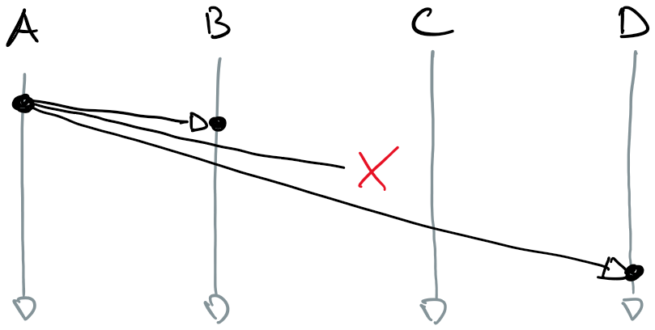
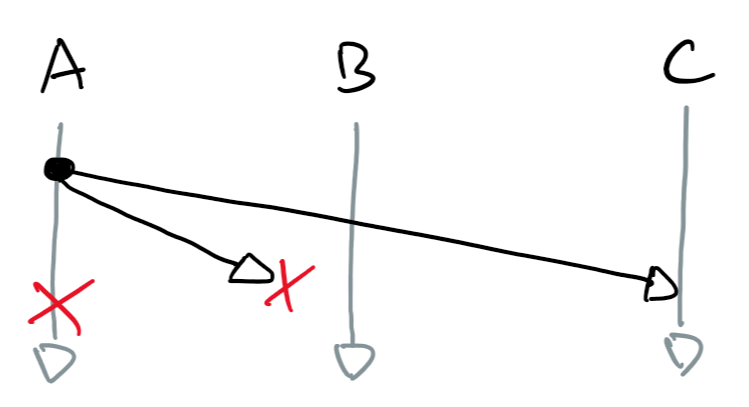
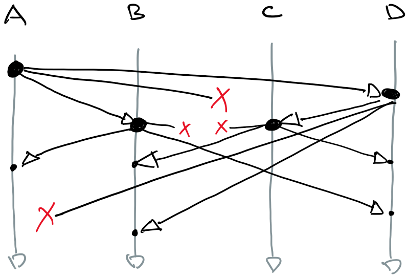
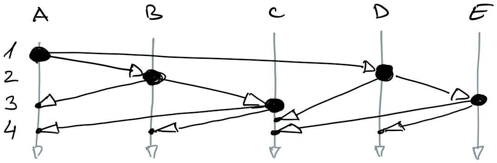
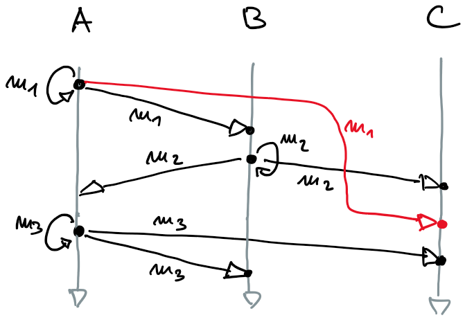
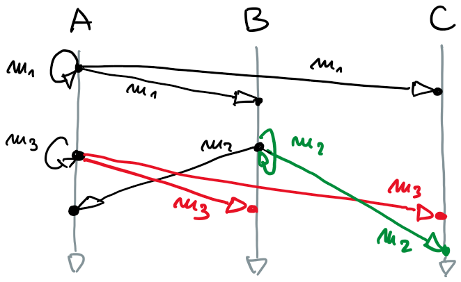
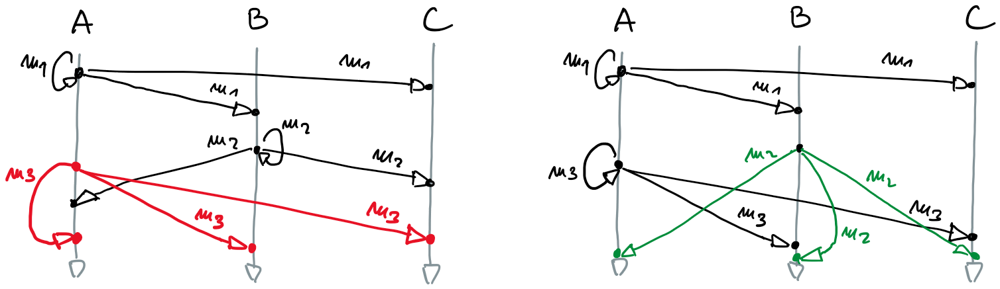
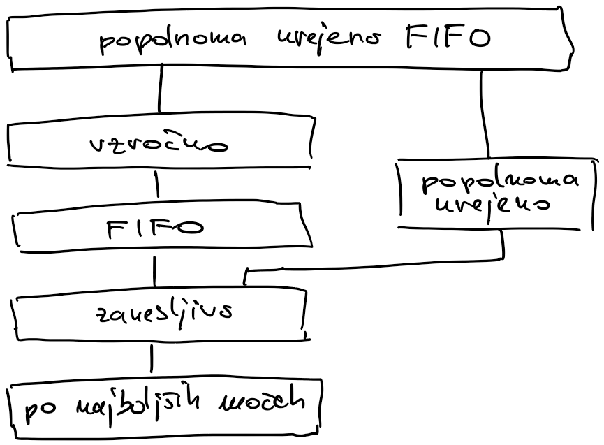

# Protokoli za razširjanje sporočil

- pošiljatelj sporočilo pošilja vsem procesom v skupini, tudi sebi
- skupina je lahko statična ali dinamična
- pomemben element v kompleksnejših porazdeljenih algoritmih

## Modeli dostave sporočil

### Dostava po najboljših močeh
- razširjanje sporočil na nivoju omrežne opreme (IP multicast)
- poskusi poslati vsem vozliščem, če je vozlišče okvarjeno, sporočila nikoli ne dobi
- zagotavlja, da, če se pošiljatelj ne zruši, sporočila dobijo vsa delujoče vozlišča



### Zanesljiva dostava sporočil
- proces pošilja sporočilo vsakemu procesu v skupini posebej
- zagotavlja, da sporočilo dobijo vsa delujoča vozlišča
- če je sporočilo zavrženo, ga proces pošlje ponovno
- v primeru, da se okvari pošiljatelj, sporočilo nikoli ne bo prišlo do sprejemnega procesa
- zanesljivo dostavo dosežemo, če ostali procesi sodelujejo pri razširjanju sporočila




#### Nestrpno razširjanje (*angl.* eager)
- ko proces prvič prejme sporočilo, ga prepošlje vsem ostalim procesom
- zelo neučinkovito: $n$ procesov, vsak prejme $n-1$ enakih sporočil, zahtevnost $O(n^2)$
    


#### Razširjanje z govoricami (*angl.* gossip)
- skupina epidemičnih protokolov
- ko proces prvič prejme sporočilo, ga prepošlje podanemu številu naključno izbranih procesom (tipično trem)
- protokoli ne zagotavljajo popolnoma zanesljive dostave        
- verjetnost, da sporočilo ne bo dostavljeno vsem vozliščem, je zelo majhna
- zahtevnost $O(n)$, bistveno bolj učinkoviti od nestrpne različice



## Vrstni red dostave
- različne zahteve glede vrstnega reda dostave sporočil
- ogrodje za razširjanje sporočil
    - aplikacija na procesu pošiljatelju pokliče funkcijo za razširjanje sporočil
    - funkcija za razširjanje sporočil pošlje sporočila ostalim procesom (prejemnikom), vsakemu posebej
    - ko prejemni proces sprejme sporočilo, ga funkcija za razširjanje posreduje aplikaciji prejemnika
    - odvisno od zahtev algoritma glede vrstnega reda dostave sporočil, lahko med sprejemom sporočila in posredovanjem aplikaciji nastane večja zakasnitev

### Modeli 

#### Razširjanje FIFO
- *angl.* first-in-first-out
- najosnovnejši protokol
- sporočila, ki jih pošilja posamezen proces, morajo biti vsem procesom dostavljena v enakem vrstnem redu, kot so bila poslana
- vrstni red sporočil, ki jih pošiljajo različna vozlišča, je poljuben
- primer
    - veljavni vrstni red: ($m_1$, $m_2$, $m_3$), ($m_1$, $m_3$, $m_2$) ali ($m_2$, $m_1$, $m_3$)
    - vzročnost na sliki ne velja, saj proces $C$ prej sprejme $m_2$ kot $m_1$, ki je bil oddan prej



#### Vzročno razširjanje
- *angl.* causal broadcast
- dopolnjeno razširjanje FIFO
    - sporočilo iz poljubnega procesa, ki je bilo poslano pred sporočilom iz drugega poljubnega procesa, mora biti vsem procesom dostavljeno prej
    - v primeru, da sta bili sporočili poslanih hkrati, vrstni red dostave ni pomemben
- na zgornji sliki: proces $C$ bo moral zadržati sporočilo $m_2$ dokler ne sprejme sporočila $m_1$
- primer vzročnega razširjanje
    - procesa $A$ in $B$ oddajata hkrati sporočili $m_3$ in $m_2$, zato sta vrstna reda dostave ($m_1$, $m_2$, $m_3$) in ($m_1$, $m_3$, $m_2$) oba pravilna



#### Popolnoma urejeno razširjanje
- *angl.* total order broadcast
- zahteva, da so sporočila vsem procesom dostavljena v enakem vrstnem redu
- vrstni red dostave sporočil je poljuben
- primera popolnoma urejenega razširjanja



#### Popolnoma urejeno razširjanje FIFO
- zlitje popolnoma urejenega razširjanja in razširjanja FIFO
- sporočila morajo biti vsem procesom dostavljena v enakem vrstnem redu (popolnoma urejeno razširjanje)
- sporočila, poslana iz posameznega procesa, morajo biti na vse procese dostavljena v istem vrstnem redu, kot so bila poslana (razširjanje FIFO)

### Hierarhija modelov razširjanja



### Algoritmi

#### Razširjanje FIFO 

- psevdokoda

    ```go
    // inicializacija procesa
    sent = 0
    delivered = [0, 0, ..., 0]
    buffer = []
    // proces i pošilja sporočilo m
    if send {
        msg = {i, sent, m}
        channel <- msg
        sent++
    }
    // proces i prejme sporočilo 
    if recv {
        msg = <- channel        // msg = {j, sent_j, m_j}
        buffer = append(buffer, msg)
        for {k, delivered[k], m} in buffer {
            application <- m
            buffer = remove(buffer, {k, delivered[k], m})
            delivered[k]++
        }
    }
    ```

    - lokalne strukture
        - `sent` je število sporočil, ki jih je poslal proces `i`
        - `delivered[j]` hrani število sporočil, ki jih je proces `i` prejel od procesa `j`
        - `buffer` hrani sporočila dokler jih algoritem ne posreduje aplikaciji
    - pošiljanje
        - vsako sporočilo `{i, sent, m}` je označeno z oznako pošiljatelja (`i`), zaporedno številko poslanega sporočila (`sent`) in vsebino (`m`)
    - sprejem
        - sporočilo damo v tabelo `buffer`
        - v tabeli pogledamo, če ima sporočilo od kateregakoli pošiljatelja (`k`) pričakovano zaporedno številko `delivered[k]`
        - če obstaja, sporočilo posredujemo aplikaciji, ga izbrišemo iz tabele in povečamo pričakovano zaporedno številko naslednjega sporočila


#### Vzročno razširjanje
- algoritem podoben algoritmu FIFO
- namesto štetja prejetih sporočil vpeljemo sistem, podoben vektorski uri (vektorska ura šteje dogodke in sporočila, tu štejemo samo prejeta sporočila)
- psevdokoda

    ```go
    // inicializacija procesa
    sent = 0
    delivered = [0, 0, ..., 0]
    buffer = []
    // proces i pošilja sporočilo m
    if send {
        counters = delivered
        counters[i] = sent
        msg = {i, counters, m}
        channel <- msg
        sent++
    }
    // proces i prejme sporočilo 
    if recv {
        msg = <- channel    // msg = {j, counters_j, m_j}
        buffer = append(buffer, msg)
        for {k, c, m} in buffer && c <= delivered {
            application <- m
            buffer = remove(buffer, {k, c, m})
            delivered[k]++
        }
    }
    ```
    - v sporočilu ne pošiljamo zaporedne številke ampak vektor vseh števcev (`counters`)
        - vektor števcev najprej nastavimo na `delivered`, ki šteje koliko sporočil smo prejeli od drugih procesov; s tem poskrbimo, da bodo vsa do zdaj prejeta sporočila, posredovana aplikaciji pred zdaj oddajanim sporočilom
        - lasten števec nastavimo na število oddanih sporočil; s tem zagotovimo, da bomo ohranjali vrstni red (FIFO) med sporočili, ki jih pošilja izbrani proces
    - sporočilo posredujemo aplikaciji samo v primeru, ko velja `c <= delivered` - vsak števec v `c` je manjši ali enak istoležnemu števcu v `delivered`; primerjava je resnična samo v primeru, ko so bila aplikaciji že posredovana vsa predhodna sporočila
    - posodobimo števec pošiljatelja sporočila, ki smo ga posredovali aplikaciji

#### Popolnoma urejeno razširjanje in popolnoma urejeno razširjanje FIFO
- pristop z enim voditeljem
    - sporočilo, ki ga proces želi razširiti med ostale, pošlje voditelju
    - uporabimo algoritem razširjanja FIFO
    - nimamo rešitve, če voditelj odpove
    - kako varno spremeniti voditelja?
    - ta pristop bomo pogledali pri replikaciji podatkov
- pristop z Lamportovo uro
    - ni enega voditelja
    - vsakemu sporočilu za posodobitev shrambe dodamo vrednost Lamportove ure
    - sporočila dostavljamo glede na vrednost Lamportove ure
        - sporočilo dostavimo aplikaciji, samo če so ga vsi vključeni procesi potrdili
        - proces $P_j$ pošlje potrditev procesu $P_i$ le če
            - $P_j$ ni poslal sporočila ostalim procesom
            - $P_j$ je posodobil svojo shrambo
            - Lamportova ura procesa $P_j$ je večja od Lamportove ure procesa $P_i$
    - kako ugotoviti, da smo videli vsa predhodna sporočila?
        - če smo od vseh procesov prejeli sporočila z večjimi časovnimi žigi
        - če je en proces odpovedal, sporočila ne bomo dobili ...
- oba pristopa odpovesta ob odpovedi enega procesa
