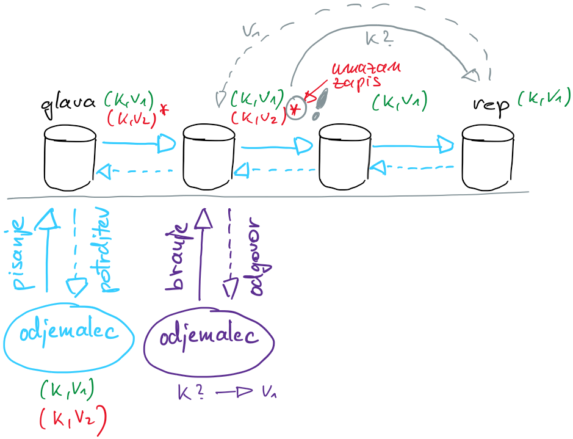

# Replikacija podatkov

- eden najpomembnejših elementov porazdeljenega sistema
- vzdrževanje kopije podatkov na več procesih
- z replikacijo 
    - povečamo zanesljivost (dostopnost) storitev
    - izboljšamo raztegljivost in odzivnost sistema
- primeri uporabe:
    - porazdeljene podatkovne baze
    - porazdeljeni datotečni sistemi
- motivacija
    - imamo porazdeljeno shrambo, do katere dostopajo odjemalci, ki v shrambo pišejo ali iz nje berejo
    - za odjemalca mora biti nepomembno ali je shramba sestavljena iz enega ali iz skupine procesov
        - vsak odjemalec mora prebrati isto vrednost, ne glede na to s katerega procesa v porazdeljeni shrambi bere
    - da to dosežemo, morajo strežniki soglašati o stanju shrambe
    - soglasnost (*angl.* consensus) je dogovor o skupnem stanju sistema
        - soglasnost je trivialno doseči z enim procesom, rešitev ni odporna na napake (posamezna točka odpovedi)
        - potrebujemo replikacijo, dovolj je, če soglaša večina procesov
    - izziv je, kako zagotoviti odpornost na napake - imeti skladne replike kljub izpadom omrežja in procesov
- replikacija s končnim avtomatom
    - vsak proces modeliramo kot končni avtomat
    - končni avtomat ima
        - množico jasno definiranih stanj
        - množico vhodov
        - množico izhodov
        - funkcijo, ki iz trenutnega stanja in vhoda določi novo stanje
        - funkcijo, ki pri danem stanju določi izhod
        - definirano začetno stanje
    - deterministični končni avtomat
        - več kopij istega avtomata začne v začetnem stanju
        - če sprejemajo vhode v enakem zaporedju, bodo prehajali čez ista stanja in generirali enake izhode
    - pri zagotavljanju odpornosti na napake je determinizem nujno potreben
        - če je en končni avtomat pokvarjen, bo drugače prehajal čez stanja in imel drugačne izhode
        - če se končni avtomat (proces) ob napaki zaustavi, je za odpornost na $f$ napak dovolj sistem s $f+1$ končnim avtomatom
        - če se ob napaki ne zaustavi (Bizantinski model) mora sistem, ki bo odporen na $f$ napak, vključevati vsaj $2f+1$ končnih avtomatov
    - primer
        - en proces, voditelj, s sporočili razširja operacije na shrambi
        - procesi sledilci sprejete operacije izvedejo v enakem zaporedju
        - ker je avtomat stanj determinističen, bo stanje sledilcev na koncu enako stanju voditelja
        - primer: shramba CRUD z operacijami `create(ključ,vrednost)` in `read(ključ)`, `update(ključ,vrednost)` in `delete(ključ)`

## Verižna replikacija
- pogosto uporabljana rešitev za replikacijo
- dve ravnini
    - podatkovno ravnino (*angl.* data plane) sestavljajo procesi, ki skrbijo za replikacijo
    - nadzorno ravnino (*angl.* control plane) pa procesi, ki skrbijo za odpornost na napake

- podatkovna ravnina
    - procesi so nanizani v verigo: prvi proces v verigi je glava, sledijo vmesni procesi, zadnji je rep
    - delovanje
        - odjemalci zahteve za vpis pošiljajo glavi
        - glava posodobi svoje stanje in posreduje zahtevo naslednjemu procesu v verigi
        - proces posodobi svoje stanje in zahtevo posreduje nasledniku
        - ko zahteva pride do repa, ta posodobi svoje stanje in predhodniku pošlje potrditev
        - vmesni procesi posredujejo potrditve predhodnikom
        - ko potrditev pride do glave, ta obvesti odjemalca o uspešnem vpisu
        - v osnovni različici branje zahteve obdeluje samo rep
    - če ni napak, algoritem zagotavlja strogo skladnost
    - če verigo sestavlja $p$ procesov, bo sistem deloval kljub odpovedi $p-1$ procesa
- nadzorna ravnina
    - nadzoruje stanje procesov na podatkovni ravnini
    - v primeru, da zazna odpoved enega od procesov, ga odstrani iz verige
        - če odpove glava, jo nadzorna ravnina zamenja z naslednjim procesom v verigi in obvesti odjemalce o spremembi
            - če je glava pred odpovedjo posodobila svojo shrambo, ni pa uspela poslati sporočila, naslednji procesi v verigi niso poslali potrditve; ker zato odjemalec ni dobil potrditve, je ponovno poslal zahtevo; posodobljene shrambe ne vidijo ostali odjemalci, saj zahteva ni prišla do repa
        - če odpove rep, ga nadzorna ravnina zamenja s predhodnim procesom v verigi in obvesti odjemalce o spremembi
            - ker so vsi predhodniki dobili enake posodobitve kot rep, lahko nemoteno strežejo odjemalce
            - če je prišlo do odpovedi po posodobitvi shrambe in pred pošiljanjem potrditve, so zapisi shranjeni v shrambi, le odjemalec tega ne ve; po preteku časa bo še enkrat poslal zahtevo
        - če odpove vmesni proces, mora nadzorna ravnina povezati njegovega predhodnika in naslednika
            - lahko je proces posodobil svojo lokalno shrambo, ni pa zahteve posredoval nasledniku
            - naslednik mora zato nadzorni ravnini poslati zaporedno številko zadnje potrjene zahteve, da mu novi predhodnik lahko pošlje manjkajoče vpise
    - dodajanje novih procesov v verigo
        - najenostavneje na rep
        - novi rep je treba najprej uskladiti s starim repom
    - tudi nadzorna ravnina mora biti odporna na napake - soglasje (algoritem raft)
        - če nadzorno ravnino sestavlja $C$ procesov, lahko sistem tolerira do $\lfloor C/2\rfloor$ napak
- verižna replikacija ima malo različnih napak, ki jih dokaj enostavno razrešimo
- optimizacija
    - pri pisalnih zahtevah moramo po verigi do repa in nazaj, kar vzame precej časa
    - zahteve lahko obdelujemo cevovodno
    - rep je usklajen z vsemi procesi, zato na bralno zahtevo lahko odjemalcu nemudoma odgovori
    - bralne zahteve lahko porazdelimo na vse procese 
        - shrambe morajo podpirati več različic zapisov
        - zapis je ob prejetju zahteve za vpis označen kot umazan
        - ko proces od naslednika dobi potrditev, zapis razume kot potrjen in ga označi kot čistega
        - pri bralni zahtevi bo proces vrnil zapis, če ni označen kot umazan; če je označen kot umazan, bo prosil rep za zadnjo potrjeno verzijo

