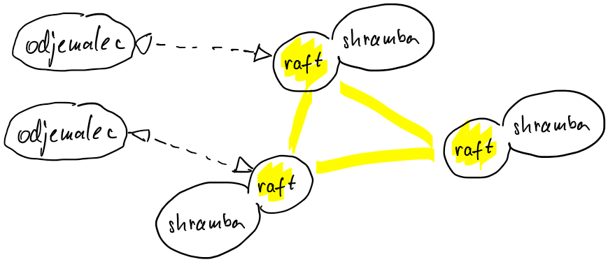

# Replikacija

## Replikacija z voditeljem (algoritem raft)

- dva znana protokola: Paxos in Raft
    - podobne lastnosti - odpornost na napake in zmogljivost  
    - (Paxos)[https://en.wikipedia.org/wiki/Paxos_(computer_science)]
        - Leslie Lamport, 1998
        - zelo kompleksen, teoretičen in zelo splošen
        - prevelik razkorak med opisom in potrebami realnega sistema; ker ni dovolj natančno opisan za dobro izvedbo, programerji dodajajo svoje (nepreverjene) rešitve
        - bolj odziven v primeru, da so procesi porazdeljeni po vsem svetu
    - (Raft)[https://raft.github.io/]
        - Ongaro, Ousterhout, 2014
        - zasnovan zato, da je razumljiv
        - algoritem ima manj stanj, enostavnejši mehanizmi za obvladovanje sistema
        - veliko večino časa se sistem obnaša predvidljivo, v primeru težav (izpad procesa in podobno) mogoče traja malo dlje, da se znova vzpostavi
- tipične napake: odpoved procesa, izguba sporočila, zamenjan vrstni red sporočil
- model popolnoma urejenega razširjanja FIFO
- algoritem predpostavlja obnovljive procese, sprejemljive izgube sporočil in delno sinhrono obnašanje
- potrebujemo voditelja, ki naloge dodeljuje ostalim procesom
- procesi se morajo uskladiti - morajo soglašati (*angl.* consensus) glede 
    - izbire voditelja in 
    - replikacije podatkov
- dva končna avtomata
    - vsak proces je končni avtomat: lahko je v enem od treh stanj: sledilec, kandidat, voditelj
    - shramba je tudi končni avtomat: vhodi so operacije nad shrambo, shramba spremeni svoje stanje, ob zahtevi odjemalca nastavi ustrezen izhod
    - algoritem raft skrbi za dnevnik zapisov
        - zapisi so operacije, s katerimi posodabljamo shrambo
        - osveževanje shrambe je, potem, ko procesi soglašajo o dnevniških zapisih, enostavno
        - če na vsaki shrambi operacije izvedemo v enakem vrstnem redu, bo končno stanje vseh shramb enako

        

- glavni elementi algoritma raft
    - izbiranje voditelja
        - volitve, izguba voditelja, volitve, 
    - replikacija dnevnika
        - problem usklajevanja dnevnikov sledilcev z dnevnikom voditelja
    - zagotavljanje odpornosti
        - voditelj je lahko tisti, ki ima dober dnevnik

### Izbiranje voditelja

- čas v algoritmu raft se meri v poljubno dolgih volilnih obdobjih (*angl.* terms)
    - obdobja so oštevilčena, vrednosti monotono naraščajo
    - vsako obdobje se začne z izbiranjem voditelja (volitvami), nato sledi replikacija dnevnika
    - za zmago na volitvah se lahko poteguje več kandidatov
    - če volitve niso uspešne (noben od kandidatov ne dobi dovolj glasov), se ponovijo

        

- voditelj ostaja glavni dokler ne odstopi ali postane nedostopen; takrat ostali procesi, sledilci, izberejo novega 
- algoritem mora zagotavljati, da je v sistemu na enkrat največ en voditelj, ki lahko dopolnjuje dnevnik
- dokler v sistemu ni voditelja, je sistem nedostopen; lahko si zapomni zahteve ki so prišle od odjemalcev, ali pa jih zavrne

#### Proces kot končni avtomat
- vsak proces je končni avtomat v enem od treh stanj:
    - sledilec, ki priznava nekoga drugega za voditelja
    - kandidat, ki začenja volitve in sebe okliče za voditelja
    - voditelj, ki sledilcem pošilja sporočila za dopolnitev dnevnika 

- dva tipa sporočil
    - kandidat pošilja zahtevo za glasovanje (`voteRequest`)
    - voditelj pošilja zahteva za dopolnjevanje dnevnika (`appendEntry`)

#### Prehajanje med stanji
- ob zagonu so vsi procesi v stanju sledilec
- sledilec 
    - pričakuje, da ga voditelj redno obvešča s sporočili za dopolnitev dnevnika ali s srčnim utripom
    - privzame obdobje, ki mu ga sporoča voditelj
    - dovoljen čas čakanja na sporočilo se po vsakem prejetem sporočilu nastavi na naključno vrednost   
    - če preteče dovoljen čas čakanja na sporočilo, sledilec sklepa, da voditelja ni več in postane kandidat
- kandidat
    - začne novo obdobje, ki je označeno z za ena višjo zaporedno številko
        - sebe predlaga za voditelja in glasuje zase
        - ostalim procesom pošlje sporočilo naj glasujejo zanj (`voteRequest`)
    - proces ostane kandidat dokler sam ali nekdo drug ne zmaga na volitvah
        - kandidat zmaga na volitvah
            - če večina procesov glasuje zanj
            - vsak proces lahko v enem volilnem obdobju glasuje samo enkrat
            - večinsko pravilo zagotavlja, da bo največ en kandidat zmagal na volitvah
        - kandidat izgubi volitve
            - če od drugega procesa (novega voditelja) dobi srčni utrip z enako ali višjo oznako obdobja
            - sprejme novega voditelja in se vrne v stanje sledilca
        - nimamo zmagovalca (manj kot 5 % primerov)
            - več sledilcev se je hkrati spremenilo v kandidate in nihče ni dobil večine glasov
            - po preteku dovoljenega časa čakanja na izid volitev kandidat začne novo volilno obdobje
- voditelj
    - o svoji vlogi periodično obvešča ostale procese
        - pošiljanje sporočil z zahtevo za dopolnitev dnevnika (`appendEntry`)
        - če zahtev ni, po preteku določenega časa pošlje srčni utrip (pazna zahteva za dopolnitev)
    - zahteva za dopolnitev med drugim vključuje oznako voditelja, številko obdobja, ko je bil izvoljen, in število zapisov v dnevniku
        - oznaka voditelja je pomembna zato, da sledilci lahko zahteve odjemalcev preusmerijo nanj
        - številka obdobja in število zapisov sta pomembna za dopolnjevanje dnevnika in odločitev pri glasovanju

        
    
#### Ilustracija delovanja z Raftscope 
- [raftscope](https://raft.github.io)
    - pet procesov
    - proces kandidat ima v notranjosti kroge, ki označujejo, kdo je glasoval zanj
    - obrobljen proces je voditelj
- primer 1: izbiranje voditelja
    - na začetku vsi sledilci
    - eden postane kandidat (nepopolna debela črna obroba označuje dovoljen čas za izvedbo volitev)
    - kandidat pošlje sporočilo `requestVote` (zelene barve)
    - sledilci prevzamejo obdobje
    - sledilci glasujejo zanj (potrditev zelene barve, polne pike v kandidatu označujejo, kdo je glasoval zanj)
    - ko je izglasovan, postane voditelj (debel črn rob)
    - pošilja srčni utrip - prazen `appendEntry` (oranžne barve)
- primer 2: dva kandidata
    - ponovno zaženemo aplikacijo (tipka F5)
    - zaustavimo simulacijo (tipka .)
    - povečamo verjetnost, da bomo imeli dva kandidata hkrati (tipka A)
    - nadaljujemo simulacijo (tipka .)
    - eden zmaga
- primer 3: dva kandidata hkrati, volitve brez zmagovalca
    - ponovno zaženemo aplikacijo (tipka F5)
    - zaustavimo simulacijo (tipka .)
    - en proces ustavimo (desni klik nanj in stop)
    - povečamo verjetnost, da bomo imeli dva kandidata hkrati (tipka A)
    - nadaljujemo simulacijo (tipka .)
    - lahko dobi en tri glasove, drugi enega ali pa oba dobita po dva glasova
    - če dobi vsak dva glasova
        - poskuša dobiti sporočilo od nedostopnega procesa s zahtevo po glasovanju
        - lahko bi se oba kandidata pomenila, kdo bo postal voditelj, ampak algoritem raft v svoji enostavnosti tega ne podpira
        - sistem čaka, da se izteče en od dovoljenih časov
            - volitve za kandidata trajajo predolgo
            - sledilec predolgo ne dobi sporočilo od voditelja
        - začne novo obdobje

### Replikacija dnevnika

- vsak proces v sistemu ima svojo shrambo
- voditelj je edini proces, ki lahko zahteva spreminjanje shrambe
- zahteve za spremembo shrambe zapisuje v svoj lokalni dnevnik
    - dnevnik je urejen seznam zapisov
    - vsak zapis vključuje 
        - deterministično operacijo nad shrambo (za replikacijo shrambe)
        - oznako voditelja
        - številko zapisa v dnevniku (za nadzor nad gradnjo dnevnika)
        - številko obdobja, v katerem je voditelj zadnjič zmagal (za nadzor nad gradnjo dnevnika)    
- lokalni dnevnik razširja na sledilce
- vsak sledilec gradi svoj dnevnik iz prejetih sporočil
- proces lahko zapise, ki so soglasno usklajeni med vsemi procesi, uporabi za posodobitev shrambe
    - operacije v zapisih izvaja po vrsti, od starejše proti novejši
    - ker je shramba končni avtomat, bo prej ali slej njeno stanje enako stanju voditeljeve shrambe 

    

### Algoritem
- odjemalec pošlje voditelju zahtevo za operacijo nad shrambo 
- voditelj pripravi dnevniški zapis, ki vključuje operacijo in kontrolne parametre (številko zapisa, številko obdobja)
- nato zapis razširi (pošlje) sledilcem
- če po preteku določenega časa ni novih operacij, voditelj pošlje prazen zapis (srčni utrip)
- sledilec zapis doda v svoj dnevnik in voditelju potrdi sprejem
- ko voditelj prejme potrditve od večine sledilcev, privzame, da je zapis potrjen in operacijo iz zapisa izvede na svoji shrambi 
- voditelj pošlje potrditev odjemalcem
- sledilcem sporoči, da je zapis potrjen, tako, da pri razširjanju naslednjega zapisa ali srčnega utripa uporabi številko zadnjega potrjenega zapisa
- sledilec po prejemu sporočila potrdi svoj zapis in izvede operacijo na svoji shrambi
- voditelj lahko v potrjevanje pošlje nov zapis šele potem, ko je prejšnji potrjen
- nov voditelj začne razširjati zapise šele potem, ko ima vse svoje zapise potrjene
    - ob zmagi na volitvah v dnevnik doda zapis z operacijo nop (*angl.* no operation)
    - ko je ta potrjena, začne razširjati ostale zapise
- algoritem zagotavlja, da je potrjen zapis trajen in ga bodo prej ali slej izvedli vsi procesi v skupini, ne le tisti ki so v trenutku potrditve zagotavljali večino

#### Ilustracija delovanja z Raftscope
- tabela na desni strani
    - v polja se vpisujejo zapisi; zapis je označen s številko obdobja, operacija ni prikazana
    - puščica predstavlja kazalec `nextIndex` in prikazuje mesto v dnevniku kamor želi voditelj sledilcu vpisati naslednji zapis
    - pika predstavlja kazalec `matchIndex` prikazuje, do kje se sledilčevi zapisi ujemajo z voditeljevimi
- primer 1: osnovna replikacija
    - vzpostavimo začetno stanje (tipki F5 in L) 
        - voditelj in en sledilec
        - odjemalec je dodal tri zahteve za vpis v shrambo
        - zapisi niso potrjeni (črtkana obroba) 
        - podobno stanje lahko dosežemo tudi tako, da počakamo da procesi izberejo voditelja, nato tri procese ustavimo in kot odjemalec zahtevamo tri vpise v dnevnik (tipka C)
    - zaženemo simulacijo (tipka .)
        - voditelj zapise iz dnevnika pošlje sledilcem
        - na sledilcu se kazalca `nextIndex` in `matchIndex` povečujeta
    - zbudimo sledilca S3 (desni klik, resume)
        - voditelj pošlje potrebne zapise sledilcu
        - ko sledilec S3 potrdi prvi zapis, se obroba na voditelju spremeni v neprekinjeno (zapis potrjen)
        - ob naslednjem pošiljanju zapisa je zapis potrjen tudi na vsakem odjemalcu
        - ko je zapis potrjen, bo obstal za vedno, proces lahko posodobi shrambo
    - če je na voditelju mesto, kamor kaže kazalec `nextIndex`, prazno, bo voditelj pošiljal srčni utrip
- primer 2: dodajanje manjkajočih zapisov
    - vzpostavimo začetno stanje (tipki F5 in L)    
    - dodamo sledilca S3 (desni klik, resume)
    - počakamo, da vsi potrdijo zapise
    - ko ni na poti nobenih sporočil, ustavimo simulacijo (tipka .)
    - voditelju S1 dodamo dva nepotrjena zapisa (tipka C)
    - ustavimo voditelja S1 (desni klik, stop)
    - zbudimo sledilca S4 (desni klik, resume)
    - nadaljujemo simulacijo (tipka .)
    - najprej morajo izbrati voditelja: zmaga S2 ali S3, S4 ne more, ker nima dovolj sodobnega dnevnika
    - vsi sledilci konzervativno nastavijo, da se njihovi zapisi ne ujemajo z voditeljevimi (`matchIndex` postavijo na nič, pika skoči na začetek)
    - po prvem sprejetem zapisu kazalec `matchIndex` kaže na mesto, do kjer so zapisi potrjeni
    - kazalec `nextIndex` se postavi na mesto, kjer novi voditelj pričakuje vnos
    - S4 zazna razliko med položajema obeh kazalcev, zato zavrne sporočilo
        - voditelj zato pošlje prejšnje sporočilo
        - ko se kazalca ujameta, voditelj manjkajoča sporočila pošlje sledilcu; lahko enega za drugim (simulacija) ali pa več hkrati (spodnja koda)
- primer 3: brisanje nepotrjenih zapisov
    - nadaljevanje primera 2
    - dodamo zapis (tipka C) in počakamo, da ga vsi potrdijo
    - zbudimo S1 (desni klik, resume)
    - S1 ima na položaju `nextIndex` napačen zapis
    - voditelj pošlje prejšnje sporočilo, spet se morata kazalca ujeti
    - zapisi na voditelju so potrjeni, zato S1 svoje zapise zavrže in jih zamenja z voditeljevimi
- primer 4: kandidat ne dobi volitev
        - vzpostavimo začetno stanje (tipka L) 
        - dvignemo procesa S3 in S4 (desni klik, resume)
        - sprožimo simulacijo (tipka .)
        - počakamo, da vsi delujoči procesi posodobijo dnevnik
        - ustavimo voditelja S1 (desni klik, stop)
        - dvignemo S5 (desni klik, resume)
        - na S5 sprožimo volitve (desni klik na S5, timeout)
        - S5 ima star dnevnik, zato ne dobi glasov od ostalih
        - v ponovnih volitvah zmaga nek drug kandidat

### Zagotavljanje odpornosti

- ohranjanje voditeljstva
    - če ne pošilja zapisov, pošilja srčne utripe (prazne zapise) in s tem sporoča svojo prisotnost
    - dovoljeni časi čakanja na zapis so naključni, da se izognemo več kandidatom na volitvah

- glasovanje
    - če odpove voditelj, skupina izvoli novega
    - ker je za potrditev zapisa dovolj večina, ni nujno, da so shrambe na vseh procesih do konca posodobljene  
    - kandidat ne sme zmagati na volitvah, če nima sodobnega dnevnika
        - pri glasovanju proces ne more glasovati za kandidata, ki ima manj sodoben dnevnik kot sam
    - primerjanje dnevnikov
        - med procesoma primerjamo zadnja zapisa v dnevnikih: številko zapisa in številko obdobja
        - če se razlikujeta številki obdobij, je novejši tisti, ki ima višjo številko
        - če sta obdobji enaki, je dnevnik, v katerem je zapis z višjo številko, daljši in bolj posodobljen
    - ker mora za kandidata glasovati večina, je njegov dnevnik vsaj tako sodoben kot dnevnik ostalih in torej vključuje vse potrjene zapise
        - nič hudega, če izgubimo nepotrjene zapise, saj z njimi še nismo posodabljali shrambe

- težave v omrežju lahko skupino razbijejo na dva dela
    - dva voditelja v različnih obdobjih
        - stari, ki se ne zaveda izgube sledilcev
            - sporočila, ki jih pošilja stari voditelj, niso potrjena, dnevnik se ne nadgrajuje
            - da ne širi lažnih informacij, mora voditelj ob vsaki bralni zahtevi preveriti, da ima večino
        - novi, izvoljen z večino
    - ko se omrežje spet vzpostavi, bo stari voditelj sestopil (če ne že prej), saj bo dobil sporočilo z višjo številko obdobja

- če voditelj ne uspe dostaviti zapisa (ne dobi potrditve), bo ponovno poskušal, dokler ne uspe
    - če so operacije idempotentne, ni nič narobe, če en zapis prispe dvakrat

- ko sledilec pride nazaj v sistem 
    - od voditelja prejme sporočilo z novim zapisom
    - sporočilo vključuje podatke o prejšnjem zapisu - številko zapisa in številko obdobja
    - če sledilec ne najde zapisa z istimi podatki kot so za prejšnji zapis navedeni v sporočilu, sporočilo zavrne, da ne ustvari luknje v dnevniku
    - voditelj zato sledilcu pošlje sporočilo s predhodnim zapisom
    - postopek ponavljata, dokler številka zapisa in številka obdobja nista sprejemljiva za sledilca
    - v primeru, da ima sledilec v dnevniku že kakšne zapise, novejše od točke ujemanja, jih pobriše in zamenja z zapisi, ki jih dobi od trenutnega voditelja
    - zapise lahko prejema zaporedno ali v paketu, odvisno od izvedbe

### Dopolnitve, potrebne za produkcijski sistem

- sprememba zgradbe sistema
    - sprememba števila procesov, ki predstavljajo večino
    - procesi v sistemu se morajo uskladiti za spremembo zgradbe sistema
        - dodajanje in odstranjevanje procesov mora iti preko mehanizma soglasja
        - dodamo ukaze, ki se ne nanašajo na samo shrambo
- velikost dnevnika
    - ko ima dnevnik ogromno zapisov, bi posodabljanje shrambe iz nič trajalo zelo dolgo
    - občasno je treba narediti varnostno sliko shrambe (*angl.* checkpoint, snapshot)
    - potem lahko vse zapise v dnevniku, ki so bili s soglasjem potrjeni pred izdelavo varnostne slike, pobrišemo
- komunikacija z odjemalci
    - odjemalec komunicira z voditeljem
    - če voditelj ni znan ali se je spremenil, ga mora vsak proces v sistemu znati preusmeriti na voditelja
    - ponovno pošiljanje sporočil v primeru težav (lahko drugemu voditelju!)
    - razreševanje problema podvojenih zapisov (odjemalec vsa svoja sporočila označuje)

### Raft v jeziku go
- predmet [Distributed systems, MIT, 2020](http://nil.csail.mit.edu/6.824/2020/labs/lab-raft.html)
    - navodila, predloge, testne funkcije
    - Yunus Kılıç: [rešitev](https://github.com/yunuskilicdev/distributedsystems) in [razlaga](https://yunuskilicdev.medium.com/raft-consensus-algorithm-implementation-with-go-d0f9bf4472a0)
- [produkcijske knjižnice za jezik go](https://raft.github.io/#implementations)

### Raft v praksi
- podatkovni bazi [CockroachDB](https://www.cockroachlabs.com/) in [MongoDB](https://www.mongodb.com/atlas/database) uporabljata algoritem raft na replikacijski plasti
- posrednik sporočil [RabbitMQ](https://www.rabbitmq.com/) uporablja algoritem raft za replikacijo vrst FIFO

### Alternative
- Paxos: multi-paxos, cheap paxos, fast paxos, generalised paxos
- Practical Byzantine Fault Tolerance algorithm (PBFT)
- Proof-of-Stake algorithm (PoS)
- Delegated Proof-of-Stake algorithm (DPoS)

## Primerjava verižne replikacije in replikacije z voditeljem
- pri verižni replikaciji moramo pri pisalnih zahtevah po verigi do repa in nazaj; to je počasneje kot pri replikaciji z voditeljem, kjer je dovolj, da zahtevo potrdi večina procesov
- pri verižni replikaciji je rep usklajen z vsemi procesi, zato na bralno zahtevo lahko odjemalcu nemudoma odgovori; pri replikaciji z voditeljem mora proces z ostalimi preveriti, če je še voditelj; verižna replikacija je v tem elementu bistveno bolj odzivna
- če med obdelavo zahteve odpove eden od procesov, mora nadzorna ravnina odpoved najprej zaznati in nato spremeniti verigo; pri replikaciji z voditeljem odpoved enega procesa ne vpliva na obdelavo zahteve
