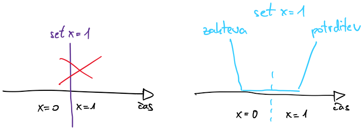
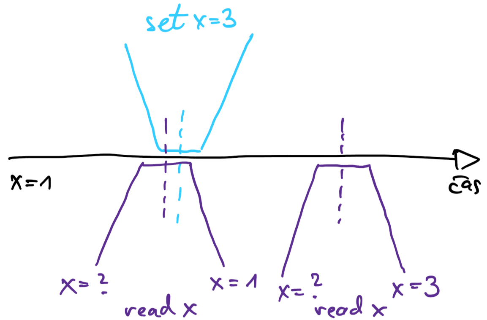
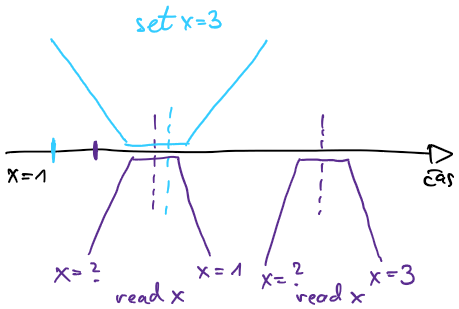
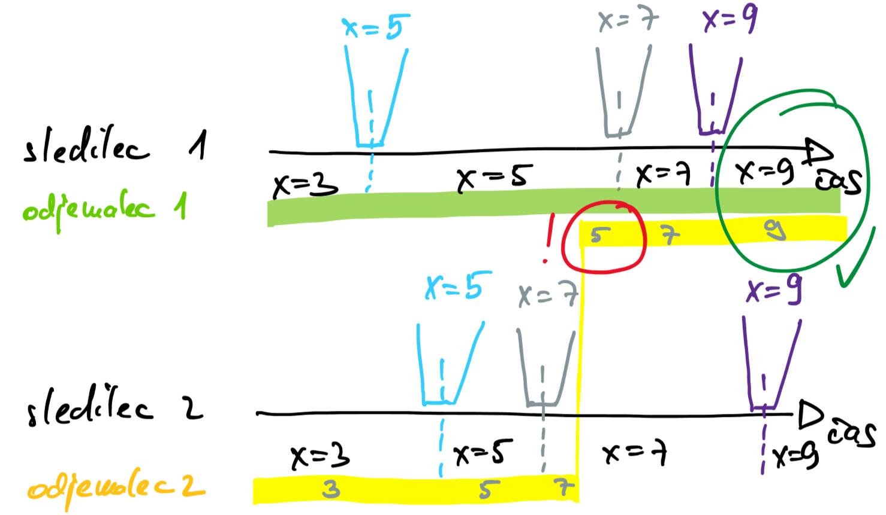
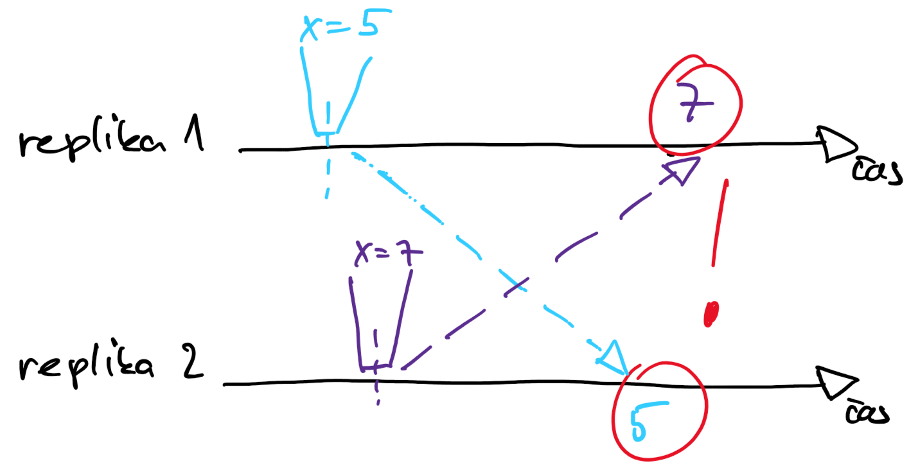
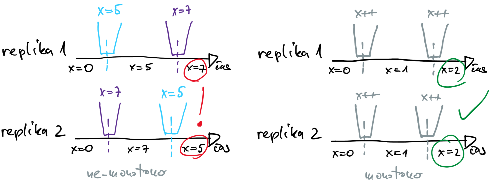
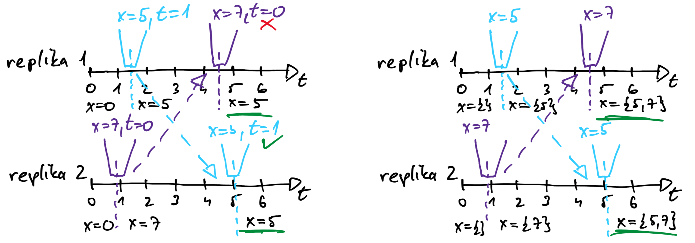

# Replikacija

## Soglasje

- *angl.* consensus
- o soglasju govorimo, ko
    - skupina procesov sodeluje, da doseže isti cilj
    - skupina procesov soglaša o vrednosti ali stanju kljub napakam v sistemu
    - vrednost ali stanje je predlagal eden od procesov   
- replikacija z algoritmom raft rešuje problem soglasja
    - dnevnik je zaporedje zapisov, o katerih so procesi soglašali
- praktični primeri uporabe soglasja
    - replikacija s končnimi avtomati
    - veriženje blokov
    - podatkovne baze
    - [Apache Zookeeper](https://zookeeper.apache.org/)
        - nadgradnja algoritma Paxos - ob odpovedi voditelja mora novi voditelj izvesti vse nepotrjene operacije v pravem vrstnem redu
        - visoko zanesljiv strežnik za koordinacijo v porazdeljenih sistemih
        - hierarhična shramba ključ-vrednost z brisanjem ključa ob poteku časovno omejenega najema
        - izbiranje voditelja z zakupom ključev (poverilnic)
        - ko proces ključ dobi, lahko najem podaljšuje; ko ga preneha podaljševati, lahko ključ zakupi drug proces
        - robusten algoritem soglasja je napisan na strežniku Zookeeper, ponuja programski vmesnik
        - porazdeljena aplikacija lahko strežnik Zookeeper uporabljajo kot storitev soglasja
            - proces strežniku Zookeeper pošlje ključ, staro vrednost in novo vrednost
            - če se ključ in stara vrednost ujemata, staro vrednost zamenja z novo in postane voditelj; če ne, ni sprememb
            - podobno kot atomarna operacija CAS (*angl.* compare and swap) v sistemih s skupnim pomnilnikom

## Modeli skladnosti

- želimo si, da shramba učinkovito streže odjemalce in da so podatki skladni
- algoritem raft 
    - shramba, odporna na napake
    - vpis v shrambo se ne zgodi v trenutku
        - odjemalec zahtevo posreduje preko voditelja
        - voditelj zahtevo razširi med ostale procese
        - ko dobi večinsko potrditev, obvesti odjemalca o uspešnem vpisu
        - vse, kar vemo, je, da se je vpis zgodil nekje med oddajo zahteve in sprejemom potrditve
        - v sistemu s skupnim pomnilnikom z vsakim branjem po vpisu preberemo novo vrednost; v sistemih s porazdeljenim pomnilnikom na to ne smemo računati
    - tudi branje se ne zgodi v trenutku
        - pred vsakim branjem mora preveriti, če je še voditelj, šele nato lahko odgovori odjemalcu
        - voditelj predstavlja ozko grlo
    - pri branju ne spreminjamo stanja shrambe, zato bi lahko bralne zahteve stregli tudi drugi procesi v skupini
        - s porazdeljevanjem branja dobimo bolj odziven sistem
        - replikacija se ne zgodi hipoma, procesi imajo lahko v danem trenutku različne slike shrambe
            - voditelj najhitreje posodobi shrambo
            - dva sledilca imata lahko različno sodobni shrambi

    

- modeli skladnosti določajo, kako različne poglede na shrambo imajo lahko procesi
    
### Stroga skladnost
- pisanja in branja potekajo izključno preko voditelja
- za odjemalce izgleda, kot da je shramba brez kopij; atomarne operacije na nivoju skupine, ki izvaja replikacijo

- zavedati se moramo, da pisanja in branja trajajo nekaj časa

    

### Zaporedna skladnost
- za večjo odzivnost sistema moramo tudi sledilcem dovoliti, da strežejo bralne zahteve
- sledilci zaostajajo za voditeljem, eni bolj kot drugi
- osveževanje shrambe poteka pri vseh zaporedno, v enakem vrstnem redu
- to lahko dosežemo, če odjemalci vedno komunicirajo z istim procesom (voditeljem ali sledilcem)
- če dva odjemalca pri branju komunicirata vsak s svojim procesom, bosta brala enake vrednosti, vendar bosta isto spremembo najverjetneje opazila ob drugem času

    

- primer: proizvajalec in porabnik: porabnik pobira izdelke iz police v enakem vrstnem redu, kot jih nanjo odlaga proizvajalec; porabnik ves čas zaostaja za proizvajalcem

### Končna skladnost
- dovolimo, da odjemalec komunicira s katerimkoli procesom v skupini, ki izvaja replikacijo z voditeljem
    - imamo dva sledilca, pri vpisovanju številke 7 sledilec 1 zaostaja za sledilcem 2
    - odjemalec 2 najprej bere preko sledilca 2, ko ta odpove, začne brati preko sledilca 1; ob prvem branju iz sledilca 1 bo lahko videl starejšo sliko, kot jo ima trenutno
- odjemalec zagotovo ve samo to, da če se vpisovanja v shrambo zaključijo, bo s časoma (na koncu) shramba na vseh sledilcih enaka kot na voditelju

    

- pisanje robustne kode je precejšen izziv
- pri mnogih aplikacijah ni tako pomembno, da so vrednosti res do konca posodobljene (štetje dostopov do spletne strani)

### Teorem CAP
- lahko se zgodi, da zaradi težav v omrežju odjemalci ne morejo več komunicirati z voditeljem; sistem lahko
    - zavrača zahteve (stroga skladnost)
    - ostane dostopen, tako da odjemalci komunicirajo z dostopnimi sledilci
- teorem o skladnosti, dostopnosti in razdelitvi omrežja (*angl.* consistency, availability, (network) partition)
    - zagotovimo lahko dva termina (pogoja) od treh
    - če ne bi bilo težav z omrežjem, bi lahko zagotovili skladnost in dostopnost
    - bolj realno je, da pride do težav v omrežju; v tem primeru lahko izbiramo med skladnostjo ali dostopnostjo
    - teorem CAP predvideva, da je sistem dostopen, če prej ali slej odjemalec dobi odziv; če se sistem odziva počasi, je bolj ali manj neuporaben; za mnoge realne sisteme je ta zahteva prešibka
- znotraj podatkovnega centra so težave na omrežju redke
    - izbiramo med skladnostjo in dostopnostjo (latenca, odzivni čas)
    - večja, kot je zahteva za skladnost, daljši so odzivni časi
    - teorem PACELC (*angl.* network partitioning, availability, consistency, else latency, consistency)
- nekatere podatkovne baze, na primer Azure CosmosDB in Cassandra, imajo možnost izbiranja med skladnostjo in dostopnostjo
- vedno gre za tehtanje med stopnjo skladnosti (zahteva koordinacijo med procesi) in učinkovitostjo delovanja
- za zagotavljanje večje odzivnosti je smiselno imeti dve ravnini: nadzorno (soglasje) in podatkovno za streženje odjemalcem, kot pri verižni replikaciji

## Replikacija brez sporov

- za replikacijo potrebujemo
    - popolnoma urejeno razširjanje podatkov, ki zagotavlja, da, kljub napakam v sistemu, vsak proces (replika) dobi zapise v enakem vrstne redu
    - deterministično funkcijo, ki glede na zahteve posodobi shrambo
- ozko grlo je pošiljanje pisalnih zahtev preko ene replike
    - če ne zahtevamo popolne urejenosti razširjanih zapisov, bi zahteve za pisanje lahko sprejemal vsak proces
- razlike med replikami so lahko začasne
- kako zagotoviti, da ne prihaja do stalnih razlik med replikami

  

- razširjanje sporočil mora zagotavljati končno skladnost in strogo konvergenco
    - ko replika prejme zahtevo za branje, odgovori s stanjem lokalne shrambe
    - ko replika prejme zahtevo za pisanje, vpiše v lokalno shrambo in zahtevo razširi med ostale replike
    - ko replika prejme sporočilo od druge replike, posodobi svojo lokalno shrambo

- rešitev je primerna za monotone aplikacije
    - shrambo lahko dopolnjujemo z novimi zapisi
    - zapisov ne smemo brisati iz shrambe
    - podatkovni tipi CRDT za replikacijo brez sporov (*angl.* conflict-free replicated data types)
        - števci, slovarji, množice, grafi, posebni registri
    - primer nemonotone in monotone operacije

        

    - monotoni registri
        - ohrani se zapis z novejšim časovnim žigom
        - večvrednostni registri

        

### Primeri uporabe
- shramba ključ-vrednost [Amazon Dynamo](https://docs.aws.amazon.com/amazondynamodb/latest/developerguide/Introduction.html)
- podatkovna baza NoSQL [Apache Cassandra](https://cassandra.apache.org/)
