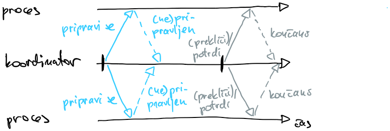
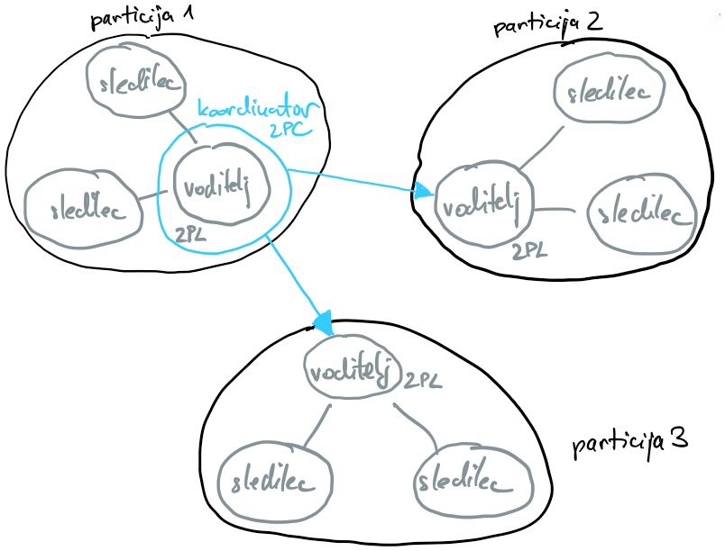
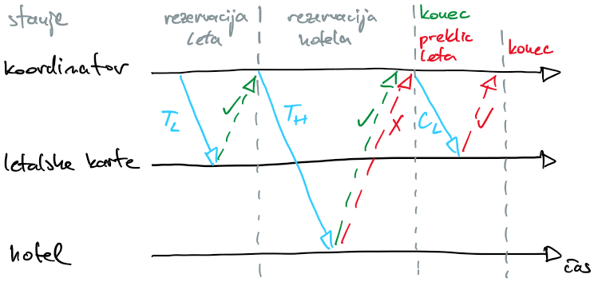

# Transakcije v porazdeljenih sistemih

- transakcija je ovojnica okrog množice operacij
- če so vse operacije uspešne, transakcija uspe
- če pade ena od operacij, pade celotna transakcija; sistem je treba restavrirati v prvotno stanje
- množična uporaba v relacijskih podatkovnih bazah
- pri mikrostoritvah potrebujemo porazdeljene transakcije
- primer: prenos denarja iz enega računa na drugega, računa sta odprta na isti ali na različnih bankah
- transakcijo sestavljajo operacije z lastnostmi ACID

## Lastnosti ACID
- *angl.* Atomicity, Consistency, Isolation, Durability
- atomarnost
    - delnih odpovedi ni - ali uspejo vse operacije ali nobena
    - če operacije ne uspejo, je treba vzpostaviti prvotno stanje
- doslednost
    - zagotavljanje veljavnih stanj; ne gre za skladnost zapisov kot pri replikaciji
    - transakcija lahko prehaja samo iz enega veljavnega stanja v drugo veljavno stanje
    - ohranjati mora invariante, ki so od aplikacije do aplikacije različne, definira jih programer
    - zgornji primer: vsota sprememb na računih mora biti 0
- izolacija
    - preprečevanje tveganih stanj pri dveh sočasnih transakcijah
- trajnost
    - ko je transakcija potrjena, spremembe shranimo na trajen medij
    - za zagotavljanje trajnosti v primeru okvar potrebujemo replikacijo

## Izolacija
- več stopenj preprečevanja tveganih stanj
    - brez nadzora (najhitrejše)
    - preprečevanje umazanih pisanj - transakcija prepiše vrednost, ki jo je druga sočasna transakcija, preden se je končala, spremenila 
    - preprečevanje umazanih branj - branje vrednosti, ki jo je druga sočasna transakcija, preden se je končala, spremenila 
    - preprečevanje nejasnih branj - dveh branji v isti transakciji sta dali različni vrednosti, ker je druga sočasna transakcija vmes spremenila vrednost
    - preprečevanje fantomskega branja - med izvajanjem poizvedbe je druga sočasna operacija izbrisala zapise
    - zaporedno izvajanje transakcij - ne prihaja do tveganih stanj, vrstni red transakcij ni podan; 
    - striktno zaporedno izvajanje (najpočasnejše) - upošteva še časovno zaporedje transakcij
- primer: PostgreSQL preprečuje umazana pisanja in branja

- zagotavljanje zaporednega izvajanja
    - preprečevanje dostopa do zapisov drugim transakcijam
    - pesimistični pristop z dvofaznim zaklepanjem
        - 2PL, *angl.* two phase lock
        - potrebujemo upravljalca ključavnic
        - enak pristop kot z bralno-pisalno ključavnico v sistemih s skupnim pomnilnikom
        - zaklepanje
            - v fazi širjenja lahko transakcija ključavnico zaklene, ne sme pa je odkleniti
            - v fazi krčenja lahko ključavnico odklene, ne sme pa je zakleniti; faza krčenja se izvede po zaključeni transakciji
        - formalno dokazano, da na ta način dosežemo popolno izolacijo
        - možen smrtni objem; potrebna je detekcija smrtnega objema in zaustavitev ene od transakcij
        - primeren pristop, če večina transakcij piše, za bralne transakcije je pristop počasen; za branje mora transakcija dobiti vse potrebne ključavnice
    - optimistični pristop
        - predpostavlja da gre za intenzivno branje iz shramb, konflikti so torej redki in transakcije se hitro izvedejo
        - ločeno hranjenje sprememb, ki jih je naredila transakcija, v dnevniku
        - ob zaključevanju transakcije primerjava dnevnikov sočasnih transakcij; če ni konfliktov, se spremembe uveljavijo na shrambi
        - vrstni red transakcij določa časovni žig
        - bralna transakcija lahko pade, če je sočasna transakcija med tem spremenila brani zapis (neučinkovito)
- nadzor z različicami
    - ob pisanju shramba naredi novo različico zapisa
        - dvofazno zaklepanje (pesimistični pristop)
        - ob zaključku transakcije $T_i$ dobijo vse nove različice zapisov časovni žig $t_{i,konec}$
    - ob branju prebere vedno isto različico zapisa - najnovejšo ob začetku transakcije
        - transakcija $T_i$ pazi, da vedno bere zapise, za katere velja $t_{i,začetek} \geq t_{j,konec}$, ne glede na to, katera transakcija $T_j$ je ustvarila nov zapis
        - transakcija vedno prebere isto vrednost, ne glede na spremembe ostalih sočasnih transakcij

## Atomarnost
- spremembe na shrambi je dobro beležiti v dnevnik, ki je shranjen na disku
- če transakcija uspe, dnevnika ne potrebujemo
- če transakcija ne uspe, moramo izničiti vse spremembe, ki jih je naredila (*angl.* roll back); v tem primeru lahko staro stanje restavriramo iz zapisov v dnevniku
- pristop je robusten dokler shramba ni porazdeljena
- primer: prenos denarja med bančnimi računi različnih bank; vsaka svojo transakcijo; če ena ne uspe, nimamo veljavnega stanja

### Dvofazno potrjevanje
- protokol, ki zagotavlja atomarno izvedbo sočasnih transakcij
- 2PC - *angl.* two phase commit
- dve stopnji: priprava in potrditev

    

- koordinator (lahko odjemalec ali voditelj shrambe) in ostali sodelujoči procesi (shramba)
    - koordinator vpraša sodelujoče procese, če so pripravljeni na potrditev transakcije
    - če vsi sodelujoči procesi soglašajo, koordinator vsem pošlje zahtevo za potrditev transakcije
    - če eden od procesov ne soglaša, koordinator vsem pošlje zahtevo za preklic transakcije
- dve kritični točki
    - če sodelujoči proces potrdi pripravljenost, potem mora transakcijo potrditi ali preklicati; če od koordinatorja ne dobi sporočila (ker je slednji odpovedal), obvisi
    - ko koordinator sprejme odločitev za potrditev ali preklic, odločitve ne more spremeniti; če odpove sodelujoči proces, bo obvisel koordinator
- dvofazno potrjevanje je torej stroga oblika soglasja, pri kateri morajo o stanju sistema soglašati tudi nedelujoči procesi
- težave protokola
    - je počasen
    - če odpove koordinator ali sodelujoči proces, so vsi v transakcijo vključeni procesi blokirani
        - tej težavi se lahko ognemo tako, da vsak proces v sistemu repliciramo; uporabimo lahko replikacijo z voditeljem 
    - protokol moramo sprogramirati za vse procese, saj lahko vsak proces uporablja svojo shrambo
- sinhrona rešitev 
  - procesi morajo čakati na drugo fazo
  - koordinator mora počakati na odzive vseh procesov po prvi in drugi fazi
  - če eden od procesov odpove, sistem blokira

## Primer: Google spanner
- shrambe NoSQL so osredotočene na odzivnost in raztegljivost, ne jamčijo lastnosti ACID; zadnje čase dobivajo funkcionalnosti klasičnih podatkovnih shramb SQL
- delitev podatkov na particije za večjo raztegljivost
- vsaka particija je replicirana na skupino vozlišč v različnih podatkovnih centrih (algoritem Paxos); vsaka particija ima sledilce in voditelja, ki tudi upravlja ključavnice za dvofazno zaklepanje (2PL)

    

- dvofazno potrjevanje (2PC) za izvedbo transakcij, ki uporabijo podatke z več particij; transakcijo začne odjemalec, koordinator je eden od voditeljev particij; piše svoj dnevnik, ki ga posreduje sledilcem; sledilci replicirajo shrambo iz dnevnika
- za izolacijo transakcij uporablja nadzor z različicami in dvofaznim zaklepanjem
- striktno zaporedno izvajanje je na porazdeljenem sistemu bolj težavno kot na enem procesu
    - natančen fizični čas - GPS ali atomske ure v vsakem podatkovnem centru
    - čas izvedbe transakcije je podan kot interval, v katerem se je transakcija najverjetneje zgodila
    - po zahtevi za potrditev transakcije X sistem počaka še za dolžino intervala preden sprosti ključavnice; s tem poskrbi, da nova transakcija, ki se je začela po zahtevi za potrditev transakcije X, vidi njene spremembe 

## Nesinhrone transakcije
- dvofazno potrjevanje je sinhroni protokol; če eden od procesov odpove, sistem blokira
- nekatere transakcije se izvajajo dolgo časa, uporabljajo ključavnice
- če se transakcije izvajajo na procesih v različnih organizacijah, ni dobro zaradi naše transakcije blokirati procesov v drugi organizaciji
- rešitev s trajnimi (*angl.* persistent) sporočili - jamčiti moramo, da bo sporočilo uporabljeno natanko enkrat
    - primer: na banki dvignemo gotovino in jo položimo na drugo banko; s tem ne blokiramo sistema nobene od bank

### Tabela odhodnih sporočil
- prvi proces v okviru transakcije posodobi zapise v shrambi in obvestilo shrani v tabelo odhodnih sporočil
- proces za posredovanje sporočil opazuje tabelo odhodnih sporočil
    - ko se sporočilo pojavi, ga posreduje drugemu procesu
    - šele ko od drugega procesa dobi potrditev, da je bilo sporočilo uspešno dostavljeno, izbriše sporočilo iz tabele
- lahko pride do podvojenih sporočil
    - sporočila je treba ustrezno označiti, da zaznamo podvojena sporočila in jih zavržemo (oznaka procesa, zaporedna številka)
- proces za posredovanje sporočila ta večkrat posreduje posredniku kot je [RabitMQ](https://www.rabbitmq.com/)
- podoben koncept kot pri replikaciji z avtomatom stanj

### Sage
- po SSKJ roman, ki v dolgi, skozi več rodov segajoči pripovedi oblikuje usodo svojih junakov
- primer: podjetje za organizacijo potovanj mora pri enem ponudniku rezervirati letalsko vozovnico, pri drugem hotel; uspeti mora oboje ali nič
- saga je porazdeljena transakcija, sestavljena iz lokalnih uveljavitvenih transakcij $T_i$ in razveljavitvenih transakcij $C_i$
- vsaka lokalna transakcija predpostavlja, da se bodo tudi ostale lokalne transakcije izvedle uspešno
- če saga zaradi neuspešne izvedbe ene od lokalnih transakcij ne uspe, razveljavitvene transakcije sistem povrnejo v stanje pred porazdeljeno transakcijo
- potrebujemo koordinatorja, ki skrbi za izvajanje lokalnih transakcij
- primer z rezervacijo letalske karte in hotela
    - sago sestavljajo tri lokalne transakcije: $T_L$ za rezervacijo letalske vozovnice, $C_L$ za razveljavitev rezervacije ter $T_H$ za rezervacijo hotela 
    - če $T_L$ ne uspe, nam ni treba ukrepati
    - koordinator ob uspešni izvedbi $T_L$ sproži še izvedbo $T_H$
        - če uspe, je organizacija potovanja uspela
        - če ne uspe, moramo preklicati porazdeljeno transakcijo; izvedemo $C_L$
- izvedba sage poteka v več korakih, za lažji nadzor toka programa je smiselno uvesti končni avtomat

- če koordinator odpove potem, ko je zahteval izvedbo lokalne transakcije in preden je posodobil svoje stanje, bo ob ponovni vzpostavitvi zahtevo posredoval še enkrat
- če proces, ki izvaja lokalno transakcijo, ni dosegljiv, bo koordinator večkrat poskušal
- proces, ki izvaja lokalno transakcijo, lahko prejme dve enaki zahtevi; potrebujemo mehanizem za obvladovanje podvojenih sporočil
- sage in izolacija
    - lokalne transakcije lahko spremembe označujejo z umazanim bitom, ki je zbrisan potem, ko saga uspe
    - saga ali lokalna transakcija, ki želi dostopati do zapisa, označenega z umazanim bitom, pade ali pa mora počakati, da zapis ni več označen
