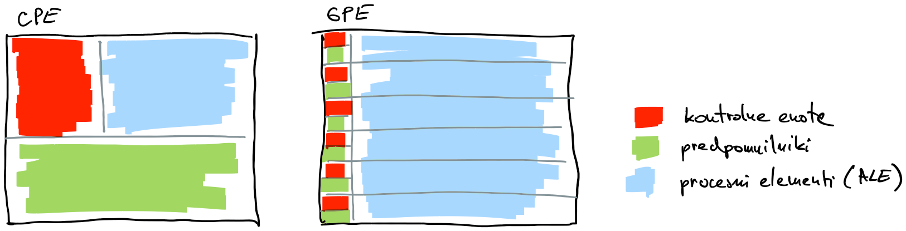
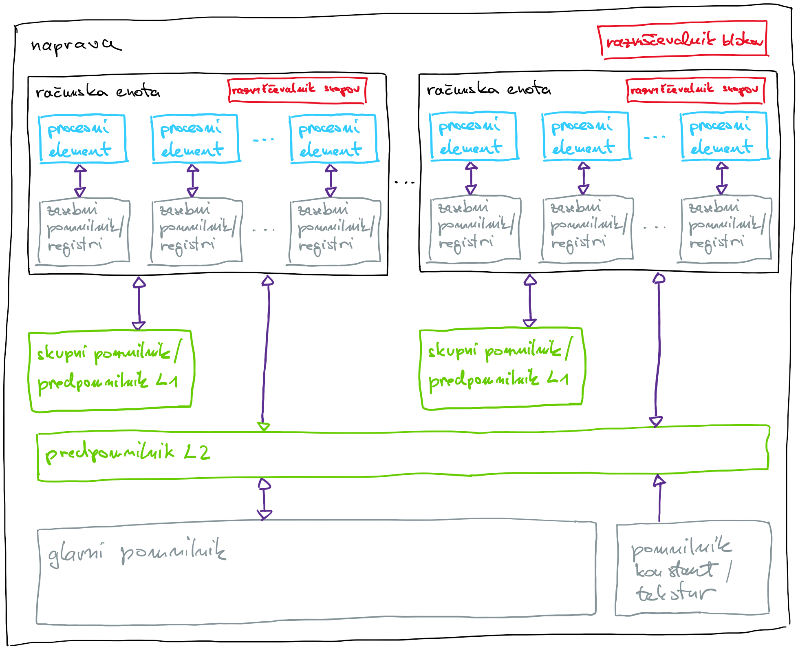

# Grafične procesne enote

## Uvod
- industrija računalniških iger je na prelomu tisočletja botrovala razvoju izjemno zmogljivih grafičnih procesnih enot
- grafične procesne enote (GPE) ali grafični pospeševalniki
    - imajo lastne procesorje in pomnilnike
    - primarno namenjena upodabljanju slik
    - grafične naloge opravijo hitreje od centralnih procesnih enot
    - 2D pospeševanje: 
        - operacije: bit-blit (block image transfer, ni utripanja pri premikanju objektov), risanje črt, barvanje, rezanje nevidnih delov slike, ...
        - senčilniki slikovnih točk
    - 3D pospeševanje:              
        - operacije: geometrijske transformacije (rotacije, perspektiva), nevidni robovi, barvanje, osvetlitev, teksture, senčenje, generiranje slike ...
        - senčilniki vozlišč
    - na začetku ločena vezja za 2D in 3D pospeševanje
        - mnogo aplikacij ne potrebuje obeh delov hkrati
        - bolj splošna vezja, ki znajo oboje
            - arhitektura Nvidia CUDA - Compute Unified Device Architecture
            - Nvidia GeForce 8800 GTX je prva naprava z arhitekturo CUDA
- v začetku tisočletja so se pojavili prvi poskusi uporabe grafičnih procesnih enot za računanje problemov, ki niso neposredno povezani z računalniško grafiko
- splošno-namensko računanje na grafičnih procesnih enotah (*angl.* general purpose graphics processing unit computing, GPGPU)
- na začetku samo programski vmesniki za delo z grafiko (Direct3D, OpenGL)
    - pretvarjanje splošnih operacij v grafične operacije nad slikovnimi točkami, vozlišči, trikotniki
    - algoritmi postanejo nepotrebno kompleksni in nepregledni
- proizvajalci grafičnih procesnih na grafičnih procesnih enotah podprejo tudi operacije v plavajoči vejici in druge
    - programiranje GPE postane podobno programiranju CPE
- programski vmesniki
    - CUDA (Nvidia)
        - omejena samo na GPE od Nvidia
        - ni potrebe po konfiguraciji strojne opreme
    - OpenCL (skupina Kronos)
        - zelo splošen, podpira GPE, vezja FPGA in čipe za digitalno procesiranje signalov (DSP)
        - prenosljivost ima svojo ceno - vsak program vključuje veliko programske kode za inicializacijo in preverjanje ustreznosti sistema
- programski model
    - precej drugačen od programskega modela CPE
    - kodo moramo v veliki meri napisati na novo
    - ustvarimo neomejeno število niti
    - razvrščevalnik niti dinamično razvršča na strojno opremo

## Arhitektura 

### GPE in CPE
- CPE
    - kompleksna kontrolna enota (analiza programskega toka)
    - velik predpomnilnik
    - optimiziran za zaporedno izvajanje
    - boljši od GPE pri problemih, kjer prihaja do pogoste divergence programskega toka: vejitve, rekurzija, operacije na grafih
- GPE so računsko zelo zmogljive naprave
    - poudarek na vzporednosti (ločeno računanje slikovnih točk)
    - veliko enostavnih aritmetično-logičnih enot (ALE) na račun kontrolnih enot in predpomnilnika
    - toleriranje latence pri dostopu do pomnilnika 
    - odlične za močno vzporedne probleme - vzporedni podatkovni tokovi, matrične operacije

    
  
### Hierarhična zasnova procesorjev

- računska enota 
    - *angl.*  compute unit, multiprocessor - MP, SIMD engine
    - podobno kot jedro na CPE
    - svoj nabor ukazov
    - zgrajena je iz množice procesnih elementov in drugih računskih enot ter kontrolnih enot

- procesni element
    - *angl.* processing elements - PE, streaming processor - SP, core, ALE
    - podobna vloga kot ALE na CPE
    - koncept SIMD (*angl.* single instruction multiple data)
    - v novejših arhitekturah specializirane enote za celoštevilčno računanje, računanje v enojni in dvojni natančnosti

- druge računske enote
    - posebne funkcije (*angl.* special function units)
    - tenzorska jedra 

- kontrolna enota nadzira več procesnih elementov
    - prevzem in dekodiranje ukazov
    - nima naprednih funkcij analize ukaznega toka
    - zakrivanje latence dostopa do pomnilnika z dobrim razvrščanjem ogromne množice niti
    - razvrščanje niti na procesne elemente (*angl.* warp scheduler)
    - prevzem in shranjevanje operandov (*angl.* load/store units)


### Hierarhična zasnova pomnilnikov

- računska enota
    - zasebni pomnilnik (*angl.* private memory) imenovan tudi registri (*angl.* register file)
        - 32-bitni registri
        - razdeljen med procesne elemente
        - vsaka nit dobi svoj delež
        - prevajalnik za lokalne spremenljivke v jedru uporabi registre
        - če registrov zmanjka, uporabi del globalnega pomnilnika!
        - dostopni čas: 1 cikel
    - L1 predpomnilnik in skupni pomnilnik (*angl.* shared memory)
        - v naprej določimo razmerje med L1 predpomnilnikom in skupnim pomnilnikom
        - preko skupnega pomnilnika si niti izmenjujejo podatke
        - dostopni čas: 1 - 32 ciklov
- naprava
    - predpomnilnik L2
        - skupen vsem računskim enotam
        - z njim naprava upravlja samodejno
    - globalni pomnilnik
        - za izmenjevanje podatkov s CPE
        - računske enote lahko berejo in pišejo
        - razdeljen na segmente po 128 bajtov, v računsko enoto se vedno prenese celoten segment
        - dostopno čas: ~500 ciklov        
    - pomnilnik konstant
        - za izmenjevanje podatkov s CPE
        - računske enote lahko samo berejo
        - dostopno čas: ~500 ciklov

    


## Heterogeni sistem

- poleg CPE vsebuje enega ali več pospeševalnikov
- CPE pravimo gostitelj (*angl.* host), pospeševalniku pa naprava (*angl.* device)
- naprava je z gostiteljem običajno povezana preko hitrega vodila
- razbremenjevanje glavnega procesorja (*angl.* offload)
- programi za heterogene sisteme so sestavljeni iz dveh delov
    - zaporedne kode na gostitelju
        - detekcija naprave (1)
        - prenos podatkov na napravo (2)
        - prevajanje (3) in prenos programa na napravo (4)
        - sproži izvajanje programa na napravi (5)
        - prenos podatkov nazaj na gostitelja (7)       
    - vzporedno izvajane kode na napravi (6)
        - ščepec ali jedro (*angl.* kernel)
        - kodo izvaja vsaka nit
- asinhrono izvajanje 
    - ko gostitelj sproži izvajanje ščepca, lahko nadaljuje z izvajanjem svojega programa
    - izvajanje ščepca se lahko prekriva s prenašanjem podatkov med napravo in gostiteljem

    


## Izvajalni model

- poudarek na podatkovnem paralelizmu
- izvajati želimo ogromno število niti, tako bodo vedno na voljo niti, ki so pripravljene na izvajanje - zakrivanje latence dostopa do glavnega pomnilnika
- hierarhična organizacija niti 
    - sledi hierarhični arhitekturi procesorjev in pomnilnikov: blok niti in snop niti
    - blok niti
        - bloke niti na računske enote enakomerno razvršča glavni razvrščevalnik na napravi
        - vse niti v bloku se izvajajo na isti računski enoti
        - na isti računski enoti se hkrati lahko izvaja več različnih blokov niti, števil oje omejeno z arhitekturo GPE
        - blok niti se na računski enoti izvaja neodvisno od ostalih blokov
        - vrstni red izvajanja blokov ni podan: predvideti moramo, da se bloki lahko izvajajo celo zaporedno
        - blok niti se na računski enoti izvaja dokler z izvajanjem ne zaključijo vse niti v bloku
        - niti v bloku si lahko izmenjujejo podatke preko skupnega pomnilnika
        - niti v bloku lahko preko skupnega pomnilnika sinhroniziramo
    - snop niti
        - predstavlja manjšo skupino niti v bloku z zaporednimi indeksi (32 pri Nvidia GPE)
        - snop je osnovna enota, s katero upravlja računska enota 
        - niti v snopu izvajajo isti ukaz
            - koncept SIMT (*angl.* single instruction multiple threads)
            - vsaka nit ima svoj programski števec in zasebne registre, zato se lahko neodvisno vejijo in izvajajo 
            - izvajanje niti v snopu je učinkovito, če vse hkrati izvajajo isti ukaz
            - če niti v snopu vejijo, se začnejo izvajati zaporedno, dokler se vse ne vrnejo na isti ukaz
        - preklapljanje med snopi 
            - če snop ni pripravljen (branje ali pisanje operandov v pomnilnik), lahko razvrščevalnik da v izvajanje drug razpoložljiv snop iz kateregakoli bloka, ki se izvaja na računski enoti
            - pri preklapljanju ni režijskih stroškov
                - strojni viri (pomnilniki, registri) so enakomerno razdeljeni med vse niti na računski enoti
                - stanje snopa je ves čas na voljo, ob preklapljanju zato ni potrebe po shranjevanju in restavriranju registrov
- dostop do glavnega pomnilnika
    - glavni pomnilnik je razdeljen na segmente po 128 bajtov
    - če niti iz istega snopa dostopajo do različnih podatkov v istem segmentu, se podatki dostavijo v eni pomnilniški transakciji
    - če so v segmentu podatki, ki jih ni zahtevala nobena nit, se ti vseeno prenesejo, s čimer se zmanjša efektivna prepustnost
    - če dve niti iz istega snopa dostopata do podatkov v različnih segmentih, se podatki dostavijo v dveh pomnilniških transakcijah
- omejitve
    - največje število niti v bloku (1024)
    - največje število niti na eni računski enoti (2048)
    - največje število blokov na eni računski enoti (32)
    - število niti v snopu (16/32)
    - največje število snopov na eni računski enoti (64)
    - največje število registrov na nit (255)
    - velikost skupnega pomnilnika za računsko enoto (48 - 228 kB)
    - velikost skupnega pomnilnika za blok (48 kB)

- lastnostni naprave
    - poizvedba o trenutnem stanju naprave v sistemu
    ```bash
    srun --partition=gpu --gpus=1 nvidia-smi --query
    ```
    - program za izpis podatkov o napravi: [naprava.c](koda/naprava.c)
    - primer izpisa

        ```C
        ======= Device 0: "NVIDIA H100 PCIe" =======

        cudaDeviceGetProperties:
          CUDA Architecture:                             Hopper, 9.0

          GPU clock rate (MHz):                          1755
          Memory clock rate (MHz):                       1593
          Memory bus width (bits):                       5120
          Peak memory bandwidth (GB/s):                  2039

          Number of MPs:                                 114
          Number of cores per MP:                        128
          Total number of cores:                         14592

          Total amount of global memory (GB):            79
          Total amount of shared memory per MP (kB):     228
          Total amount of shared memory per block (kB):  48
          Maximum number of registers per MP:            65536
          Total number of registers available per block: 65536

          Maximum number of threads per MP:              2048
          Maximum number of threads per block:           1024
          Warp size:                                     32

          Max dimension size of a thread block (x,y,z):  (1024, 1024, 64)
          Max dimension size of a grid size    (x,y,z):  (2147483647, 65535, 65535)

        cudaDeviceGetAttribute:
          Size of L2 cache in MB:                        50
          Maximum nuber of blocks per MP:                32    
        ```
