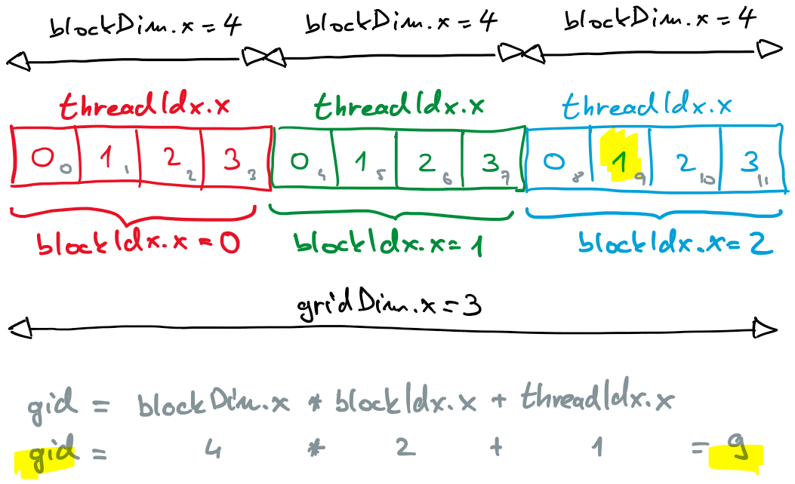

# Programski vmesnik CUDA

- ščepec ali jedro predstavlja kodo, ki se izvaja na GPE
- ščepec napišemo kot zaporedni program
- programski vmesnik poskrbi za prevajanje in prenos ščepca na napravo
- ščepec izvaja vsaka nit posebej na svojih podatkih


## Hierarhična organizacija niti

- mreža niti (*angl.* grid)
    - vse niti v mreži izvajajo isti ščepec
    - niti v mreži si delijo globalni pomnilnik na GPE
    - mreža je sestavljena iz blokov niti
- blok niti
    - vse niti v bloku se izvajajo na isti računski enoti
    - preko skupnega pomnilnika lahko izmenjujejo in se sinhronizirajo
- nit
    - zaporedno izvaja ščepec na svojih podatkih
    - uporablja zasebni pomnilnik
    - z nitmi v bloku si deli skupni pomnilnik
    - lahko dostopa do globalne pomnilnika in pomnilnika konstant


## Označevanje niti

- 1D, 2D ali 3D oštevilčenje
- število dimenzij izberemo glede na naravo problema
- CUDA C podpira množico spremenljivk, ki odražajo organizacijo niti
    - `threadIdx.x`, `threadIdx.y`, `threadIdx.z`
    - `blockIdx.x`, `blockIdx.y`, `blockIdx.z`
    - `blockDim.x`, `blockDim.y`, `blockDim.z`
    - `gridDim.x`, `gridDim.y`, `gridDim.z`
- niti se v snope združujejo najprej po dimenziji `x`, potem `y` in nazadnje `z`




## Ščepec ali jedro

- ščepec ali jedro je koda, ki jo zaženemo na gostitelju, izvaja pa se na napravi
- ščepec napišemo kot funkcijo, ki ji pred deklaracijo dodamo ključno besedo `__global__`
- ščepec ne vrača vrednosti
- primer ščepca

    ```C
    __global__ void pozdrav(void) {
        printf("Pozdrav z naprave, nit %d.%d!\n", blockIdx.x, threadIdx.x);
    }
    ```

- ščepec zaženemo na gostitelju, kjer med ime in argumente vrinemo trojne trikotne oklepaje
- med trojne trikotne oklepaje vpišemo organizacijo niti v mreži - število blokov in število niti v vsaki dimenziji
- za opis večdimenzionalne organizacije niti jezik CUDA C ponuja strukturo `dim3`

    ```C
	dim3 gridSize(numBlocks, 1, 1);
	dim3 blockSize(numThreads, 1, 1);
	pozdrav<<<gridSize, blockSize>>>();
    ```
- ščepec lahko kliče tudi druge funkcije na napravi, ki jih označimo s ključno besedo `__device__`
- če želimo poudariti, da se funkcija izvaja samo na gostitelju, jo označimo s `__host__`

- prvi program na GPE
    - [pozdrav-gpe.cu](koda/pozdrav-gpe.cu)
    - naložimo modul: `module load CUDA`
    - kodo prevedemo s prevajalnikom za CUDA C: `nvcc -o pozdrav-gpe pozdrav-gpe.cu`
    - zaženemo program: `srun --gpus=1 --partition=gpu ./pozdrav-gpe 2 4`


## Rezervacija pomnilnika in prenašanje podatkov
- gostitelj ima dostop samo do globalnega pomnilnika naprave

### Eksplicitno prenašanje podatkov

- na gostitelju pomnilnik rezerviramo s funkcijo `malloc` in vanj vpišemo podatke
- globalni pomnilnik na napravi rezerviramo s klicem funkcije
    ```C
    cudaError_t cudaMalloc(void** dPtr, size_t count)
    ```
    - funkcija rezervira `count` bajtov in vrne naslov v globalnem pomnilniku naprave v kazalcu `dPtr`
- za prenašanje podatkov med globalnim pomnilnikom naprave in pomnilnikom gostitelja uporabimo funkcijo
    ```C
    cudaError_t cudaMemcpy(void* dst, const void* src, size_t count, cudaMemcpyKind kind)
    ```
    - funkcija kopira `count` bajtov iz naslova `src` na naslov `dst` v smeri določeni s `kind`, ki je 
        - za prenos podatkov iz gostitelja na napravo `cudaMemcpyHostToDevice` in
        - za prenos podatkov iz naprave na gostitelja `cudaMemcpyDeviceToHost`
    - funkcija je blokirajoča - izvajanje programa se nadaljuje šele po končanem prenosu podatkov
- pomnilnik na napravi sprostimo s klicem funkcije
    ```C
    cudaError_t cudaFree(void *devPtr)
    ```
- pomnilnik na gostitelju sprostimo s klicem funkcije `free`

### Enotni pomnilnik

- novejše različice CUDA podpirajo enotni pomnilnik
- prenos podatkov izvaja CUDA po potrebi
- programer nima nadzora, večkrat manj učinkovito od eksplicitnega prenašanja
- enotni pomnilnik rezerviramo s klicem funkcije
    ```C
    cudaError_t = cudaMallocManaged(void **hdPtr, count);
    ```
- enotni pomnilnik sprostimo s klicem funkcije
    ```C
    cudaError_t cudaFree(void *hdPtr)
    ```

## Primer: računanje razlike vektorjev

- $\mathbf{c} = \mathbf{a} - \mathbf{b}$
- [vektorja-razlika-1.cu](koda/vektorja-razlika-1.cu)
    - gostitelj
        - preberemo argumente iz ukazne vrstice
        - rezerviramo pomnilnik za vektorje na gostitelju (`ha`, `hb`, `hc`)
        - nastavimo vrednosti vektorjev na gostitelju
        - rezerviramo pomnilnik za vektorje na napravi (`da`, `db`, `dc`)
        - prenesemo vektorja $\mathbf{a}$ in $\mathbf{b}$ iz gostitelja na napravo
        - na napravi zaženemo ščepec, ki izračuna razliko $\mathbf{c}$
        - prenesemo vektor $\mathbf{c}$ iz naprave na gostitelja
        - preverimo rezultat
        - sprostimo pomnilnik na napravi
        - sprostimo pomnilnik na gostitelju
    - naprava
        - vsaka nit izračuna razliko istoležnih elementov v vektorjih $\mathbf{a}$ in $\mathbf{b}$
        - indeks niti določa kateri par elementov obdela posamezna nit
        - slaba rešitev: indeks lahko presega velikost tabele
- [vektorja-razlika-2.cu](koda/vektorja-razlika-2.cu)
    - preverimo velikost tabele
    - še vedno podpora za samo en blok niti
- [vektorja-razlika-3.cu](koda/vektorja-razlika-3.cu)
    - podpora za več blokov
    - napačen rezultat, če je elementov več kot niti
- [vektorja-razlika-4.cu](koda/vektorja-razlika-4.cu)
    - pravilna rešitev
    - uporabnik določa število blokov
- [vektorja-razlika-5.cu](koda/vektorja-razlika-5.cu)
    - pravilna rešitev
    - izračun potrebnega števila blokov
- [vektorja-razlika-6.cu](koda/vektorja-razlika-6.cu)
    - rešitev z enotnim pomnilnikom
