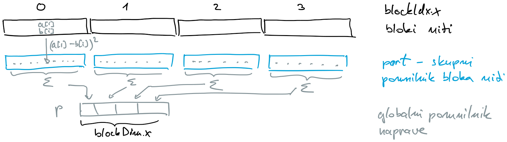
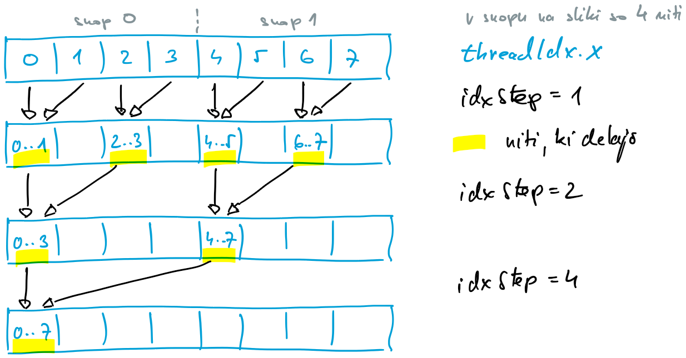
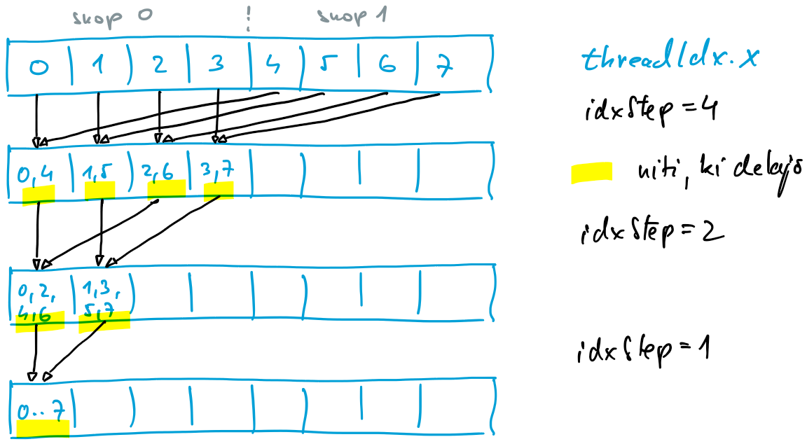
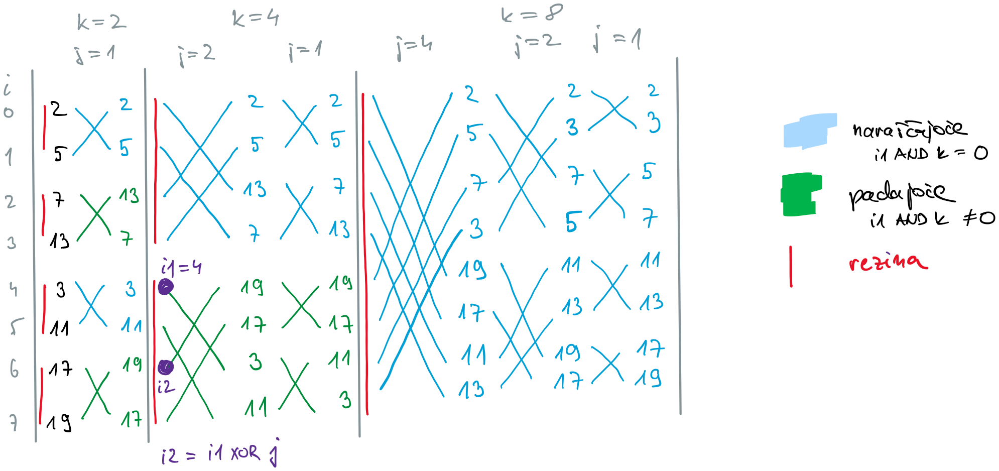

# CUDA - primeri programov

## Primer: računanje razlike vektorjev

- imamo vektorja $\mathbf{a}=(a_0, \ldots, a_{N-1})$ in $\mathbf{b}=(a_0, \ldots, a_{N-1})$
- razlika med njima je enaka $\mathbf{c} = \mathbf{a} - \mathbf{b}$

- [razlika-1.cu](koda/razlika/razlika-1.cu)
  - gostitelj
    - preberemo argumente iz ukazne vrstice
    - rezerviramo pomnilnik za vektorje na gostitelju (`ha`, `hb`, `hc`)
    - nastavimo vrednosti vektorjev na gostitelju
    - rezerviramo pomnilnik za vektorje na napravi (`da`, `db`, `dc`)
    - prenesemo vektorja $\mathbf{a}$ in $\mathbf{b}$ iz gostitelja na napravo
    - na napravi zaženemo ščepec, ki izračuna razliko $\mathbf{c}$
    - prenesemo vektor $\mathbf{c}$ iz naprave na gostitelja
    - preverimo rezultat
    - sprostimo pomnilnik na napravi
    - sprostimo pomnilnik na gostitelju
  - naprava
    - vsaka nit izračuna razliko para istoležnih elementov v vektorjih $\mathbf{a}$ in $\mathbf{b}$
    - indeks niti določa kateri par elementov obdela posamezna nit
    - slaba rešitev: indeks lahko presega velikost tabele
- [razlika-2.cu](koda/razlika/razlika-2.cu)
  - preverimo velikost tabele
  - še vedno podpora za samo en blok niti
- [razlika-3.cu](koda/razlika/razlika-3.cu)
  - podpora za več blokov
  - napačen rezultat, če je elementov več kot niti
- [razlika-4.cu](koda/razlika/razlika-4.cu)
  - pravilna rešitev
  - uporabnik določa število blokov
- [razlika-5.cu](koda/razlika/razlika-5.cu)
  - pravilna rešitev
  - izračun potrebnega števila blokov
- [razlika-6.cu](koda/razlika/razlika-6.cu)
  - rešitev z enotnim pomnilnikom

## Primer: razdalja med vektorjema

- imamo vektorja $\mathbf{a}=(a_0, \ldots, a_{N-1})$ in $\mathbf{b}=(a_0, \ldots, a_{N-1})$
- razdalja med njima je enaka

  $$\mathrm{dist} = \sqrt{\sum_{i=0}^{N-1} (a_i - b_i)^2 }$$

- [razdalja-01.cu](koda/razdalja/razdalja-01.cu)
  - nadgradimo rešitev [razlika-05.cu](../20-cuda/koda/razlika-5.cu)
  - razlike med elementi vektorjev izračunamo na napravi
  - na gostitelju seštejemo kvadrate razlik in izračunamo koren vsote

- [razdalja-02.cu](koda/razdalja/razdalja-02.cu)
  - kvadriranje izvedemo na napravi
  - zaporedno seštevanje vseh kvadratov in koren vsote izvedemo na gostitelju

- [razdalja-03.cu](koda/razdalja/razdalja-03.cu)
  - naprava
    - izračunamo vsote kvadratov za vsak blok niti
    - uporabimo skupni pomnilnik, rezerviramo ga statično
    - niti kvadrate razlik shranijo v skupni pomnilnik
    - ko vse niti izračunajo svoje kvadrate, naredimo pregrado (`__syncThreads()`)
    - na koncu delno vsoto kvadratov za blok izračuna prva nit z lokalnim indeksom `threadIdx.x = 0`, ki zaporedno sešteje vse kvadrate razlik, ki so jih niti prej shranile v skupni pomnilnik
  - gostitelj
    - iz naprave kopiramo vektor delnih vsot, ki ima toliko elementov, kot je blokov niti
    - zaporedno seštejemo delne vsote in izračunamo koren vsote



- [razdalja-04.cu](koda/razdalja/razdalja-04.cu)
  - skupni pomnilnik rezerviramo dinamično
  - pri seštevanju uporabimo register

- [razdalja-05.cu](koda/razdalja/razdalja-05.cu)
  - zaporedno seštevanje delne vsote kvadratov zamenjamo s seštevanjem po drevesu, korak povečujemo
  - po vsakem koraku potrebujemo pregrado



- [razdalja-06.cu](koda/razdalja/razdalja-06.cu)
  - seštevanje po drevesu, korak zmanjšujemo



- [razdalja-07.cu](koda/razdalja/razdalja-07.cu)
  - seštevanje po drevesu, korak zmanjšujemo
  - upoštevamo, da niti v snopu ne potrebujejo sinhronizacije s pregrado

- [razdalja-08.cu](koda/razdalja/razdalja-08.cu)
  - prenos vektorja delnih vsot zamenjamo z atomarnim seštevanjem

- [razdalja-09.cu](koda/razdalja/razdalja-09.cu)
  - atomarno seštevanje in enotni pomnilnik

- [razdalja-10.cu](koda/razdalja/razdalja-10.cu)
  - pretirana uporaba atomarnega seštevanja in enotni pomnilnik

## Primer: bitonično urejanje

- neobičajen algoritem za urejanje
- zelo enostavno ga je vzporediti, saj niti v vseh korakih delajo na ločenih podatkih
- algoritem ni intuitiven, uporablja precej pregrad

- algoritem po korakih gradi urejene rezine podatkov, ki tvorijo bitonična zaporedja
- bitonično zaporedje je zaporedje elementov, v katerem vrednosti najprej naraščajo, potem pa padajo
- primerjave elementov v vsakem koraku sledijo vzorcu metulja (podobno kot pri algoritmu FFT)
- pri osnovnem algoritmu mora biti število elementov v tabeli potenca števila 2

- primer: urejanje 8 števil: 2, 5, 7, 13, 3, 11, 17, 19
  - imamo $\log_2{8}=3$ primerjave z velikostmi rezin $k=2, 4, 8$
    - ob primerjavi elementa po potrebi zamenjamo glede na zahtevano urejanje (naraščajoče, padajoče)
    - vsaka primerjava je sestavljena iz $\log_2{k}$ korakov, kjer primerjamo elemente oddaljene za $j=k/2, k/4, \ldots, 1$
  - prva primerjava poteka na rezinah velikosti $k=2$
    - primerjamo sosednje elemente, ki jih izmenično urejamo naraščajoče in padajoče
    - dobimo bitonično zaporedje
  - druga primerjava poteka na rezinah velikosti $k=4$ v dveh korakih
    - najprej med elementi, ki so oddaljeni za $j=2$, s čimer v zgornji rezini urejamo naraščajoče, v spodnji rezini pa padajoče
    - nato še med elementi, ki so oddaljeni za $j=1$, saj moramo ponovno urediti elemente znotraj obeh rezin - v zgornji rezini urejamo naraščajoče, v spodnji rezini pa padajoče
    - rezultat primerjave sta dva rezini, prva urejena naraščajoče, druga padajoče
  - tretja primerjava poteka na eni sami rezini velikosti $k=8$, ki jo urejamo naraščajoče v treh korakih
    - najprej primerjamo elemente, ki so oddaljeni za $j=4$
    - nato postopek ponavljamo na pol manjši razdalji, $j=j/2$
    - zaključimo, ko naredimo primerjave za $j=1$

- shema urejanja 8 elementov iz primera



- zaporedna koda za bitonično urejanje vektorja $\mathbf{a}$

  ```C
  for (int k = 2; k <= tableLength; k <<= 1) 
      for (int j = k/2; j > 0; j >>= 1)
          for (int i1 = 0; i1 < tableLength; i1++) {  // element 1
              int i2 = i1 ^ j;                        // element 2
              int dec = i1 & k;                       // padajoče ali naraščajoče
              if (i2 > i1)                            // primerjamo samo enkrat
                  if ((dec == 0 && a[i1] > a[i2]) || (dec != 0 && a[i1] < a[i2])) {
                      int temp = a[i1];
                      a[i1] = a[i2];
                      a[i2] = temp;
                  }
          }
  ```

- [urejanje-1.cu](koda/urejanje/urejanje-1.cu)
  - gostitelj
    - izvaja zanki po indeksih `k` in `j`
    - globalna sinhronizacija ob novem klicu ščepca
  - naprava
    - vzporedimo najbolj notranjo zanko (indeks `i`)
    - indeks prvega elementa `i1` določimo iz globalnega indeksa niti `gid`
  - dela samo polovica niti (pogoj `i2 > i1`)
- [urejanje-2.cu](koda/urejanje/urejanje-2.cu)
  - zaposlimo vse niti
  - število elementov je dvakrat tolikšno, kot je število niti - spremembe v ščepcu in na gostitelju
  - bolj zoprn izračun prvega elementa, ki ga ureja izbrana nit, `i1 = 2*j * (int)(gid/j) + (gid%j);`
- [urejanje-3.cu](koda/urejanje/urejanje-3.cu)
  - dokler urejamo rezine, ki so manjše ali enake številu niti v bloku, se lahko delamo sinhronizacijo v bloku
  - ščepec `bitonicSort` spremenimo v funkcijo, ki se izvaja samo na napravi (`__device__`)
  - naredimo tri ščepce, ki kličejo funkcijo `bitonicSort`
    - `bitonicSortStart`
      - se zažene prvi in ureja, dokler $k$ ne preseže dvakratnika števila niti v bloku
      - vključuje zanki po indeksih `k` in `j` in sinhronizacijo v bloku s `__syncthreads()`
    - `bitonicSortMiddle`
      - zunanji zanki izvaja gostitelj, tako kot prej pri ščepcu `bitonicSort`
    - `bitonicSortFinish` 
      - prevzame zaključno urejanje rezine, ko je razdalja med elementi $j$ enaka ali manjša od števila niti v bloku
- [urejanje-4.cu](koda/urejanje/urejanje-4.cu)
  - ščepca `bitonicSortStart` in `bitonicSortFinish` podatke najprej skopirata iz glavnega v skupni pomnilnik, jih uredita in po urejanju zapišeta nazaj v glavni pomnilnik
  - podatke v ščepcu `bitonicSortMiddle` preberemo in po potrebi preuredimo samo enkrat, zato bo uporaba skupnega pomnilnika kvečjemu upočasnila izvajanje
