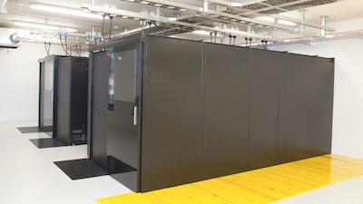

# Uporaba računske gruče Arnes

Pri predmetu Porazdeljeni sistemi bomo za delo uporabljali računsko gručo [Arnes](https://www.arnes.si/arnes-z-najzmogljivejsim-superacunalnikom-v-sloveniji/). Trenutno je to drugi najzmogljivejši superračunalnik v Sloveniji ([prvi je Vega](https://doc.vega.izum.si/general-spec/)).
|  | 
|:--:| 
| *Računska gruča Arnes*|

### Specifikacije
- 4256 procesorskih jeder
  - 62 x 64 jeder, [AMD Epyc 7702P](https://www.amd.com/en/products/cpu/amd-epyc-7702p)
  - 24 x 12 jeder [AMD Epyc 7272](https://www.amd.com/en/products/cpu/amd-epyc-7272), 2x [Nvidia V100](https://www.nvidia.com/en-us/data-center/v100/)
- 17,9 TB RAM
- 3 PB HDD, 320 TB SSD
- 100 Gb/s WAN
- Programska oprema
  - OS [AlmaLinux 8](https://almalinux.org/)
  - Porazdeljen datotečni sistem [Ceph](https://ceph.io/en/)
  - Sistem za upravljanje s posli [SLURM](https://slurm.schedmd.com/)

Do sistema bomo dostopali preko povezave SSH. Uporabniške račune in gesla za dostop najdete na [spletni učilnici FRI](https://ucilnica.fri.uni-lj.si/mod/assign/view.php?id=37145). Dostop je mogoč samo z uporabo ustreznega ključa SSH. Navodila kako si ustvarite lasten ključ in ga dodate v sistem za upravljanje z identitetami najdete na [tukaj](https://doc.sling.si/workshops/supercomputing-essentials/02-slurm/06-ssh-key/). Po tem, ko ste uredili vse potrebno se na gručo preko ukazne vrstice povežete z ukazom:

```ssh <uporabnisko_ime>@hpc-login.arnes.si```

## Nastavitev okolja

Pri delo z gručo lahko uporabljate poljubno orodje za oddaljen dostop (ukazna lupina, MobaXterm, Putty, FileZilla, WinSCP, CyberDuck, Termius, ...). Priporočamo pa uporabo orodja [VSCode](https://code.visualstudio.com/) v kombinaciji z razširitvijo [Remote - SSH](https://code.visualstudio.com/docs/remote/ssh). Navodila kako vzpostavite povezavo preko VSCode najdete [tukaj](https://doc.sling.si/navodila/vscode/). 

## Zaganjanje poslov na gruči

Vodič za delo na gruči in uporamo vmesne programske upreme [SLURM](https://slurm.schedmd.com/) za upravljanje s posli in nalogami najdete [tukaj](https://doc.sling.si/workshops/supercomputing-essentials/01-intro/01-course/). Vsem udeležencem predmeta priporočam, da se prebijejo čez tečaj objavljen na prejšnji povezavi. Pri našem delu z gručo bomo uporabljali rezervacijo `psistemi`, tako da ne bomo imeli težav s čakanjem, da se naši posli izvedejo. V rezervaciji imamo na voljo nekaj računskih vozlišč, ki jih ostali uporabniki gruče ne morejo zasesti. Rezervacijo pri zaganjanju posla uporabite na naslednji način:

```srun --reservation=psistemi <ime_programa>```

## Naloga
*Ne šteje kot ena izmed petih nalog pri predmetu!*
1. Spremeni privzeto uporabniško geslo na [https://fido.sling.si/](https://fido.sling.si/).
2. Ustvari in dodaj ključ SSH v uporabniški profil na [https://fido.sling.si/](https://fido.sling.si/). Navodila najdete na [povezavi](https://doc.sling.si/workshops/supercomputing-essentials/02-slurm/06-ssh-key/).
3. Preko SSH se povežite na vstopno vozlišče Arnes: `hpc-login.arnes.si`.
4. Zaženite program `hostname` na računskem vozlišču znotraj rezervacije `psistemi`.
5. Zaženite program `nvidia-smi` (izpiše informacije o grafičnih procesnih enotah na vozlišču). Pri zagonu morate uporabiti ustrezno particijo z vozlišči, ki vsebujejo GPE. (`--partition=gpu`).
6. Kogar zanima malo več gre lahko skozi delavnico [Osnove superračunalništva](https://doc.sling.si/workshops/supercomputing-essentials/01-intro/01-course/).