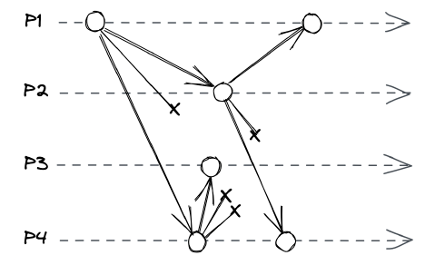
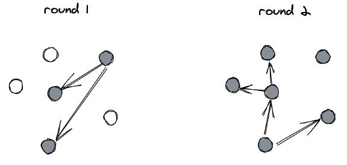

# Razširjanje sporočil

Pri kompleksnejših porazdeljenih algoritmih želimo včasih poslati neko sporočilo vsem procesom v skupini. To operacijo imenujemo razširjanje (angl. broadcast). V primeru uporabe mrežnih protokolov, kjer je komunikacija tipično točka-v-točka, je potrebno razviti protokol za učinkovito razširjanje sporočil.  Protokoli za razširjanje sporočil lahko ponujajo različne ravni zanesljivosti in izpolnjujejo bolj ali manj stroge zahteve glede vrstnega reda prejetih sporočil. V nadaljevanju bomo predstavili dva protokola, ki zagotavljata zanesljivo razširjanje sporočil v skupini procesov.

## Nestrpno razširjanje
Pri nestrpnem razširjanju proces ob prvem prejemu sporočila to nemudoma posreduje vsem ostalim procesom. Ta postopek zagotavlja, da bo sporočilo dostavljeno vsem delujočim procesom v skupini, tudi če izvorni pošiljatelj odpove.  Zanesljivost je v tem primeru dosežena z visokim številom posredovanih sporočil med procesi. Pri razširjanju sporočila med $N$ rpocesov, vsak proces prejme $N-1$ sporočil, kar pa je precej neučinkovito, saj se vsakič razpošlje $N^2$ sporočil.

## Razširjanje z govoricami
Število posredovanih sporočil lahko zmanjšamo, če vsak proces sporočilo posreduje le naključni podmnožici procesov. Ta pristop zaradi naključnosti ne zagotavlja, da bo sporočilo dobil vsak proces, vendar se lahko tej zahtevi približamo s poljubno verjetnostjo, ki je odvisna od parametrov protokola razširjanja. Ker ta način delovanja spominja na širjenje govoric, mu pravimo razširjanje z govoricami.

## Naloga

Navodila za tretjo domačo nalogo najdete [tukaj](../naloga-3/naloga-3.md).
