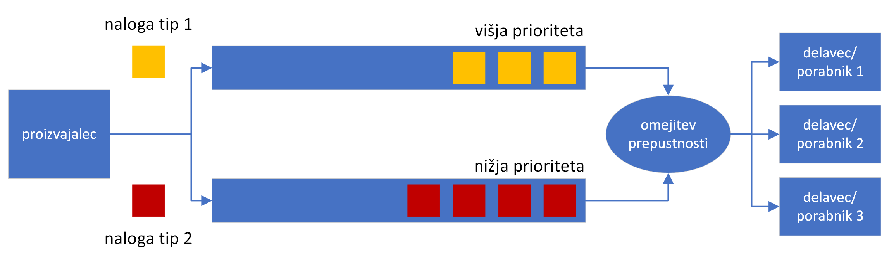

# 2. Domača naloga: Indeksiranje in iskanje po objavah na socialnem omrežju Q

**Rok za oddajo: 3. 12. 2023**

Izmišljenemu socialnemu omrežju **Q** želimo dodati storitev, ki bo omogočala iskanje s ključnimi besedami po naboru objav. **Q** bomo simulirali lokalno s pomočjo paketa [socialNetwork](./koda/socialNetwork/). Zahtevki, ki pridejo do storitve za indeksiranje so dveh tipov. Bodisi so to zahtevki za iskanje `search` ali pa zahtevki za indeksiranje `index` objav. Posamezen zahtevek je opisan s podatkovno strukturo 

```Go
type Task struct {
	Id       uint64
	TaskType string
	Data     string
}
```
Pomen posameznih polj:
 - Polje `Id`: identifikator zahtevka
 - Polje `TaskType`: Tip zahtevka, ki je lahko `search` ali `index`
 - Polje `Data`: Vsebina zahtevka. V primeru, da je zahtevek tipa `search`, potem je vsebina enaka ključni besedi, ki jo želimo posikati v indeksu. V primeru, da je zahtevek tipa `index`, se v polju nahaja objava, ki ga želimo indeksirati. 

**Procesiranje zahtevka tipa `index`:**

Ko dobimo zahtevek tipa `index`, je naša naloga, da najprej iz besedila objave izluščimo ključne besede. To storimo tako, da iz besedila **odstranite vsa ločila in ostale posebne znake**. Spremenite vse znake v **male tiskane črke**. Iz besedila nato izluščite vse besede, ki **dolge vsaj 4 znake** in jih dodate v indeks ključnih besed. Indeks ključnih besed deluje po principu [obrnjenega kazala](https://en.wikipedia.org/wiki/Inverted_index) (angl. Inverted Index), kjer za vsako ključno besedo hranimo seznam objav, v katerih se beseda pojavi. V kazalu, torej za vsako ključno besedo hranimo `Id`-je vseh objav, v katerih se je pojavila. Po koncu obdelave izpišemo objavo na zaslon. 

**Procesiranje zahteveka tipa `search`:**

Ko dobimo zahtevek tipa `search`, je naša naloga, da na zaslon izpišemo ključno besedo, ki jo iščemo in `Id`-je vseh objav, v katerih se je beseda pojavila.

**Prioriteta obdelave zahtevkov in omejevanje prepustnosti**

Zahtevke naj obdeluje več delavcev. Število delavcev določimo preko argumenta ukazne vrstice.

V našem servisu za indeksiranje želimo obravnavati zahtevke z različnimi prioritetami. Želimo, da imajo zahtevki tipa `index` prednost pred zahtevki tipa `search`. Torej, v kolikor sta v čakalnici hkrati zahtevka tipa `index` in `search` **vedno** prej prevzamemo v obdelavo zahtevek tipa `index`.
To lahko dosežemo z uporabo dveh medpomnjenih čakalnih vrst (kanalov). V eno gredo zahtevki z višjo prioriteto, v drugo pa zahtevki z nižjo. Ko je nek delavec pripravljen za prevzem zahteva najprej preveri vrsto z višjo prioriteto, če tam zahtevka ni, preveri še vrsto z nižjo prioriteto. 

Storitvi želimo dodati tudi možnost omejevanja prepustnosti (angl. Rate Limiting). Po [zgledu](https://zchee.github.io/golang-wiki/RateLimiting/) dodajte možnost omejevanja prepustnosti na dano število zahtevkov na sekundo. S tem želimo preprečiti preveliko zasedenost strežnika **Q** za potrebe storitve indeksiranja. Prepustnost naj bo nastavljiva preko argumenta ukazne vrstice kot največje število dovoljenih obdelav zahtevkov na sekundo. Nastavitev `0` naj onemogoči omejevanje prepustnosti. Po koncu izvajanja naj program **izpiše dejansko število obdelanih zahtevkov na sekundo**.

Spodnja slika prikazuje shematski prikaz storitve indeksiranja, kjer proizvajalec generira zahtevke, ki se razvrščajo v dve vrsti z različnima prioritetama. Delavci (porabniki) na drugi strani prevzemajo zahteve, s hitrostjo, ki jo dovoli omejevalec prepustnosti.



**Uporaba paketa `socialNetwork`**

Znotraj mape [koda](./koda/) se nahaja mapa `socialNetwork`, ki vsebuje generator zahtevkov. Prenesite jo v vašo delovno mapo in znotraj delovne mape zaženite ukaz
```bash
$ go mod init <ime_projekta>
```

sedaj v stavku import dodate paket
```Go
import (
    "<ime_projekta>/socialNetwork"
)
```
Nov generator definirate na naslednji način:
```Go
var producer socialNetwork.Q
```
V podatkovni strukturi `Q` so na volja naslednja polja
```Go
type Q struct {
	Types          [2]string
	N              [2]uint64
	PriorityLowP   float64
	TaskChan       chan Task
}
```
- Polje `Types`: vsebuje oba tipa zahtevkov `search` in `index`, ki jih paket generiramo
- Polje `N`: vsebuje skupno število generiranih zahtevkov obeh tipov
- Polje `PriorityLowP`: vsebuje verjetnost generiranja zahtevka z nižjo prioriteto
- Polje `TaskChan`: kanal v katerega se zapisujejo generirani zahtevki

Primer uporabe generatorja zahtevkov znotraj programa:
```Go
func main() {
    // Definiramo nov generator
	var producer socialNetwork.Q
	// Inicializiramo generator. Parameter določa verjetnost generiranja zahtevka tipa "search"
    producer.New(0.5)

	start := time.Now()
    // Delavec, samo prevzema zahtevke
	go func() {
		for {
			<-producer.TaskChan
		}
	}()
    // Zaženemo generator
	go producer.Run()
	time.Sleep(time.Second * 2)
	// Ustavimo generator
        producer.Stop()
	elapsed := time.Since(start)
    // Izpišemo število generiranih zahtevkov na sekundo
	fmt.Printf("Spam rate: %f MReqs/s\n", float64(producer.N[socialNetwork.LowPriority]+producer.N[socialNetwork.HighPriority])/float64(elapsed.Seconds())/1000000.0)
}
```
