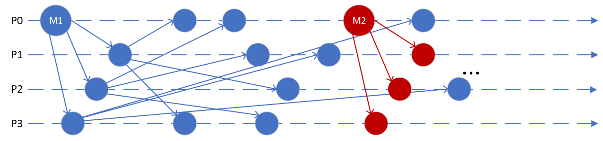

# 3. Domača naloga: Razširjanje sporočil

**Rok za oddajo: 17. 12. 2023**

Na podlagi [razlage](../07-razsirjanje-sporocil/Razsirjanje-sporocil.md), želimo poustvariti protokol za razširjanje sporočil med procesi.

Vaša naloga je napisati program v **go** za razširjanje sporočil med procesi in ga preizkusiti na **gruči Arnes**. Program naj preko ukazne vrstice prejme naslednje argumente (lahko tudi dodatne, če je potrebno):
- identifikator procesa `id`: celo število, ki identificira posamezen proces znotraj skupine,
- število vseh procesov v skupini `N`,
- število sporočil `M`, ki jih bo razširil glavni proces,
- število sporočil `K`, ki jih bo vsak proces ob prvem prejemu posredoval ostalim. S tem parametrom nastavljamo tudi metodo razširjanja sporočil. Če nastavimo `K==N-1`, naj se uporabi **nestrpno razširjanje**. Za `K<N-1` pa naj se uporabi **razširjanje z govoricami**.

Procesi naj za komunikacijo uporabljajo protokol **UDP**. Vsak proces naj ob prvem prejemu novega sporočila to izpiše na zaslon. Nadaljnje prejeme istega sporočila, naj proces ignorira. Razširjanje sporočila naj vedno začne proces z `id==0`.

Pri **nestrpnem razširjanju**, naj vsak proces posreduje sporočilo vsem ostalim v skupini. To naj stori samo ob **prvem** prejemu novega sporočila. Vsebina sporočil, ki se razširjajo, je lahko poljubna, vendar mora omogočati, da procesi med sabo ločijo različna sporočila. Komunikacijo vedno začne glavni proces (`id==0`), ki zaporedoma pošlje `M` sporočil. Med posamezna pošiljanja dodajte kratko pavzo (reda 100 ms). Pri razširjanju ni potrebno skrbeti za pravilen vrstni red prejema. 

Pri **razširjanju z govoricami** naj vsak proces ob prvem prejemu novega sporočila, le-tega posreduje naprej `K` naključno izbranim procesom. Pri naključnem izbiranju procesov poskrbite, da posamezen proces ne izbere istega procesa večkrat.

Pri pisanju programa se lahko zgledujete po kodi iz [prejšnjih vaj](../06-posredovanje-sporocil/Posredovanje-sporocil.md). Pri poslušanju za sporočila je priporočeno, da nastavite rok trajanja povezave s pomočjo funkcije [SetDeadline](https://pkg.go.dev/net#IPConn.SetDeadline) ali pa kako drugače poskrbite, da se proces zaključi in sprosti vrata, če po nekem času ne dobi sporočila. S tem se boste izognili težavam z zasedenostjo vrat v primeru, da pride do smrtnega objema, ko nek proces čaka na sporočilo, ki nikoli ne pride.

V procesih ni potrebno uporabiti principa preverjanja utripa za ugototavljanje, če so procesi prejemniki pripravljeni oziroma živi. Glavni proces naj kar takoj začne pošiljati sporočila. 

Za zaganjanje poljubnega števila procesov na gruči Arnes se lahko zgledujete po [skripti](../06-posredovanje-sporocil/koda/run_telefon.sh) iz prejšnjih vaj.