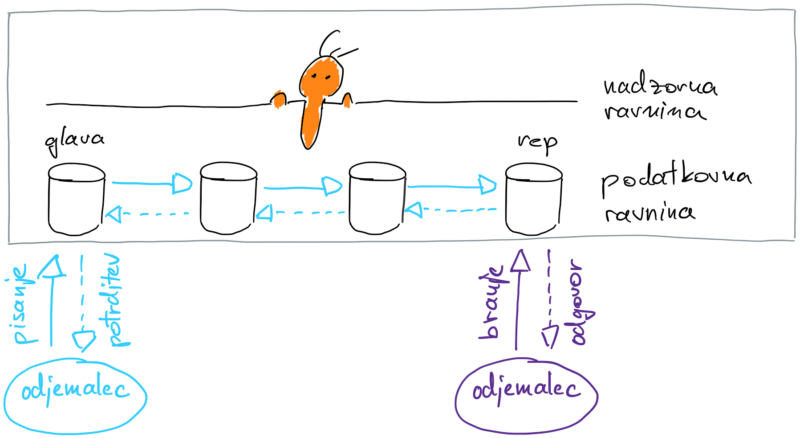

# 4. Domača naloga: Verižna replikacija

**Rok za oddajo: 7. 1. 2024**

## Verižna replikacija

[Verižna replikacija](https://www.cs.cornell.edu/home/rvr/papers/OSDI04.pdf) je protokol za replikacijo, kjer so procesi razporejeni v verigo. Najbolj levi proces imenujemo glava (angl. head), najbolj desni proces pa rep (angl. tail), med njima je lahko poljubno število vmesnih procesov. V celotni verigi je lahko tudi samo en proces, ki je hkrati rep in glava. V tem primeru seveda nimamo replikacije podatkov. 

Odjemalci vse pisalne zahteve pošiljajo izključno glavi, ki zahtevo prejme, jo shrani in posreduje naslednjemu procesu v verigi. Naslednji proces prejeto zahtevo shrani in pošlje naslednjemu procesu v verigi. Postopek ponovijo vsi procesi, dokler ta ne pride do repa. Rep zahtevo obdela in predhodnemu procesu pošlje potrditev, da je bila zahteva uspešno obdelana. Le-ta potrditev posreduje svojemu predhodniku, kar storijo tudi vsi ostali procesi, dokler potrditev ne pride do glave. Ko glava dobi potrditev, je bila zahteva uspešno obdelana v celotni verigi, kar sporoči odjemalcu s potrditvijo njegove pisalne zahteve.

Bralne zahteve streže samo rep, pri katerem so vsi zapisi v shrambi vedno potrjeni. V splošnem se protokol lahko razširi z možnostjo pošiljanja bralnih zahtevkov kateremu koli procesu v verigi, kar poveča zmogljivost sistema, vendar je potem potrebno skrbeti za ustrezno beleženje zaporedja zahtevkov. Pri nalogi se bomo omejili na primer, kjer pisalne zahtevke streže samo glava in bralne zahteve streže samo rep.

Poleg same strežbe odjemalcev, je potrebno pri verižni replikaciji imeti tudi koordinatorja oziroma nadzorno ravnino, ki skrbi za odstranjevanje procesov, ki postanejo nedostopni, in za dodajanje novih procesov. Kako ta proces deluje ste spoznali na predavanjih. Pri domači nalogi se z nadzorno ravnino ne bomo ukvarjali.

## Pomnilniška shramba

Sistem naj odjemalcem omogoča dostop do pomnilniške shrambe tipa ključ-vrednost. V programskem jeziku **go** jo lahko ustvarite na osnovi pomnilniške strukture slovar (map) Pomnilniška shramba naj podpira tri vrste operacij:

- **Put**: Izvede zapis novega vnosa v shrambo, če ta še ne obstaja, sicer pa ga ustrezno posodobi.
- **Get**: Izvede branje vnosa iz shrambe; če vnos ne obstaja, vrne prazen zapis.
- **Commit**: Vsak vnos v shrambi naj ima pripadajočo zastavico (e.g. *commited*), ki pove ali je zapis v shrambi potrjen. Operacija **Commit**, naj posamezen zapis v shrambi potrdi.

Za shrambo lahko uporabite že pripravljeno [predlogo](koda/storage/storage.go).

## Komunikacija med procesi v verigi

Za komunikacijo med procesi v verigi pripravite vmesnik na osnovi klicev oddaljenih metod (angl. RPC). Uporabite lahko poljubno knjižnico (gRPC, net/rpc, ...). Vmesnik naj podpira oddaljene metode, ki se skladajo z operacijami nad pomnilniško shramo. Potrebujemo torej naslednje tri oddaljene metode:
  - **Put**: Metoda izvede pisalni dostop do pomnilniške shrambe. Proces po prejemu zatevka **Put**. zapiše nov vnos v lokalno pomnilniško shrambo in ga hkrati posreduje naslednjemu procesu v vrsti s pomočjo klica iste oddaljene metode. Proces zapis označi kot nepotrjen, dokler ne dobi potrditve od predhodnega procesa.
  - **Commit**: Metoda potrdi zapis v shrambi. S tem postane zapis na voljo odjemalcem. Metodo uporabljajo procesi v verigi, da potrjujejo zahtevke. Proces naj najprej potrdi svoj zapis v shrambi, nato pa naj pokliče **Commit** nad predhodnim procesom, dokler potrditev ne pride do glave.

## Odjemalec

Delovanje sistema demonstrirajte z odjemalcem, ki se poveže na glavo in rep verige, ter izvaja pisalne in bralne zahteve.
Odjemalec kliče naslednji dve oddaljeni metodi:
  - **Put**: Odjemalec metodo kliče nad glavo verige. Metoda doda nov zapis v pomnilniško shramo. Ko je zapis potrjen v celotni verigi se metoda zaključi in vrne rezultat operacije odjemalcu. Glava naj dovoli samo eno izvajanje metode **Put** naenkrat, da se izognemu hkratnemu spreminjanju istih vnosov iz strani različnih odjemalcev (uporabite ključavnico).
  - **Get**: Odjemalec metodo kliče nad repom verige. Metoda izvede bralni dostop do pomnilniške shrambe in vrne ustrezen vnos. Če vnosa v shrambi ne najde, vrne prazen vnos. Metoda vrača samo **potrjene** ujemajoče zapise.

## Zagon

Delovanje vašega sistema demonstrirajte na gruči Arnes. Pri zagonu verige procesov, si lahko pomagate s [skripto](../06-posredovanje-sporocil/koda/run_telefon.sh) iz vaje 6, ki jo ustrezno prilagodite. Vsak proces mora vedeti kje v verigi se nahaja in se ustrezno obnašati.
