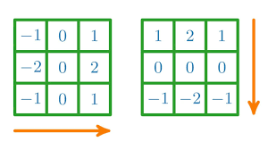

# 5. Domača naloga: Odkrivanje robov v slikah

**Rok za oddajo: 21. 1. 2024**

[Odkrivanje robov](https://en.wikipedia.org/wiki/Edge_detection) v slikah je postopek, ki zazna in označi spremembe v svetlosti ali barvi na sliki, ki ustrezajo mejam med različnimi objekti ali regijami. Odkrivanje robov je pomembna tehnika za analizo in obdelavo slik, saj omogoča izluščenje pomembnih informacij, kot so oblike, konture, teksture in orientacije. Obstaja več metod za odkrivanje robov v slikah, ki se razlikujejo po načinu filtriranja, upragovanja, povezovanja in izboljševanja robov. Nekatere pogoste metode so Cannyjev detektor robov, Sobelov filter, Laplaceov operator, Houghov transform in aktivne konture.  

Tipočno se pri odkrivanju robov v slikah poslužujemo Sobelovega operatorja, ki temelji na aproksimaciji gradienta intenzitete slike. Operator uporablja dve 3×3 jedri za izračun približkov odvodov v horizontalni in vertikalni smeri. Rezultat je slika, ki poudarja robove med različnimi objekti ali regijami na sliki.

Če z vrednostjo $s(i,j)$ označimo vrednost slikovne točke, ki se nahaja v vrstici $i$ in stolpcu $j$ v vhodni sliki, potem izračunamo izhodno vrednost $d(i,j)$ v isti točki  s pomočjo Sobelovega operatorja na naslednji način:

$G_x=-s(i-1,j-1)-2s(i,j-1)-s(i+1,j-1)+s(i-1,j+1)+2s(i,j+1)+s(i+1,j+1)$
$G_y=s(i-1,j-1)+2s(i-1,j)+s(i-1,j+1)-s(i+1,j-1)-2s(i+1,j)-s(i+1,j+1)$

$d(i,j)=\sqrt{G_x^2+G_y^2}$

Pri računanju vrednosti izhodnih slikovnih točk moramo biti pozorni na:
 - za vrednosti vhodnih slikovnih točk, ki padejo izven slike privzamemo vrednost 0,
 - pri računanju izhodne vrednosti $d(i,j)$ uporabimo aritmetiko z nasičenjem. Če izračunana vrednost prekorači maksimalno, jo nastavimo na maksimalno. V primeru vrednosti slikovnih točk je to običajno 255, ker imamo na voljo 8 bitov na barvni kanal.

## Branje in pisanje slik

Za branje in pisanje slik uporabite odprto dostopno knjižnico [STB](https://github.com/nothings/stb), ki omogoča branje in pisanje datotek v različnih formatih. Primer uporabe knjižnice s predlogo za CUDA najdete [tu](./koda/sample/). Pri branju vhodno sliko pretvorite v sivinsko, tako da nastavite želeno število barvnih kanalov na ena pri klicu funkcije `stbi_load`. Izhodno sliko prav tako zapišite kot sivinsko.

## Odkrivanje robov v sliki na GPE

Postopek odkrivanja robov izvedite na grafični procesni enoti s pomočjo ogrodja CUDA v programskem jeziku C/C++. Pri tem je potrebno narediti naslednje korake:
 - Branje vhodne slike iz datoteke v pomnilnik gostitelja.
 - Rezervacija pomnilnika za podatkovne strukture na gostitelju (CPE) in napravi (GPE) (prostor za vhodno in izhodno sliko).
 - Prenos vhodne slike iz pomnilnika gostitelja na napravo.
 - Nastavitev organizacije niti: število blokov initi in število niti na blok. Uporabite 2D organizacijo niti, saj se najbolj prilega problemu, ki ga rešujemo. Pri nastavljanju organizacije niti moramu upoštevati tudi, kako bomo delo razdelili med niti. Uporabite pristop ena nit izračuna vrednost ene izhodne slikovne točke.
 - Zagon ščepca, ki izračuna izhodno sliko.
 - Prenos izhodne slike iz pomnilnika naprave v pomnilnik gostitelja.
 - Zapis izhodne slike v datoteko.

Izmerite tudi čas potreben za generiranje slike na GPE in ga primerjate s časom, ki ga potrebuje eno jedro CPE. Posledično morate isti algoritem napisati tudi za CPE. Pri merjenju časa upoštevajte tudi čas prenosa slike na/iz naprave. Izračunajte pohitritev $S=T_{cpe}/T_{gpe}$ za poljubno sliko v 4K resoluciji (3840 x 2160).
